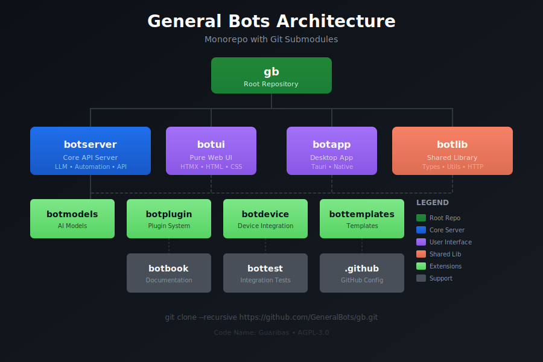
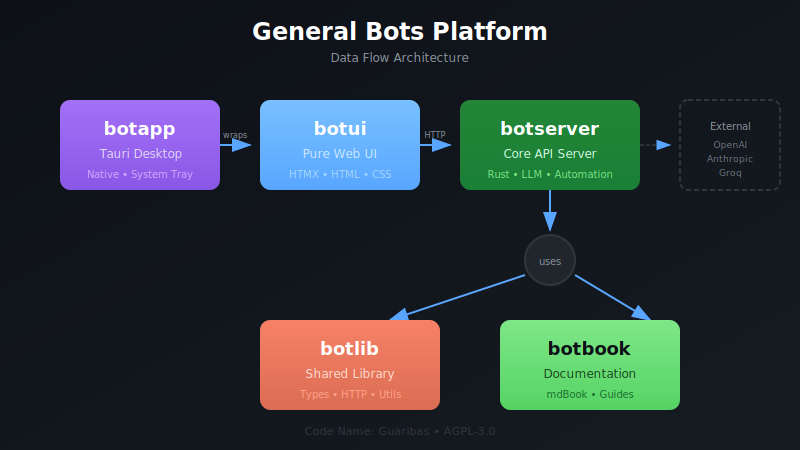

<a href="https://github.com/generalbots/gb/graphs/contributors">
  
</a>


# General Bots

**Enterprise-Grade LLM Orchestrator and AI Automation Platform**

A strongly-typed, self-hosted conversational platform focused on convention over configuration and code-less approaches.

---

## Architecture



---

## Platform Data Flow



---

## Repository Structure

The **[gb](https://github.com/GeneralBots/gb)** repository is the root monorepo containing all components as Git submodules:

```
gb/                        ← Root repository (clone this!)
├── Cargo.toml             ← Workspace configuration
├── README.md              ← Project overview
├── PROMPT.md              ← Development guide
├── .gitmodules            ← Submodule definitions
│
├── botserver/             ← [submodule] Core API server
├── botui/                 ← [submodule] Pure web UI
├── botapp/                ← [submodule] Tauri desktop app
├── botlib/                ← [submodule] Shared Rust library
├── botbook/               ← [submodule] Documentation
├── bottest/               ← [submodule] Integration tests
├── botdevice/             ← [submodule] Device integration
├── botmodels/             ← [submodule] AI models
├── botplugin/             ← [submodule] Plugin system
├── bottemplates/          ← [submodule] Templates
└── .github/               ← [submodule] GitHub org config
```

---

## Quick Start

### Clone Everything

```bash
git clone --recursive https://github.com/GeneralBots/gb.git
cd gb
cargo build
```

### Update All Submodules

```bash
git submodule update --init --recursive
git submodule foreach git pull origin master
```

---

## Components

| Component | Description | Status |
|-----------|-------------|--------|
| [**gb**](https://github.com/GeneralBots/gb) | Root monorepo - workspace config, submodules | Production |
| [**botserver**](https://github.com/GeneralBots/botserver) | Core API server - LLM orchestration, automation | Production |
| [**botui**](https://github.com/GeneralBots/botui) | Pure web UI - HTMX-based minimal interface | Production |
| [**botapp**](https://github.com/GeneralBots/botapp) | Tauri desktop wrapper - native file access | Production |
| [**botlib**](https://github.com/GeneralBots/botlib) | Shared Rust library - common types, utilities | Production |
| [**botbook**](https://github.com/GeneralBots/botbook) | Documentation - mdBook format | Production |
| [**bottest**](https://github.com/GeneralBots/bottest) | Integration tests | Production |
| [**botdevice**](https://github.com/GeneralBots/botdevice) | Device integration | Production |
| [**botmodels**](https://github.com/GeneralBots/botmodels) | AI models | Production |
| [**botplugin**](https://github.com/GeneralBots/botplugin) | Plugin system | Production |
| [**bottemplates**](https://github.com/GeneralBots/bottemplates) | Templates - bots, apps, prompts | Production |

---

## Key Features

| Feature | Description |
|---------|-------------|
| Multi-Vendor LLM | Unified API for OpenAI, Groq, Claude, Anthropic |
| MCP and Tools | Instant tool creation from code and functions |
| Semantic Cache | 70% cost reduction on LLM calls |
| Web Automation | Browser automation with AI intelligence |
| Enterprise Connectors | CRM, ERP, database integrations |
| Version Control | Git-like history with rollback |

---

## Documentation

- [Complete Docs](https://github.com/GeneralBots/botbook)
- [Quick Start](https://github.com/GeneralBots/botserver/blob/main/docs/QUICK_START.md)
- [API Reference](https://github.com/GeneralBots/botserver/blob/main/docs/src/chapter-10-api/README.md)

---

## License

**AGPL-3.0** - True open source with dual licensing option.

---

Code Name: Guaribas