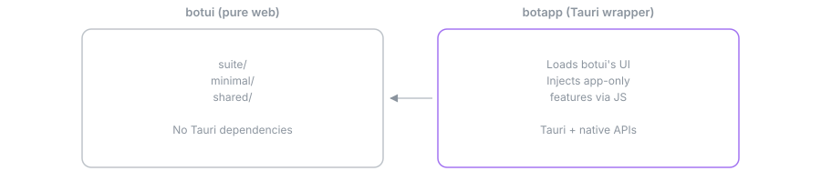
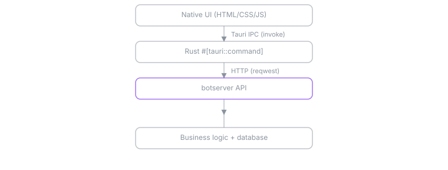

# BotApp - General Bots Desktop Application

<p align="center"></p>

**Version:** 6.3.1  
**Purpose:** Desktop application wrapper (Tauri 2)

[](./LICENSE)
[](https://www.rust-lang.org/)
[](https://github.com/generalbots/generalbots/releases)
[](https://tauri.app/)
[](https://github.com/generalbots/generalbots/graphs/contributors)
[](https://github.com/generalbots/generalbots/issues)
[](https://github.com/generalbots/generalbots/pulls)
[](https://generalbots.org)
<a href="https://github.com/generalbots/generalbots/graphs/contributors">
  
</a>

---

## Overview

BotApp is the Tauri-based desktop wrapper for General Bots, providing native desktop and mobile capabilities on top of the pure web UI from [botui](https://github.com/GeneralBots/botui). It extends the web interface with native file system access, system tray functionality, and desktop-specific features while maintaining a clean separation from the pure web UI.

For comprehensive documentation, see **[docs.generalbots.org](https://docs.generalbots.org)** or the **[BotBook](../botbook)** for detailed guides, API references, and tutorials.

---

## Architecture

<a href="../.github/svg/diagram-botapp-shell.svg"></a>

### Why Two Projects?

- **botui**: Pure web UI with zero native dependencies. Works in any browser.
- **botapp**: Wraps botui with Tauri for desktop/mobile native features.

This separation allows:
- Same UI code for web, desktop, and mobile
- Clean dependency management (web users don't need Tauri)
- App-specific features only in the native app

### Communication Flow

<a href="../.github/svg/diagram-botapp-ipc.svg"></a>

---

## Features

BotApp adds these native capabilities to botui:

- **Local File Access**: Browse and manage files on your device
- **System Tray**: Minimize to tray, background operation
- **Native Dialogs**: File open/save dialogs
- **Desktop Notifications**: Native OS notifications
- **App Settings**: Desktop-specific configuration

---

## Project Structure

```
botapp/
├── src/
│   ├── main.rs           # Rust backend, Tauri commands
│   ├── lib.rs            # Library exports
│   └── desktop/
│       ├── mod.rs        # Desktop module organization
│       ├── drive.rs      # File system commands
│       └── tray.rs       # System tray functionality
├── ui/
│   └── app-guides/       # App-specific HTML
├── js/
│   └── app-extensions.js # JavaScript extensions
├── icons/                # App icons (all sizes)
├── tauri.conf.json       # Tauri configuration
└── Cargo.toml
```

---

## Development

### Prerequisites

- Rust 1.70+
- Node.js 18+ (for Tauri CLI)
- Tauri CLI: `cargo install tauri-cli`

#### Platform-specific

**Linux:**
```bash
sudo apt install libwebkit2gtk-4.1-dev libappindicator3-dev librsvg2-dev
```

**macOS:**
```bash
xcode-select --install
```

**Windows:**
- Visual Studio Build Tools with C++ workload

### Getting Started

1. Clone both repositories:
```bash
git clone https://github.com/GeneralBots/botui.git
git clone https://github.com/GeneralBots/botapp.git
```

2. Start botui's web server (required for dev):
```bash
cd botui
cargo run
```

3. Run botapp in development mode:
```bash
cd botapp
cargo tauri dev
```

---

## Building

### Debug Build
```bash
cargo tauri build --debug
```

### Release Build
```bash
cargo tauri build
```

Binaries will be in `target/release/bundle/`.

---

## Tauri Command Pattern

```rust
use tauri::command;

#[command]
pub async fn my_command(
    window: tauri::Window,
    param: String,
) -> Result<MyResponse, String> {
    if param.is_empty() || param.len() > 1000 {
        return Err("Invalid parameter".into());
    }
    Ok(MyResponse { /* ... */ })
}

fn main() {
    tauri::Builder::default()
        .invoke_handler(tauri::generate_handler![
            my_command,
        ])
        .run(tauri::generate_context!())
        .map_err(|e| format!("error running app: {e}"))?;
}
```

### JavaScript Invocation

```javascript
const result = await window.__TAURI__.invoke('my_command', {
    param: 'value'
});
```

### Available Tauri Commands

| Command | Description |
|---------|-------------|
| `list_files` | List directory contents |
| `upload_file` | Copy file with progress |
| `create_folder` | Create new directory |
| `delete_path` | Delete file or folder |
| `get_home_dir` | Get user's home directory |

---

## Security Directives

### Path Validation

```rust
// ❌ WRONG - trusting user path
#[tauri::command]
async fn read_file(path: String) -> Result<String, String> {
    std::fs::read_to_string(path).map_err(|e| e.to_string())
}

// ✅ CORRECT - validate and sandbox paths
#[tauri::command]
async fn read_file(app: tauri::AppHandle, filename: String) -> Result<String, String> {
    let safe_name = filename
        .chars()
        .filter(|c| c.is_alphanumeric() || *c == '.' || *c == '-')
        .collect::<String>();
    if safe_name.contains("..") {
        return Err("Invalid filename".into());
    }
    let base_dir = app.path().app_data_dir().map_err(|e| e.to_string())?;
    let full_path = base_dir.join(&safe_name);
    std::fs::read_to_string(full_path).map_err(|e| e.to_string())
}
```

### Security Prohibitions

```
❌ NEVER trust user input from IPC commands
❌ NEVER expose filesystem paths to frontend without validation
❌ NEVER store secrets in plain text or localStorage
❌ NEVER disable CSP in tauri.conf.json for production
❌ NEVER use allowlist: all in Tauri configuration
```

---

## Icons - MANDATORY

**NEVER generate icons with LLM. Use official SVG icons from `botui/ui/suite/assets/icons/`**

Required icon sizes in `icons/`:
```
icon.ico          # Windows (256x256)
icon.icns         # macOS
icon.png          # Linux (512x512)
32x32.png
128x128.png
128x128@2x.png
```

All icons use `stroke="currentColor"` for CSS theming.

---

## Configuration (tauri.conf.json)

```json
{
  "$schema": "https://schema.tauri.app/config/2",
  "productName": "General Bots",
  "version": "6.2.0",
  "identifier": "br.com.pragmatismo.botapp",
  "build": {
    "devUrl": "http://localhost:3000",
    "frontendDist": "../botui/ui/suite"
  },
  "app": {
    "security": {
      "csp": "default-src 'self'; script-src 'self'; style-src 'self' 'unsafe-inline'"
    }
  }
}
```

---

## How App Extensions Work

BotApp injects `js/app-extensions.js` into botui's suite at runtime. This script:

1. Detects Tauri environment (`window.__TAURI__`)
2. Injects app-only navigation items into the suite's `.app-grid`
3. Exposes `window.BotApp` API for native features

Example usage in suite:
```javascript
if (window.BotApp?.isApp) {
    // Running in desktop app
    const files = await BotApp.fs.listFiles('/home/user');
    await BotApp.notify('Title', 'Native notification!');
}
```

---

## ZERO TOLERANCE POLICY

**EVERY SINGLE WARNING MUST BE FIXED. NO EXCEPTIONS.**

### Absolute Prohibitions

```
❌ NEVER use #![allow()] or #[allow()] in source code
❌ NEVER use _ prefix for unused variables - DELETE or USE them
❌ NEVER use .unwrap() - use ? or proper error handling
❌ NEVER use .expect() - use ? or proper error handling  
❌ NEVER use panic!() or unreachable!()
❌ NEVER use todo!() or unimplemented!()
❌ NEVER leave unused imports or dead code
❌ NEVER add comments - code must be self-documenting
```

### Code Patterns

```rust
// ❌ WRONG
let value = something.unwrap();

// ✅ CORRECT
let value = something?;
let value = something.ok_or_else(|| Error::NotFound)?;

// Use Self in Impl Blocks
impl MyStruct {
    fn new() -> Self { Self { } }  // ✅ Not MyStruct
}

// Derive Eq with PartialEq
#[derive(PartialEq, Eq)]  // ✅ Always both
struct MyStruct { }
```

---

## Key Dependencies

| Library | Version | Purpose |
|---------|---------|---------|
| tauri | 2 | Desktop framework |
| tauri-plugin-dialog | 2 | File dialogs |
| tauri-plugin-opener | 2 | URL/file opener |
| botlib | workspace | Shared types |
| reqwest | 0.12 | HTTP client |
| tokio | 1.41 | Async runtime |

---

## Testing and Safety Tooling

BotApp follows General Bots' commitment to code quality and safety.

### Standard Testing

```bash
cargo test
```

### Miri (Undefined Behavior Detection)

Miri detects undefined behavior in unsafe code. Useful for testing data structures and parsing logic.

```bash
cargo +nightly miri test
```

**Limitations:** Cannot test I/O, FFI, or full integration tests.

### AddressSanitizer

Detects memory errors at runtime:

```bash
RUSTFLAGS="-Z sanitizer=address" cargo +nightly test
```

### Kani (Formal Verification)

For mathematically proving critical code properties:

```bash
cargo kani --function critical_function
```

### Ferrocene

Ferrocene is a qualified Rust compiler for safety-critical systems (ISO 26262, IEC 61508).

**Should BotApp use Ferrocene?**

- **For typical desktop deployment:** No - standard Rust + testing is sufficient
- **Consider Ferrocene if:** Deploying in regulated industries (medical, automotive, aerospace)

For most use cases, comprehensive testing with the tools above provides adequate confidence.

---

## Platform applications

The desktop shell hosts the same application suite the web interface serves. Icons match the menu on [generalbots.org](https://generalbots.org).

| | Application | What it does |
|---|-------------|--------------|
|  | **Server**<br><sub>Core Platform</sub> | Web server, WebSocket messaging, REST API and request routing. Serves both the API and the web interface. |
|  | **Auth / Identity**<br><sub>Core Platform</sub> | OAuth 2.0, OpenID Connect, JWT validation and session management, with role-based access control on every endpoint. SSO-ready. |
|  | **Shared / Database**<br><sub>Core Platform</sub> | PostgreSQL with managed schema definitions, shared models and common utilities used across every application. |
|  | **AI Engine**<br><sub>Core Platform</sub> | LLM provider orchestration across DeepSeek, Qwen, GLM, Kimi, MiniMax, Yi or any OpenAI-compatible API. Automatic failover, token counting, streaming and cost tracking. |
|  | **Drive / Storage**<br><sub>Core Platform</sub> | S3-compatible object storage with upload, download, versioning and automatic indexing for search and RAG. Works with MinIO, AWS S3 and Wasabi. |
|  | **Dashboards / Analytics**<br><sub>Core Platform</sub> | Real-time dashboards covering system health, business KPIs and custom visualisations. Exportable and embeddable. |
|  | **AI Search**<br><sub>Capabilities</sub> | Retrieval-augmented generation over PDFs, Word and Excel with sub-second semantic retrieval and cited answers. |
|  | **Bot Factory**<br><sub>Capabilities</sub> | Rapid prototyping and multi-bot orchestration. Run many bots with distinct personalities from one dashboard. |
|  | **Broadcast**<br><sub>Capabilities</sub> | Omnichannel outbound messaging with AI-driven personalisation across WhatsApp, Telegram and SMS. |
|  | **Content Generation**<br><sub>Capabilities</sub> | Generate on-brand, SEO-optimised content in a consistent brand voice. |
|  | **APIs in BASIC**<br><sub>Capabilities</sub> | Build REST endpoints using simplified BASIC syntax, for legacy integration and rapid delivery. |
|  | **LLM Tools**<br><sub>Capabilities</sub> | Give the model real capabilities: web search, calculation and custom API calls. |
|  | **Talk to Data**<br><sub>Capabilities</sub> | Query SQL databases, Excel files and CSVs in plain language. |
|  | **Training**<br><sub>Capabilities</sub> | Ingest institutional knowledge from Word, Excel and PDF documents with no coding. |
|  | **Advanced RAG**<br><sub>Capabilities</sub> | Agentic RAG, Graph RAG, persistent memory and multi-modal retrieval over the knowledge base. |
|  | **Calendar**<br><sub>Business & Productivity</sub> | CalDAV integration with event creation, conflict detection and automated reminder workflows. Syncs with Google, Outlook and Apple Calendar. |
|  | **Email**<br><sub>Business & Productivity</sub> | IMAP/SMTP integration with automatic templating, attachment handling and trigger-based workflows across inbox, starred, sent and scheduled folders. |
|  | **Meet / Video**<br><sub>Business & Productivity</sub> | Video conferencing with screen sharing, recording, transcription and auto-generated meeting notes. |
|  | **Documents, Sheets & Slides**<br><sub>Business & Productivity</sub> | Office-compatible document processing. Read and generate Word, Excel and PowerPoint files from templates. |
|  | **WhatsApp & Teams**<br><sub>Business & Productivity</sub> | WhatsApp Business API and the MS Teams bot framework, with template messages, proactive notifications and rich media. |
|  | **People / CRM**<br><sub>Business & Productivity</sub> | Contact management with CRM-style relationship tracking, tagging, deal pipelines and automated follow-up reminders. |
|  | **Knowledge Base**<br><sub>AI & Intelligence</sub> | Automatic document ingestion with chunking, embedding and semantic search. PDFs, Word files and web pages all become queryable. |
|  | **Web Automation**<br><sub>AI & Intelligence</sub> | Headless browser automation. Scrape sites, fill forms, capture screenshots and trigger workflows when a page changes. |
|  | **Search**<br><sub>AI & Intelligence</sub> | Full-text and semantic search across everything indexed, combining keyword and vector matching with faceted filtering. |
|  | **Security**<br><sub>Operations</sub> | Encryption, threat detection, audit logging and compliance reporting, built to LGPD, GDPR and HIPAA expectations. |
|  | **Monitoring**<br><sub>Operations</sub> | System health monitoring for CPU, memory, disk and network, with alert thresholds, escalation and uptime tracking. |
|  | **Analytics**<br><sub>Operations</sub> | Event tracking, funnel analysis and conversion metrics across every channel. |
|  | **RBAC & Multi-Tenancy**<br><sub>Enterprise</sub> | Fine-grained role-based access control and multi-tenant workspaces with complete data isolation between organisations. |
|  | **On-Premise Deployment**<br><sub>Enterprise</sub> | Runs entirely inside your own infrastructure with no cloud dependency and no data leaving the network. Air-gapped deployments supported. |
|  | **Compliance (LGPD, GDPR)**<br><sub>Enterprise</sub> | Data subject requests, right to erasure, audit trails, retention policies and anonymisation tooling. |

---

## Documentation

For complete documentation, guides, and API references:

- **[docs.generalbots.org](https://docs.generalbots.org)** - Full online documentation
- **[BotBook](../botbook)** - Local comprehensive guide with tutorials and examples
- **[Testing & Safety Tooling](../botbook/src/07-gbapp/testing-safety.md)** - Complete testing documentation

---

## Remember

- **ZERO WARNINGS** - Every clippy warning must be fixed
- **NO ALLOW IN CODE** - Never use #[allow()] in source files
- **NO DEAD CODE** - Delete unused code
- **NO UNWRAP/EXPECT** - Use ? operator
- **Security** - Minimal allowlist, validate ALL inputs
- **Desktop-only features** - Shared logic in botserver
- **Tauri APIs** - No direct fs access from JS
- **Official icons** - Use icons from botui/ui/suite/assets/icons/
- **Version 6.2.0** - Do not change without approval

---

## Related Projects

- [botui](https://github.com/GeneralBots/botui) - Pure web UI
- [botserver](https://github.com/generalbots/generalbots) - Backend server
- [botlib](https://github.com/GeneralBots/botlib) - Shared Rust library

---

## License

MIT - See [LICENSE](LICENSE) for details.