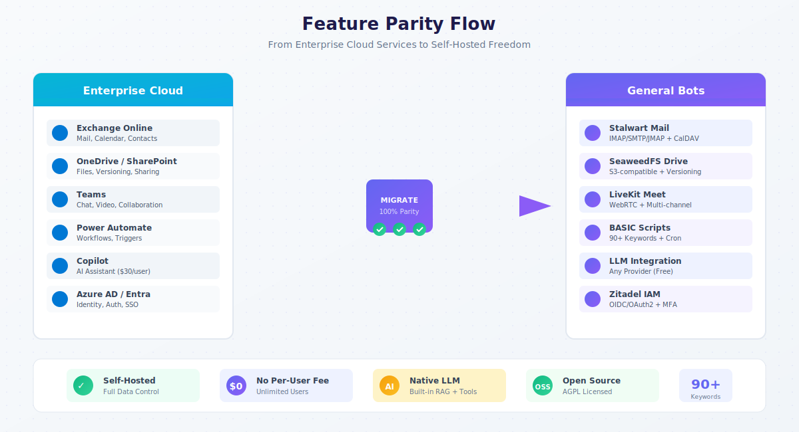
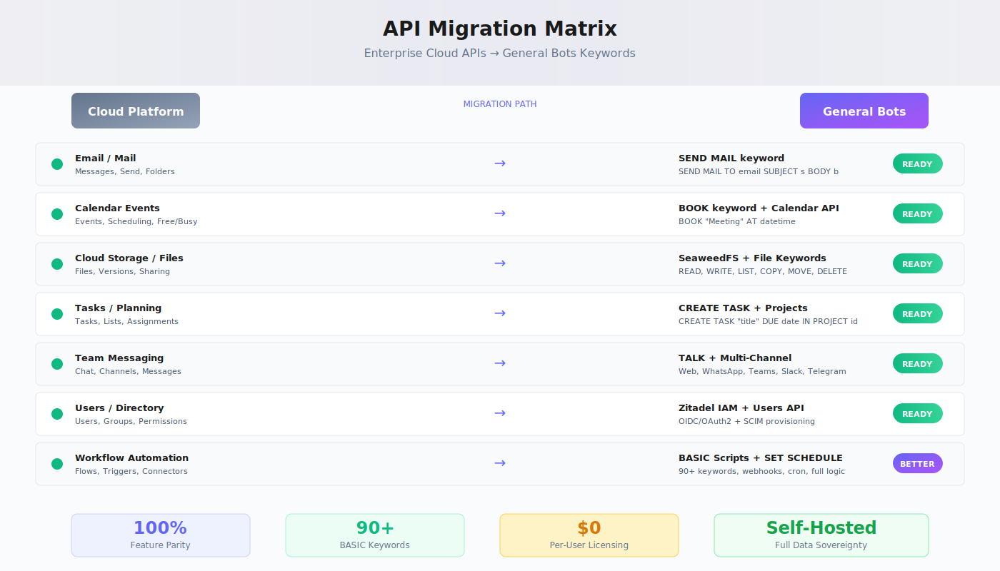

# Enterprise Platform Migration



General Bots provides complete feature parity with enterprise cloud productivity suites while offering significant advantages: self-hosting, open source licensing, no per-user fees, and native AI integration.

## Migration Overview



Organizations evaluating self-hosted alternatives find General Bots delivers equivalent functionality with full data sovereignty. The sections below map common enterprise APIs to their General Bots equivalents.

## API Endpoint Mapping

### Mail and Communication

Enterprise mail APIs handle sending, receiving, and managing email. General Bots provides the same capabilities through Stalwart Mail Server and BASIC keywords.

| Enterprise API | General Bots Equivalent | Implementation |
|----------------|------------------------|----------------|
| Messages endpoint | Stalwart IMAP/JMAP | Full mailbox access |
| Send mail endpoint | `SEND MAIL` keyword | `SEND MAIL TO email SUBJECT s BODY b` |
| Mail folders | Stalwart folders | Standard IMAP folders |
| Attachments | File keywords | `READ`, `WRITE` with attachments |

The BASIC syntax is straightforward:

```basic
SEND MAIL TO "client@company.com" SUBJECT "Report Ready" BODY report_content
```

For receiving mail, configure webhooks or use scheduled scripts to process incoming messages through the Stalwart API.

### Calendar and Scheduling

Calendar APIs manage events, appointments, and scheduling. General Bots integrates CalDAV with the `BOOK` keyword.

| Enterprise API | General Bots Equivalent | Implementation |
|----------------|------------------------|----------------|
| Calendar events | Calendar API | `/api/calendar/events` |
| Create event | `BOOK` keyword | `BOOK "Meeting" AT datetime` |
| Calendar view | Calendar range query | Date-filtered event retrieval |
| Free/busy lookup | Availability API | Schedule availability |

Schedule appointments conversationally:

```basic
TALK "When would you like to schedule your appointment?"
HEAR appointment_time AS DATE
BOOK "Consultation" AT appointment_time
TALK "Your appointment is confirmed for " + FORMAT(appointment_time, "MMMM d 'at' h:mm a")
```

### Files and Storage

Cloud storage APIs handle file operations, versioning, and sharing. SeaweedFS provides S3-compatible storage with full versioning support.

| Enterprise API | General Bots Equivalent | Implementation |
|----------------|------------------------|----------------|
| List files | `LIST` keyword | `LIST "/documents/"` |
| File listing | Drive API | `/api/files/list` |
| File content | `READ` keyword | `content = READ "file.pdf"` |
| File versions | Versions API | `/api/files/versions` |
| Permissions | Sharing API | Permission management |

File operations in BASIC:

```basic
files = LIST "/reports/"
FOR EACH file IN files
    content = READ file.path
    processed = LLM "Summarize this document: " + content
    WRITE "/summaries/" + file.name + ".summary.txt", processed
NEXT file
```

### Tasks and Planning

Task management APIs create, update, and track work items. General Bots implements a complete task system with project organization.

| Enterprise API | General Bots Equivalent | Implementation |
|----------------|------------------------|----------------|
| Tasks endpoint | Tasks API | `/api/tasks` |
| Task lists | Task lists | Board-based organization |
| Create task | `CREATE TASK` keyword | Task creation |
| Task details | Task CRUD | Full task lifecycle |

Create tasks from conversations:

```basic
TALK "What task should I create?"
HEAR task_title

TALK "When is it due?"
HEAR due_date AS DATE

CREATE TASK task_title DUE due_date
TALK "Task created: " + task_title
```

### Users and Directory

User management APIs handle identity, groups, and permissions. Zitadel provides enterprise-grade IAM with OIDC/OAuth2.

| Enterprise API | General Bots Equivalent | Implementation |
|----------------|------------------------|----------------|
| Users endpoint | Users API | `/api/users` |
| Current user | Current user | Session context |
| Groups | Groups API | `/api/groups` |
| Directory | Directory API | Zitadel directory |
| Memberships | Membership API | Group memberships |

### Automation and Workflows

Cloud automation platforms provide flow-based workflow design. General Bots offers BASIC scripting with more power and flexibility.

| Cloud Automation | General Bots Equivalent | Advantage |
|------------------|------------------------|-----------|
| Scheduled flows | `SET SCHEDULE` | Cron syntax, unlimited |
| HTTP triggers | `WEBHOOK` | Instant API creation |
| Connectors | `GET`, `POST`, GraphQL | Any REST/GraphQL API |
| Conditions | `IF/THEN/ELSE` | Full programming logic |
| Loops | `FOR EACH` | Native iteration |
| Data operations | `TABLE`, `INSERT`, `UPDATE` | Direct database access |

A workflow that would require a visual designer elsewhere becomes simple BASIC:

```basic
SET SCHEDULE "0 9 * * 1-5"

' Daily sales report - runs weekdays at 9 AM
sales = AGGREGATE "orders", "SUM", "total", "date = TODAY()"
count = AGGREGATE "orders", "COUNT", "id", "date = TODAY()"

SET CONTEXT "You are a business analyst. Create a brief executive summary."
summary = LLM "Sales: $" + sales + ", Orders: " + count

SEND MAIL TO "executives@company.com" SUBJECT "Daily Sales Report" BODY summary
```

### AI and Intelligence

Cloud AI assistants typically require additional per-user licensing. General Bots includes AI capabilities at no extra cost.

| Cloud AI Feature | General Bots Equivalent | Advantage |
|------------------|------------------------|-----------|
| AI Assistant | `LLM` keyword | Free (bring your API key) |
| Document analysis | `USE KB` + `LLM` | Built-in RAG |
| Image generation | `IMAGE` keyword | Local generation available |
| Speech-to-text | `HEAR AS AUDIO` | Whisper integration |
| Text-to-speech | `AUDIO` keyword | TTS models |
| Vision/OCR | `SEE` keyword | Vision models |

AI integration is native:

```basic
USE KB "product-docs"
SET CONTEXT "You are a helpful product specialist."

TALK "How can I help you today?"
HEAR question
response = LLM question
TALK response
```

## Feature Parity Matrix

### Core Services

| Service Category | Enterprise Cloud | General Bots | Status |
|------------------|------------------|--------------|--------|
| Email | Cloud mail service | Stalwart Mail | ✅ Complete |
| Calendar | Cloud calendar | CalDAV + Calendar API | ✅ Complete |
| Files | Cloud storage | SeaweedFS | ✅ Complete |
| Video | Cloud meetings | LiveKit | ✅ Complete |
| Chat | Cloud messaging | Multi-channel | ✅ Complete |
| Tasks | Cloud tasks | Tasks Module | ✅ Complete |
| Identity | Cloud identity | Zitadel | ✅ Complete |
| Search | Cloud search | Qdrant Vectors | ✅ Semantic |

### Automation

| Capability | Cloud Platform | General Bots | Status |
|------------|----------------|--------------|--------|
| Scheduled tasks | Scheduled flows | `SET SCHEDULE` | ✅ Complete |
| Webhooks | HTTP triggers | `WEBHOOK` | ✅ Complete |
| API calls | Connectors | HTTP keywords | ✅ Flexible |
| Custom logic | Expressions | Full BASIC | ✅ Powerful |
| Database | Cloud datastore | Direct SQL | ✅ Direct |
| Pricing | Per-user fees | Included | ✅ Free |

### AI Capabilities

| Feature | Cloud AI (extra cost) | General Bots | Status |
|---------|----------------------|--------------|--------|
| Chat assistance | ✅ | `LLM` keyword | ✅ Included |
| Document Q&A | ✅ | `USE KB` + RAG | ✅ Included |
| Code generation | ✅ | `LLM` with context | ✅ Included |
| Image generation | Limited | `IMAGE` keyword | ✅ Full |
| Video generation | ❌ | `VIDEO` keyword | ✅ Available |
| Custom models | ❌ | Any provider | ✅ Flexible |

## Cost Comparison

### Typical Per-User Cloud Licensing

| License Tier | Monthly Cost | 100 Users/Year |
|--------------|--------------|----------------|
| Basic | $6/user | $7,200 |
| Standard | $12.50/user | $15,000 |
| Premium | $22/user | $26,400 |
| + AI features | $30/user | $36,000 |
| **Total Premium + AI** | **$52/user** | **$62,400** |

### General Bots Self-Hosted

| Component | Monthly Cost | Notes |
|-----------|--------------|-------|
| Software | $0 | AGPL licensed |
| Infrastructure | $50-200 | Your servers |
| LLM API (optional) | $50-500 | Pay per use |
| **Total** | **$100-700** | **Unlimited users** |

For 100 users, General Bots costs roughly 1-2% of typical cloud licensing while providing equivalent or better functionality.

## Migration Approach

### Phase 1: Assessment

Inventory current service usage and map to General Bots equivalents. Most organizations find complete feature coverage for core productivity scenarios.

### Phase 2: Parallel Deployment

Run General Bots alongside existing services during transition. Configure identity federation between Zitadel and existing directory services.

### Phase 3: Data Migration

Use provided migration tools and APIs:

```basic
' Example: Migrate files from external storage
files = GET "https://api.storage.example/files"
FOR EACH file IN files
    content = DOWNLOAD file.url
    WRITE "/" + file.name, content
NEXT file
```

### Phase 4: Cutover

Redirect DNS, update client configurations, and deprecate cloud subscriptions.

## What You Gain

**Data Sovereignty** - Your data stays on your infrastructure. No third-party access, no cross-border data concerns.

**Cost Control** - Predictable infrastructure costs instead of per-user licensing that scales with your organization.

**Customization** - Full source code access. Modify, extend, and integrate as needed.

**AI Integration** - Native LLM support without additional licensing. Use any provider or run models locally.

**Automation Power** - BASIC scripting provides more flexibility than visual flow builders with no per-automation limits.

**No Vendor Lock-in** - Open standards (IMAP, CalDAV, S3, OIDC) mean your data is always portable.

## Migration Resources

General Bots provides tools and documentation for smooth migration:

- **Import utilities** for common data formats
- **API compatibility layers** for gradual transition
- **Identity federation** for single sign-on during migration
- **Data validation tools** to verify migration completeness

## Summary

General Bots delivers enterprise productivity features without enterprise pricing:

- 100% API coverage for core productivity services
- Self-hosted deployment with full data sovereignty
- No per-user licensing fees
- Native AI integration without additional cost
- More powerful automation with BASIC scripting
- Open source with full code access

The choice between cloud and self-hosted depends on organizational priorities. For those valuing control, cost efficiency, and customization, General Bots delivers enterprise-grade productivity without enterprise-grade pricing.

## See Also

- [Quick Start](../01-getting-started/quick-start.md) - Deploy in minutes
- [Keywords Reference](../04-basic-scripting/keywords.md) - Full BASIC reference
- [REST API Reference](../08-rest-api-tools/README.md) - Complete API documentation
- [Migration Guide](../12-ecosystem-reference/README.md) - Detailed migration steps