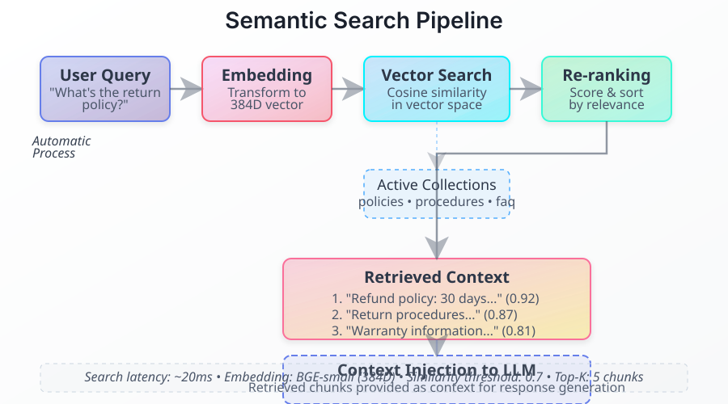

# Semantic Search 🟡 BETA

Semantic search finds content by meaning rather than by matching words. Ask "How many days off do I get?" and it can surface the document about "vacation policy" or "PTO allowance" even though no word is shared.

Semantic search is the **dense half** of retrieval. For the full picture — including keyword fusion, LLM query rewriting, entity expansion and grading — read [Retrieval and RAG](./hybrid-search.md).



## How It Works

1. **Query embedding** — the question is embedded with the same model that embedded the documents
2. **Vector search** — Qdrant returns the closest chunks by cosine distance
3. **Score cut** — results below **0.20** are discarded
4. **Context injection** — the surviving chunks are added to the model prompt

## Using It

Semantic search needs no code. Activate a knowledge base and ask:

```basic
USE KB "policies"
USE KB "products"

' Both collections are searched for every question
TALK "How can I help you?"
```

The retrieval strategy is chosen by the `rag-mode` setting, which defaults to `standard` — plain dense search. See [Retrieval and RAG](./hybrid-search.md#retrieval-modes) for the other five modes.

## Search Details

| Stage | Operation | Value |
|-------|-----------|-------|
| Embedding | Query to vector | Local `all-MiniLM-L6-v2` (384-d), or `text-embedding-3-small` (1536-d) when an API key is set |
| Search | Vector similarity | Qdrant, cosine distance |
| Results per source | Candidate limit | 10 |
| Minimum relevance | Score cut-off | 0.20 |

### When there is no embedding model

This is the most common cause of poor results, and it fails quietly:

- If **no embedding model is configured**, retrieval falls back to **keyword matching** — Qdrant is scrolled and results are ranked by term overlap. Semantically equivalent wording will not match.
- If **embedding generation fails** at query time, a **hash embedding** is substituted. It is deterministic but carries no meaning, so results become effectively arbitrary.

Both cases are logged. If search results look wrong rather than thin, check for them before assuming the documents are at fault.

## Multiple Collections

When several knowledge bases are active, each one is searched and the best results are combined:

```basic
USE KB "hr-docs"      ' Active
USE KB "it-docs"      ' Active
USE KB "finance"      ' Active

' All three are searched; results come back regardless of source
```

Use `CLEAR KB` to deactivate collections when the topic changes.

## Optimizing Quality

**Documents**

- Write text that resembles the questions users ask, not only the internal jargon
- Prefer several focused documents over one sprawling one
- Remove outdated material — it competes with the correct answer

**Collections**

- One topic per folder. Focused collections outrank catch-all collections
- Fewer active collections means less noise to filter
- Split large document sets by domain

**Mode**

- Exact terms, codes and names → `hybrid`
- Vague or badly phrased questions → `corrective`
- Several subjects in one question → `graph` or `agentic`

## Troubleshooting

| Issue | Cause | Solution |
|-------|-------|----------|
| No results | Collection not active | `USE KB "name"` |
| No results | No embedding model, and keyword matching found nothing | Configure an embedding model |
| Nonsensical results | Hash-embedding fallback in use | Check the logs for embedding failures |
| Exact terms not found | Dense-only search | Switch to `hybrid` mode |
| Wrong results | Too many collections active | Clear irrelevant knowledge bases |
| Missing matches | Document not indexed | Verify the file is in the `.gbkb` folder and has been indexed |

## See Also

- [Retrieval and RAG](./hybrid-search.md) - Modes, fusion, grading and the 2027 outlook
- [Document Indexing](./indexing.md) - How documents are processed
- [Vector Collections](./vector-collections.md) - Vector database structure
- [USE KB](../04-basic-scripting/keyword-use-kb.md) - Keyword reference
