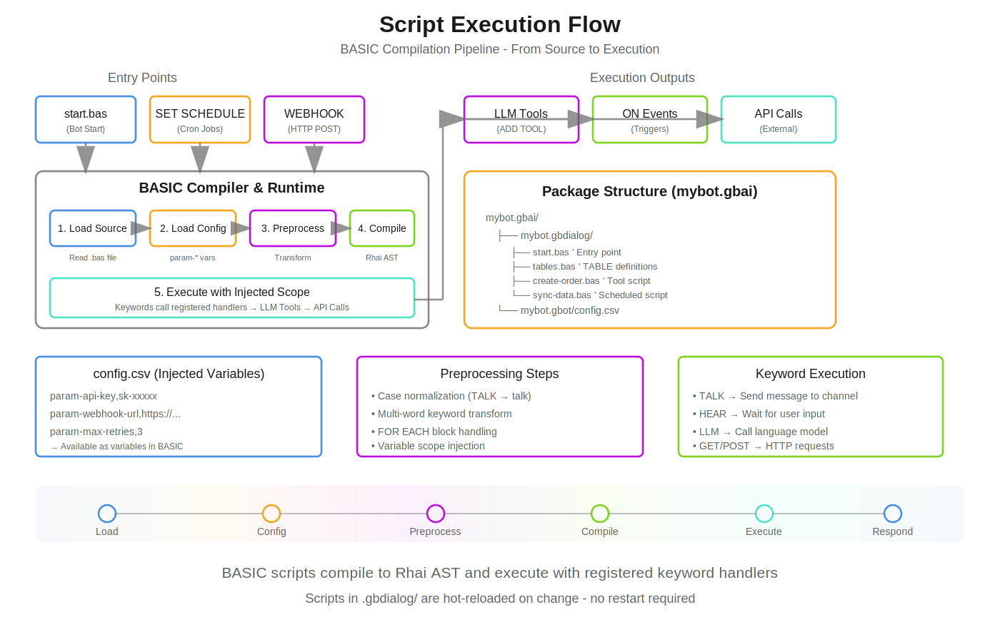

# Script Execution Flow & Entry Points

Understanding how General Bots BASIC scripts are loaded, compiled, and executed is essential for building effective automation. This document covers the complete execution lifecycle.

> **Two execution modes exist:** RUNTIME (default) and WORKFLOW. See [Execution Modes](./execution-modes.md) for the full comparison.

## Execution Entry Points

Scripts in General Bots can be triggered through several entry points:



*BASIC scripts compile to Rhai AST and execute with registered keyword handlers. Scripts in .gbdialog/ are hot-reloaded on change.*

### 1. Bot Startup (`start.bas`)

The primary entry point. Executed when a bot initializes or a conversation begins.

```basic
' start.bas - Primary entry point
' NO MAIN function needed - execution starts at line 1

' 1. Register tools for LLM to use
ADD TOOL "create-order"
ADD TOOL "track-shipment"
ADD TOOL "customer-lookup"

' 2. Load knowledge bases
USE KB "products"
USE KB "policies"

' 3. Set AI context/personality
BEGIN SYSTEM PROMPT
You are a helpful e-commerce assistant for AcmeStore.
You can help customers with orders, tracking, and product questions.
Always be friendly and professional.
END SYSTEM PROMPT

' 4. Setup UI suggestions
CLEAR SUGGESTIONS
ADD SUGGESTION "New Order"
ADD SUGGESTION "Track Package"
ADD SUGGESTION "Contact Support"

' 5. Welcome message
BEGIN TALK
**Welcome to AcmeStore!** 🛒

I can help you:
• Browse and order products
• Track your shipments
• Answer questions

What would you like to do?
END TALK
```

### 2. Scheduled Execution (`SET SCHEDULE`)

Scripts can run on a cron schedule without user interaction.

```basic
' sync-data.bas - Runs automatically on schedule
SET SCHEDULE "0 0 */4 * * *"  ' Every 4 hours

' Variables from config.csv are available
' param-host -> host, param-limit -> limit, param-pages -> pages

SEND EMAIL admin1, "Data sync started..."

page = 1
DO WHILE page > 0 AND page < pages
    res = GET host + "/products?page=" + page + "&limit=" + limit
    
    IF res.data THEN
        MERGE "products" WITH res.data BY "id"
        page = page + 1
    ELSE
        page = 0
    END IF
    
    WAIT 0.5  ' Rate limiting
LOOP

SEND EMAIL admin1, "Sync complete! " + REPORT
RESET REPORT
```

**Cron Format:** `second minute hour day month weekday`

| Pattern | Description |
|---------|-------------|
| `0 0 8 * * *` | Daily at 8:00 AM |
| `0 30 22 * * *` | Daily at 10:30 PM |
| `0 0 0 */2 * *` | Every 2 days at midnight |
| `0 0 * * * *` | Every hour |
| `0 */15 * * * *` | Every 15 minutes |

### 3. Webhook Entry (`WEBHOOK`)

Scripts exposed as HTTP endpoints for external integrations.

```basic
' order-webhook.bas - HTTP endpoint
WEBHOOK "order-received"

' Creates: POST /api/bot/{botname}/order-received
' Parameters become variables automatically

' Access webhook parameters
orderId = GET TOOL PARAM "orderId"
customerEmail = GET TOOL PARAM "email"
amount = GET TOOL PARAM "amount"

' Validate (optional)
IF orderId = "" THEN
    RETURN #{ status: 400, error: "Missing orderId" }
END IF

' Process the webhook
order = NEW OBJECT
order.id = orderId
order.email = customerEmail
order.amount = amount
order.status = "received"
order.timestamp = NOW

SAVE "orders", order

' Notify
TALK TO customerEmail, "Order " + orderId + " received! Total: $" + amount

RETURN #{ status: 200, orderId: orderId, message: "Order processed" }
```

### 4. LLM Tool Invocation

When registered with `ADD TOOL`, scripts become callable by the LLM during conversation.

```basic
' create-order.bas - Called by LLM when user wants to order
PARAM productId AS STRING LIKE "PROD-001" REQUIRED
PARAM quantity AS NUMBER LIKE 1 REQUIRED  
PARAM customerEmail AS STRING LIKE "john@example.com" REQUIRED
DESCRIPTION "Creates a new order for a product"

' This script is invoked by the LLM, not directly by user
' The LLM collects all parameters through natural conversation

product = FIND "products", "id=" + productId

IF ISEMPTY(product) THEN
    RETURN "Product not found: " + productId
END IF

IF product.stock < quantity THEN
    RETURN "Only " + product.stock + " available"
END IF

' Create the order
order = NEW OBJECT
order.id = "ORD-" + FORMAT(NOW, "yyyyMMddHHmmss")
order.productId = productId
order.quantity = quantity
order.total = product.price * quantity
order.customerEmail = customerEmail
order.status = "pending"

SAVE "orders", order

' Update inventory
UPDATE "products", productId, "stock=" + (product.stock - quantity)

RETURN "Order " + order.id + " created! Total: $" + order.total
```

### 5. Event Handlers (`ON`)

React to system events.

```basic
' events.bas - Event handlers
ON "message" CALL HandleMessage
ON "user_joined" CALL WelcomeUser
ON "error" CALL LogError

SUB HandleMessage(message)
    ' Process incoming message
    LOG_INFO "Received: " + message.text
END SUB

SUB WelcomeUser(user)
    TALK TO user.email, "Welcome to our service!"
END SUB

SUB LogError(error)
    LOG_ERROR "Error occurred: " + error.message
    SEND EMAIL admin1, "Bot Error: " + error.message
END SUB
```

---

## Variable Injection from config.csv

Variables defined with `param-` prefix in config.csv are automatically injected into script scope.

### config.csv
```csv
name,value

bot-name,Bling Integration
bot-description,ERP synchronization bot

param-host,https://api.bling.com.br/Api/v3
param-limit,100
param-pages,50
param-admin1,admin@company.com
param-admin2,backup@company.com
param-blingClientID,your-client-id
param-blingClientSecret,your-secret
```

### Script Usage
```basic
' Variables are available without param- prefix
' All normalized to lowercase for case-insensitivity

result = GET host + "/products?limit=" + limit

DO WHILE page < pages
    ' Use injected variables directly
    data = GET host + "/items?page=" + page
LOOP

' Admin emails for notifications
SEND EMAIL admin1, "Sync complete!"
SEND EMAIL admin2, "Backup notification"
```

### Type Conversion

Values are automatically converted:
- Numbers: `param-limit,100` → `limit` as integer `100`
- Floats: `param-rate,0.15` → `rate` as float `0.15`
- Booleans: `param-enabled,true` → `enabled` as boolean `true`
- Strings: Everything else remains as string

---

## Case Insensitivity

**All variables in General Bots BASIC are case-insensitive.**

```basic
' These all refer to the same variable
host = "https://api.example.com"
result = GET Host + "/endpoint"
TALK HOST
```

The preprocessor normalizes all variable names to lowercase while preserving:
- Keywords (remain UPPERCASE for clarity)
- String literals (exact content preserved)
- Comments (skipped entirely)

---

## Script Compilation Flow

```
┌─────────────────────────────────────────────────────────────────┐
│                    COMPILATION PIPELINE                          │
├─────────────────────────────────────────────────────────────────┤
│                                                                 │
│  1. LOAD SOURCE                                                 │
│     └─→ Read .bas file from .gbdialog folder                   │
│                                                                 │
│  2. LOAD CONFIG                                                 │
│     └─→ Read config.csv, extract param-* entries               │
│     └─→ Inject into execution scope                            │
│                                                                 │
│  3. PREPROCESS                                                  │
│     ├─→ Strip comments (REM, ', //)                            │
│     ├─→ Process SWITCH/CASE blocks                             │
│     ├─→ Normalize variables to lowercase                       │
│     ├─→ Transform multi-word keywords                          │
│     └─→ Handle FOR EACH blocks                                 │
│                                                                 │
│  4. COMPILE                                                     │
│     └─→ Parse to Rhai AST                                      │
│                                                                 │
│  5. EXECUTE                                                     │
│     └─→ Run AST with injected scope                            │
│     └─→ Keywords call registered handlers                      │
│                                                                 │
└─────────────────────────────────────────────────────────────────┘
```

---

## Functions vs Entry Points

### NO MAIN Function

Unlike traditional programming, BASIC scripts do NOT use a `MAIN` function. Execution starts at line 1.

```basic
' ❌ WRONG - Don't do this
SUB MAIN()
    TALK "Hello"
END SUB

' ✅ CORRECT - Start directly
TALK "Hello"
```

### SUB and FUNCTION for Reuse

Use `SUB` and `FUNCTION` for reusable code within tools, not as entry points.

```basic
' sync-products.bas - A complex tool with helper functions

FUNCTION CalculateDiscount(price, percentage)
    RETURN price * (1 - percentage / 100)
END FUNCTION

SUB NotifyAdmin(message)
    SEND EMAIL admin1, message
    LOG_INFO message
END SUB

SUB ProcessProduct(product)
    IF product.discount > 0 THEN
        product.finalPrice = CalculateDiscount(product.price, product.discount)
    ELSE
        product.finalPrice = product.price
    END IF
    SAVE "products", product
END SUB

' Main execution starts here (not in a MAIN sub)
products = GET host + "/products"

FOR EACH product IN products.data
    CALL ProcessProduct(product)
NEXT product

CALL NotifyAdmin("Processed " + COUNT(products.data) + " products")
```

---

## Tool Chain Pattern

Register tools in `start.bas`, implement in separate files:

### start.bas
```basic
' Register tools - LLM can call these
ADD TOOL "create-customer"
ADD TOOL "update-customer"
ADD TOOL "delete-customer"

' Or clear and re-register
CLEAR TOOLS
ADD TOOL "order-management"
ADD TOOL "inventory-check"
```

### create-customer.bas
```basic
PARAM name AS STRING LIKE "John Doe" REQUIRED
PARAM email AS STRING LIKE "john@example.com" REQUIRED
PARAM phone AS STRING LIKE "+1-555-0123"
DESCRIPTION "Creates a new customer record in the CRM"

' Tool implementation
customer = NEW OBJECT
customer.id = "CUS-" + FORMAT(NOW, "yyyyMMddHHmmss")
customer.name = name
customer.email = email
customer.phone = phone
customer.createdAt = NOW

SAVE "customers", customer

RETURN #{ 
    success: true, 
    customerId: customer.id,
    message: "Customer created successfully"
}
```

---

## Best Practices

### 1. Organize by Purpose

```
mybot.gbai/
├── mybot.gbdialog/
│   ├── start.bas           ' Entry point, tool registration
│   ├── tables.bas          ' Database schema (TABLE definitions)
│   │
│   ├── create-order.bas    ' Tool: order creation
│   ├── track-order.bas     ' Tool: order tracking
│   ├── cancel-order.bas    ' Tool: order cancellation
│   │
│   ├── sync-products.bas   ' Scheduled: product sync
│   ├── sync-inventory.bas  ' Scheduled: inventory sync
│   │
│   └── order-webhook.bas   ' Webhook: external orders
│
├── mybot.gbot/
│   └── config.csv          ' Configuration & param-* variables
│
└── mybot.gbkb/             ' Knowledge base files
```

### 2. Use param-* for Configuration

Keep credentials and settings in config.csv, not hardcoded:

```basic
' ❌ WRONG
host = "https://api.bling.com.br/Api/v3"
apiKey = "hardcoded-key"

' ✅ CORRECT - From config.csv
' param-host and param-apiKey in config.csv
result = GET host + "/endpoint"
SET HEADER "Authorization", "Bearer " + apikey
```

### 3. Error Handling in Tools

```basic
PARAM orderId AS STRING REQUIRED
DESCRIPTION "Cancels an order"

order = FIND "orders", "id=" + orderId

IF ISEMPTY(order) THEN
    RETURN #{ success: false, error: "Order not found" }
END IF

IF order.status = "shipped" THEN
    RETURN #{ success: false, error: "Cannot cancel shipped orders" }
END IF

UPDATE "orders", orderId, "status=cancelled"

RETURN #{ success: true, message: "Order cancelled" }
```

### 4. Logging for Scheduled Jobs

```basic
SET SCHEDULE "0 0 6 * * *"

LOG_INFO "Daily sync started"

' ... sync logic ...

IF errorCount > 0 THEN
    LOG_WARN "Sync completed with " + errorCount + " errors"
    SEND EMAIL admin1, "Sync Warning", REPORT
ELSE
    LOG_INFO "Sync completed successfully"
END IF

RESET REPORT
```

---

## See Also

- [Keyword Reference](./keywords.md) - Complete keyword documentation
- [SET SCHEDULE](./keyword-set-schedule.md) - Scheduling details
- [WEBHOOK](./keyword-webhook.md) - Webhook configuration
- [Tools System](./keyword-use-tool.md) - Tool registration
- [BEGIN SYSTEM PROMPT](./prompt-blocks.md) - AI context configuration