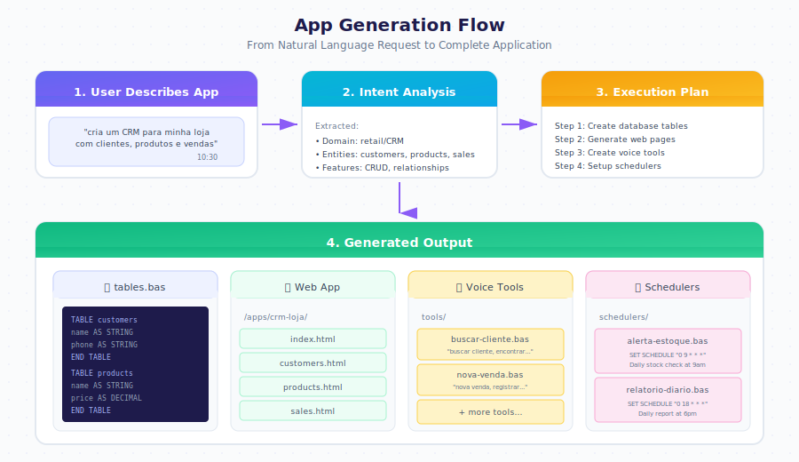

# App Generation

From natural language to complete application, the generation process handles database design, UI creation, and automation setup.

---

## How It Works

You describe what you need. The system analyzes your request, identifies the domain, extracts entities, and generates everything automatically.

  

    

      
Create an inventory app for my store

      
10:30

    

  

  

    

      
<strong>Done:</strong>

      
products table created

      
categories table created

      
suppliers table created

      
App available at /apps/inventory

      
10:31

    

  

---

## What Gets Created

| Component | Location | Description |
|-----------|----------|-------------|
| Database tables | `tables.bas` | Data schema with fields and types |
| Web pages | `/apps/{name}/` | HTMX-based user interface |
| Voice commands | `.gbdialog/tools/` | Activated by trigger phrases |
| Automations | `.gbdialog/schedulers/` | Timed tasks and reports |

---

## Modifying Your App

Use conversation to change any aspect of your application.

  

    

      
Add a supplier field to products

      
14:20

    

  

  

    

      
Supplier field added to products table.

      
Form updated in products.html.

      
14:20

    

  

  

    

      
Change the header color to red

      
14:21

    

  

  

    

      
Header color updated to red in styles.css.

      
14:21

    

  

---

## Multiple Apps, Shared Data

Create different applications that share the same database tables.

  

    

      
Create a reports app using the same inventory data

      
15:00

    

  

  

    

      
<strong>Done:</strong>

      
App created at /apps/inventory-reports

      
Uses existing tables: products, categories, suppliers

      
15:01

    

  

---

## Generation Process

| Phase | Description |
|-------|-------------|
| **Intent Analysis** | LLM identifies domain and required entities |
| **Schema Design** | Tables and relationships defined |
| **UI Generation** | HTMX pages created for each entity |
| **Tool Creation** | Voice commands for common actions |
| **Scheduler Setup** | Automations for reports and alerts |

---

## Next Steps

- [Designer Guide](./designer.md) — All modification commands
- [Data Model](./data-model.md) — Understanding table definitions