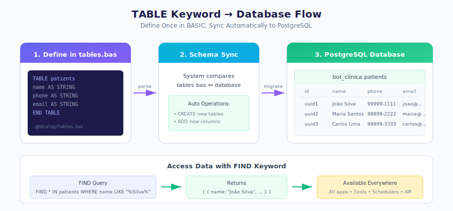

# Data Model

Tables store your application data. When you describe what you need, the system creates table definitions automatically in `tables.bas`.

---

## What Is a Table?

A table organizes related data into rows and columns, similar to a spreadsheet.

| id | name | phone | email |
|----|------|-------|-------|
| 1 | John Smith | 555-1234 | john@email.com |
| 2 | Maria Garcia | 555-5678 | maria@email.com |

---

## Creating Tables

Describe what data you need to store.

  

    

      
I need a customers table with name, phone, and email

      
10:30

    

  

  

    

      
customers table created with fields:

      
name (STRING)

      
phone (STRING)

      
email (STRING)

      
10:30

    

  

---

## Adding Fields

Add new fields to existing tables through conversation.

  

    

      
Add address to customers

      
14:15

    

  

  

    

      
Address field added to customers table.

      
14:15

    

  

---

## Field Types

| Type | Use For | Example |
|------|---------|---------|
| `STRING` | Short text | Names, phones |
| `TEXT` | Long text | Notes, descriptions |
| `INTEGER` | Whole numbers | Age, quantity |
| `DECIMAL` | Numbers with decimals | Price, weight |
| `BOOLEAN` | Yes/No values | Active, completed |
| `DATE` | Dates only | Birth date |
| `DATETIME` | Date and time | Appointment time |

---

## Searching Data

Use natural language to find records.

  

    

      
Find customers named Smith

      
11:00

    

  

  

    

      
<strong>Found 2 customers:</strong>

      
John Smith - 555-1234

      
Jane Smith - 555-9876

      
11:00

    

  

---

## Linking Tables

Create relationships between tables.

  

    

      
Create orders table linked to customers

      
11:30

    

  

  

    

      
orders table created with:

      
customer_id (links to customers)

      
date (DATETIME)

      
total (DECIMAL)

      
status (STRING)

      
11:30

    

  

---

## Shared Data

All applications within a bot share the same tables. Change data in one app, and it updates everywhere.

| Concept | Description |
|---------|-------------|
| One bot = one database | All apps share tables |
| Schema in tables.bas | Single source of truth |
| Auto-sync | Changes deploy automatically |

---

## TABLE Keyword

Tables are defined in `.gbdialog/tables.bas` using the TABLE keyword:

| Syntax | Description |
|--------|-------------|
| `TABLE name` | Start table definition |
| `field AS TYPE` | Define a field |
| `END TABLE` | End table definition |

---

## FIND Keyword

Query data using the FIND keyword:

| Syntax | Description |
|--------|-------------|
| `FIND * IN table` | Get all records |
| `FIND * IN table WHERE condition` | Filter records |
| `FIND field1, field2 IN table` | Select specific fields |

---

## Next Steps

- [Designer Guide](./designer.md) — Modify tables through conversation
- [Examples](./examples.md) — Real-world data models