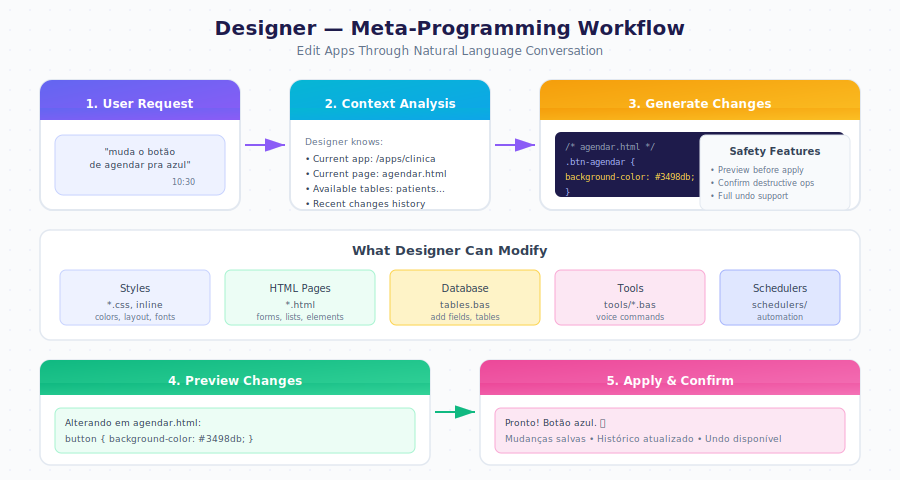

# Designer

Designer is an AI assistant that appears alongside your application. Use natural conversation to modify any aspect of your app without writing code.

---

## How It Works

Designer understands the context of your application. When you make a request, it knows which app you are viewing, which page is active, and what tables exist.

  

    

      
Change the schedule button to blue

      
10:30

    

  

  

    

      
Updating schedule.html:

      
.btn-schedule { background-color: #3498db; }

      
Button color changed to blue.

      
10:30

    

  

---

## What Designer Can Modify

| Category | Examples |
|----------|----------|
| **Styles** | Colors, layout, fonts, spacing |
| **HTML Pages** | Forms, lists, buttons, elements |
| **Database** | Add fields, create tables |
| **Tools** | Voice commands, chat triggers |
| **Schedulers** | Automated tasks, reports |

---

## Editing Styles

  

    

      
Make the colors more modern, blue tones

      
14:20

    

  

  

    

      
Updating styles.css:

      
Primary color: #2563eb

      
Secondary color: #3b82f6

      
Background: #f8fafc

      
Visual style updated.

      
14:20

    

  

---

## Adding Form Fields

  

    

      
Add an insurance field to the patient form

      
11:00

    

  

  

    

      
Making two changes:

      
<strong>1. tables.bas</strong> - new field:

      
insurance AS STRING

      
<strong>2. patients.html</strong> - new input added

      
Insurance field added to form.

      
11:00

    

  

---

## Creating Voice Commands

  

    

      
Create a command to see today's appointments

      
09:15

    

  

  

    

      
Creating .gbdialog/tools/todays-appointments.bas

      
Triggers: "today's appointments", "daily schedule"

      
Command created. Say "today's appointments" to use it.

      
09:15

    

  

---

## Creating Schedulers

  

    

      
Every day at 9am send reminders to today's patients

      
16:00

    

  

  

    

      
Creating .gbdialog/schedulers/daily-reminder.bas

      
Schedule: Every day at 9:00 AM

      
Action: Send reminder to patients with appointments today

      
Scheduler configured.

      
16:00

    

  

---

## Adding Database Fields

  

    

      
Add SSN field to the patients table

      
10:45

    

  

  

    

      
Updating tables.bas:

      
Adding: ssn AS STRING UNIQUE INDEX

      
Database synchronized.

      
Field available in all apps.

      
10:45

    

  

---

## Context Awareness

Designer tracks your current location and correlates follow-up requests.

| Context | How It Is Used |
|---------|----------------|
| **Current app** | Edits apply to that app's files |
| **Current page** | Defaults edits to that file |
| **Recent changes** | Correlates follow-up requests |
| **Available tables** | Knows your data structure |
| **Existing tools** | Knows voice commands already created |

  

    

      
Change the button to green

      
14:30

    

  

  

    

      
Changing button in schedule.html to green.

      
Button updated.

      
14:30

    

  

  

    

      
And add a notes field

      
14:31

    

  

  

    

      
Adding notes field to the same form.

      
Field added.

      
14:31

    

  

---

## Handling Sensitive Information

When Designer needs API keys or credentials:

  

    

      
Integrate with Stripe for payments

      
15:00

    

  

  

    

      
To integrate with Stripe, I need the API Key.

      
Do you want to provide it now or later?

      
15:00

    

  

  

    

      
Later

      
15:00

    

  

  

    

      
Saved as pending item.

      
Pending: Stripe API Key

      
You can provide it in Settings, Pending Items.

      
Payment structure created. When you provide the key, it will work automatically.

      
15:01

    

  

---

## Preview Before Changes

Designer shows what will change before applying destructive operations.

  

    

      
Remove the email field from the form

      
11:30

    

  

  

    

      
I will remove the email field from patients.html.

      
<strong>Note:</strong> The field will remain in the database. Existing data will not be lost.

      
Confirm?

      
11:30

    

  

  

    

      
Yes

      
11:30

    

  

  

    

      
Field removed from form.

      
11:30

    

  

---

## Safety Features

| Feature | Description |
|---------|-------------|
| Preview changes | Shows what will change before applying |
| Confirm destructive actions | Asks before deleting |
| Change history | All changes are logged |
| Undo support | Can undo recent changes |

---

## Limitations

| Limitation | Reason |
|------------|--------|
| Cannot delete entire app | Safety protection |
| Cannot access external systems without credentials | Security |
| Cannot modify system files | Isolation |
| Cannot execute arbitrary code | Security |

---

## Available Keywords

Designer uses GB BASIC keywords to implement changes:

| Category | Keywords |
|----------|----------|
| **Communication** | TALK, HEAR, SEND MAIL, SEND TEMPLATE |
| **Data** | FIND, SAVE, UPDATE, DELETE |
| **Automation** | SET SCHEDULE, ON CHANGE, ON EMAIL |
| **AI** | LLM, USE KB |
| **Web** | SCRAPE, GET, POST, RSS |
| **Memory** | SET BOT MEMORY, GET BOT MEMORY |
| **Control** | IF/THEN/ELSE, FOR EACH/NEXT, WHILE/WEND |

---

## Undoing Changes

  

    

      
Undo the last change

      
12:00

    

  

  

    

      
Last change: Removed email field from patients.html

      
Do you want to undo?

      
12:00

    

  

  

    

      
Yes

      
12:00

    

  

  

    

      
Email field restored.

      
12:00

    

  

---

## Tips for Better Results

### Be Specific

| Less Effective | More Effective |
|----------------|----------------|
| "improve the form" | "add email validation to the form" |
| "change the colors" | "change the main button to green" |
| "fix this" | "increase the font size in the table" |

### Combine Requests

  

    

      
Add SSN field to patient form with mask and validation, and show it in the list too

      
10:00

    

  

  

    

      
Making 3 changes:

      
1. tables.bas - new SSN field

      
2. patients.html - input with mask XXX-XX-XXXX

      
3. patients.html - SSN column in the table

      
All changes applied.

      
10:00

    

  

---

## Next Steps

- [App Generation](./app-generation.md) — How apps are created
- [Task Workflow](./workflow.md) — How tasks are processed
- [Data Model](./data-model.md) — TABLE keyword reference