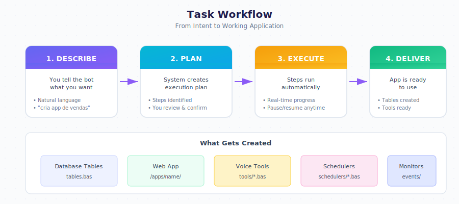

# Task Workflow

From request to working application, the task workflow handles every step automatically.

---

## The Three Steps

| Step | What Happens |
|------|--------------|
| 1. **Describe** | You tell the bot what you want in plain language |
| 2. **Plan** | System analyzes and creates an execution plan |
| 3. **Execute** | Steps run automatically, app is delivered |

---

## Example Workflow

  

    

      
Create a CRM for my store with customers, products, and sales

      
10:30

    

  

  

    

      
<strong>Planning:</strong>

      
Step 1: Create database tables

      
Step 2: Generate customer management UI

      
Step 3: Generate product inventory UI

      
Step 4: Generate sales tracking UI

      
Step 5: Create voice commands

      
10:30

    

  

  

    

      
<strong>Done:</strong>

      
customers table created

      
products table created

      
sales table created

      
App available at /apps/crm

      
10:31

    

  

---

## Error Handling

When something goes wrong, the system asks what to do.

  

    

      
<strong>Error:</strong> Could not create chart component

      
Options: Retry, Skip, Cancel

      
10:32

    

  

  

    

      
Skip

      
10:32

    

  

  

    

      
Skipped chart component. Continuing with remaining steps.

      
10:32

    

  

---

## Approval Requests

Some actions require confirmation before executing.

  

    

      
<strong>Approval required:</strong>

      
This action will send 50 emails to customers.

      
Confirm?

      
11:00

    

  

  

    

      
Yes

      
11:00

    

  

  

    

      
50 emails sent successfully.

      
11:01

    

  

---

## Actions Requiring Approval

| Action | Reason |
|--------|--------|
| Bulk email sends | Prevents accidental spam |
| Data deletion | Prevents data loss |
| External API calls | Cost and security |
| Schema changes | Database integrity |

---

## Next Steps

- [Designer Guide](./designer.md) — Edit apps through conversation
- [Examples](./examples.md) — Real-world applications