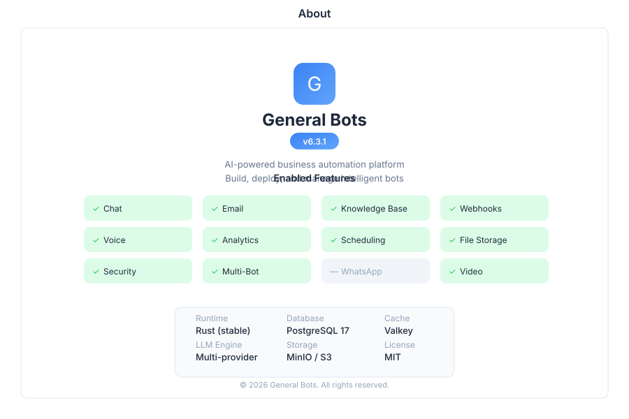

# About - General Bots

> **Product information**

---

## Overview

The About page provides comprehensive product information for General Bots Suite. View version details, enabled features, system configuration, and copyright information. This page serves as the central reference for platform identification and support.

---

## Features

### Version Information

| Field | Description |
|-------|-------------|
| **Platform Version** | Current General Bots Suite version |
| **Build Number** | Compilation identifier |
| **Release Date** | When this version was released |
| **Release Channel** | Stable, Beta, or Nightly |
| **Last Updated** | When the system was last updated |

### Enabled Features

| Feature | Status |
|---------|--------|
| **Bot Engine** | Core bot runtime |
| **LLM Integration** | AI language model support |
| **Knowledge Base** | Document processing and retrieval |
| **Video Monitoring** | AI camera surveillance |
| **Email Service** | SMTP/IMAP email handling |
| **WhatsApp** | WhatsApp Business API |
| **Video Conferencing** | LiveKit integration |
| **Object Storage** | MinIO file storage |
| **Vector Database** | Qdrant embeddings |

### System Details

| Component | Information |
|-----------|-------------|
| **Operating System** | Server environment details |
| **Database** | PostgreSQL version and status |
| **Cache** | Valkey/Redis version and status |
| **Storage** | MinIO bucket configuration |
| **Runtime** | Rust version and build info |

### Copyright

| Field | Description |
|-------|-------------|
| **Copyright** | © 2024 General Bots |
| **License** | Open source / Commercial |
| **Website** | General Bots official site |
| **Documentation** | Technical documentation |
| **Support** | Contact information |

---

## Related Pages

- [Suite](suite.md) — Suite overview and navigation
- [Admin](admin.md) — System administration
- [Compliance](compliance.md) — Compliance information