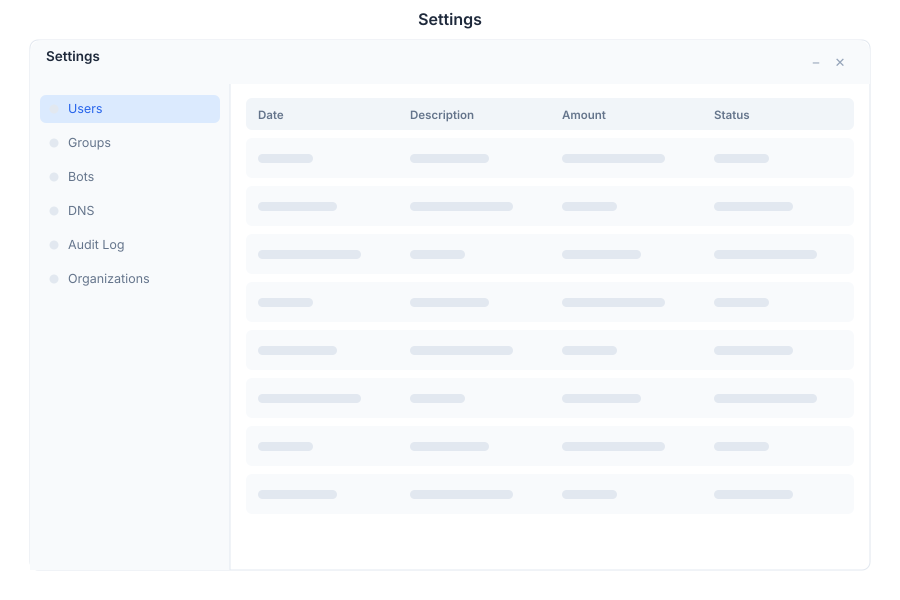

# Admin 🟡 BETA - Administration Panel

> **Full system administration console**



---

## Overview

Admin is the central administration console in General Bots Suite. Manage users, roles, organizations, billing, compliance, and system health from a single dashboard. Admin gives administrators full control over the platform without touching the command line.

---

## Features

### Dashboard

The operations dashboard provides a real-time overview of system health and usage.

| Metric | Description |
|--------|-------------|
| **Active Users** | Total users with sessions in the last 30 days |
| **Bots Running** | Currently deployed and active bots |
| **Messages Today** | Total messages processed across all bots |
| **System Uptime** | Service availability percentage |

### User Management

| Action | Description |
|--------|-------------|
| **Create User** | Add new user with email, name, and initial role |
| **Edit User** | Update profile, role, or organization membership |
| **Deactivate** | Disable user without deleting history |
| **Reset Password** | Send password reset email |
| **Impersonate** | Login as user for support (audit logged) |

### Roles & Permissions

| Role | Access Level |
|------|-------------|
| **Admin** | Full system access, user management, billing |
| **Operator** | Bot management, conversations, analytics |
| **Viewer** | Read-only access to dashboards and reports |
| **Custom** | Define granular permissions per resource |

### Organization Management

Multi-tenant organization support:

| Field | Description |
|-------|-------------|
| **Name** | Organization display name |
| **Slug** | URL-safe identifier |
| **Plan** | Subscription tier (Free, Pro, Enterprise) |
| **Members** | User count and limits |
| **Bots** | Bot count and limits |
| **Storage** | Drive usage and limits |

### Billing Dashboard

| Section | Description |
|---------|-------------|
| **Subscription** | Current plan, renewal date, usage |
| **Invoices** | Payment history and downloadable invoices |
| **Usage** | API calls, storage, active users metrics |
| **Payment Method** | Credit card or payment provider management |

### Compliance Center

| Feature | Description |
|---------|-------------|
| **Audit Log** | Track all admin actions with timestamps |
| **Data Exports** | LGPD/GDPR data export requests |
| **Retention Policies** | Auto-delete old conversations and data |
| **Access Reviews** | Periodic permission audits |

---

## Navigation

| Section | Icon | Description |
|---------|------|-------------|
| Dashboard | 📊 | System overview and metrics |
| Users | 👥 | User management |
| Roles | 🔐 | Permission and role configuration |
| Organizations | 🏢 | Multi-tenant org management |
| DNS | 🌐 | Custom domain configuration |
| Billing | 🋓 | Subscription and payments |
| Compliance | 🛡 | Audit, GDPR, data governance |
| Onboarding | 📦 | New user setup wizards |
| Settings | 🔧 | System-wide configuration |

---

## Keyboard Shortcuts

| Shortcut | Action |
|----------|--------|
| `G` then `D` | Go to Dashboard |
| `G` then `U` | Go to Users |
| `G` then `R` | Go to Roles |
| `N` | Create new user |
| `/` | Focus search |
| `?` | Show shortcuts |

---

## Accessing Admin

### Via Suite

1. Open Suite desktop
2. Click **Admin** in the app launcher
3. Requires **Admin** or **Operator** role

### Via URL

Navigate directly to:

```
/admin/
```

### Role Requirements

| Action | Required Role |
|--------|---------------|
| View Dashboard | Admin, Operator |
| Manage Users | Admin |
| Manage Roles | Admin |
| Manage Organizations | Admin |
| View Billing | Admin |
| Manage Billing | Admin |
| View Compliance | Admin, Operator |
| Export Data | Admin |

---

## Admin via Chat

### Checking System Status

<div class="wa-chat">
  <div class="wa-message user">
    <div class="wa-bubble">
      <p>System status</p>
      <div class="wa-time">09:00</div>
    </div>
  </div>
  <div class="wa-message bot">
    <div class="wa-bubble">
      <p>System Health:</p>
      <p>✅ BotServer - Running (port 8080)</p>
      <p>✅ PostgreSQL - Connected (5432)</p>
      <p>✅ Valkey - Connected (6379)</p>
      <p>✅ MinIO - Running (9000)</p>
      <p>📊 Uptime: 99.9% (30 days)</p>
      <div class="wa-time">09:00</div>
    </div>
  </div>
</div>

### Creating a User

<div class="wa-chat">
  <div class="wa-message user">
    <div class="wa-bubble">
      <p>Create user maria@company.com as Operator</p>
      <div class="wa-time">09:05</div>
    </div>
  </div>
  <div class="wa-message bot">
    <div class="wa-bubble">
      <p>✅ User created:</p>
      <p>📧 maria@company.com</p>
      <p>👤 Role: Operator</p>
      <p>🔑 Invitation sent</p>
      <div class="wa-time">09:05</div>
    </div>
  </div>
</div>

---

## API Reference

Admin operations are available via REST API:

| Endpoint | Method | Description |
|----------|--------|-------------|
| `/api/admin/users` | GET | List all users |
| `/api/admin/users` | POST | Create user |
| `/api/admin/users/:id` | PUT | Update user |
| `/api/admin/users/:id` | DELETE | Delete user |
| `/api/admin/roles` | GET | List roles |
| `/api/admin/orgs` | GET | List organizations |
| `/api/admin/audit` | GET | Audit log entries |
| `/api/admin/health` | GET | System health check |

---

## Related Pages

- [Suite User Manual](../suite-manual.md) — Full Suite overview
- [RBAC Overview](../../09-security/rbac-overview.md) — Role-based access control
- [Permissions Matrix](../../09-security/permissions-matrix.md) — Detailed permissions
- [Compliance Requirements](../../09-security/compliance-requirements.md) — LGPD/GDPR/HIPAA
