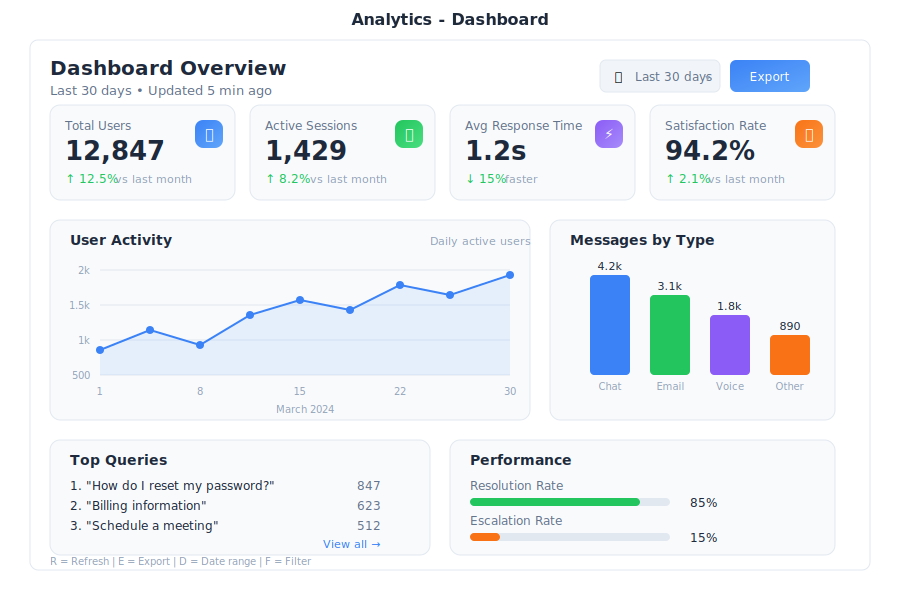

# Analytics - Dashboards

> **Your business intelligence center**



---

## Overview

Analytics is the data visualization and reporting app in General Bots Suite. Track key metrics, build custom dashboards, generate reports, and get AI-powered insights about your business. Analytics turns your data into actionable information.

---

## Features

### Dashboard Overview

Dashboards are collections of widgets that display your data visually.

**Default Dashboards:**

| Dashboard | What It Shows |
|-----------|---------------|
| **Overview** | Key metrics across all areas |
| **Sales** | Revenue, deals, pipeline |
| **Marketing** | Campaigns, leads, conversion |
| **Support** | Tickets, response time, satisfaction |
| **HR** | Headcount, hiring, retention |

---

### Creating a Dashboard

**Step 1: Click "+ New" in the sidebar**

Fill in the dashboard details:
- **Dashboard Name** - A descriptive title (e.g., "Q2 Performance")
- **Description** - Optional context for the dashboard
- **Template** - Start blank, use a template, or copy from existing

**Step 2: Add Widgets**

Click **+ Widget** and choose a visualization type.

---

### Widget Types

**Numbers:**
- **Number** - Single metric display
- **Comparison** - Metric with percentage change
- **Progress** - Goal tracking with progress bar

**Charts:**
- **Line** - Trends over time
- **Bar** - Category comparisons
- **Area** - Volume visualization
- **Pie** - Proportional breakdown

**Tables & Lists:**
- **Table** - Data grid with sorting
- **Leaderboard** - Ranked list
- **List** - Simple bullet items

**Special:**
- **Geography** - Map visualization
- **Heatmap** - Intensity grid
- **AI Summary** - AI-generated insights

---

### Configuring Widgets

After selecting a widget type, configure the data source:

| Setting | Description |
|---------|-------------|
| **Title** | Widget display name |
| **Source** | Database or data connection |
| **Table** | Specific table to query |
| **X-Axis** | Horizontal dimension |
| **Y-Axis** | Vertical measure |
| **Group By** | Time period or category |
| **Aggregate** | Sum, Count, Average, etc. |
| **Filters** | Conditions to apply |

---

### Key Metric Cards

Display important numbers with context:

| Element | Purpose |
|---------|---------|
| **Value** | The main metric number |
| **Trend Arrow** | Up/down indicator |
| **Comparison** | vs last period |
| **Progress Bar** | Visual goal tracking |
| **Goal** | Target value |

**Color Indicators:**

| Color | Meaning |
|-------|---------|
| 🟢 Green (▲) | Positive trend / On target |
| 🔴 Red (▼) | Negative trend / Below target |
| 🟡 Yellow (─) | No change / Needs attention |
| ⚪ Gray | No comparison available |

---

### AI Insights ✨

Let AI analyze your data and surface insights:

**Insight Types:**

| Category | What It Shows |
|----------|---------------|
| **📈 Trends** | Patterns and momentum in your data |
| **⚠️ Alerts** | Issues that need attention |
| **💡 Recommendations** | Suggested actions |
| **🎯 Predictions** | Forecasts based on current data |

**Ask the AI:**

<div class="wa-chat">
  <div class="wa-message user">
    <div class="wa-bubble">
      <p>Why did revenue spike in March?</p>
      <div class="wa-time">10:30</div>
    </div>
  </div>
  <div class="wa-message bot">
    <div class="wa-bubble">
      <p>March revenue increased 28% due to three factors:</p>
      <p>1. <strong>Enterprise Deal Closure</strong> - Three large deals ($150K+) that were in pipeline since Q4 closed in March</p>
      <p>2. <strong>Annual Renewals</strong> - 15 customers renewed annual contracts (worth $320K total)</p>
      <p>3. <strong>Product Launch</strong> - The new feature release drove 12 new mid-market signups</p>
      <p>The spike is partially seasonal (end of Q1) and partially due to the product launch timing.</p>
      <div class="wa-time">10:30</div>
    </div>
  </div>
</div>

---

### Reports

Generate and schedule reports:

**Creating a Report:**

1. Click **+ New** under Reports
2. Select report type
3. Configure data and format
4. Schedule delivery (optional)

**Report Options:**

| Setting | Options |
|---------|---------|
| **Content** | Dashboard, AI insights, raw data |
| **Date Range** | Last 7/30/90 days, quarter, custom |
| **Format** | PDF, Interactive Web, Excel, PowerPoint |
| **Schedule** | Daily, Weekly, Monthly |
| **Recipients** | Email addresses for delivery |

---

### Data Sources

Connect Analytics to various data sources:

| Source Type | Examples |
|-------------|----------|
| **Databases** | PostgreSQL, MySQL, SQLite |
| **Files** | Excel, CSV, JSON |
| **APIs** | REST endpoints, GraphQL |
| **Apps** | CRM, Support, Calendar data |
| **Bot Data** | Conversation logs, user data |

**Adding a Data Source:**

1. Go to **Settings** → **Data Sources**
2. Click **+ Add Source**
3. Select source type
4. Enter connection details
5. Test and save

---

### Sharing Dashboards

Share dashboards with your team:

1. Click **Share** on any dashboard
2. Set permissions (View, Edit, Owner)
3. Copy link or invite by email

**Permission Levels:**

| Level | Can Do |
|-------|--------|
| **View** | See dashboard, apply filters |
| **Edit** | Modify widgets, change layout |
| **Owner** | Full control, manage sharing |

**Link Sharing:**
- **Off** - Only specific people can access
- **On** - Anyone with link can view

---

## Keyboard Shortcuts

| Shortcut | Action |
|----------|--------|
| `R` | Refresh dashboard |
| `F` | Toggle fullscreen |
| `E` | Edit mode |
| `N` | New widget |
| `D` | Duplicate widget |
| `Delete` | Delete selected widget |
| `Ctrl+S` | Save dashboard |
| `Ctrl+P` | Print / Export PDF |
| `Ctrl+F` | Find / Filter |
| `/` | Quick search |
| `←` `→` | Navigate dashboards |
| `Escape` | Exit edit mode |

---

## Tips & Tricks

### Dashboard Design

💡 **Keep it simple** - 5-7 widgets per dashboard is optimal

💡 **Most important metrics at top** - Follow the F-pattern reading

💡 **Use consistent colors** - Same metric = same color across widgets

💡 **Group related widgets** - Keep sales metrics together

### Data Tips

💡 **Set up daily sync** for data sources that change frequently

💡 **Use filters** to let viewers customize their view

💡 **Add comparison periods** (vs last month, vs last year)

💡 **Include goals/targets** to show progress

### AI Tips

💡 **Ask "why" questions** - AI excels at explaining trends

💡 **Request predictions** for planning

💡 **Use AI for anomaly detection** - "What's unusual this month?"

💡 **Generate executive summaries** before board meetings

---

## Troubleshooting

### Dashboard not loading

**Possible causes:**
1. Data source disconnected
2. Query timeout
3. Permission issues

**Solution:**
1. Check data source status in Settings
2. Reduce date range or add filters
3. Verify you have dashboard access
4. Refresh the page

---

### Data not updating

**Possible causes:**
1. Sync schedule not running
2. Source data hasn't changed
3. Cache showing old data

**Solution:**
1. Click Refresh on the dashboard
2. Check data source sync status
3. Go to Settings → Clear cache
4. Verify source data has new records

---

### Charts showing wrong numbers

**Possible causes:**
1. Filter applied incorrectly
2. Wrong aggregation method
3. Date range mismatch

**Solution:**
1. Check widget filters
2. Verify aggregation (Sum vs Count vs Average)
3. Confirm date range matches expectations
4. Edit widget and review query

---

### Export not working

**Possible causes:**
1. Dashboard too large
2. Browser blocking download
3. Permission restrictions

**Solution:**
1. Try exporting individual widgets
2. Check browser download settings
3. Use a different export format
4. Contact administrator for permissions

---

## BASIC Integration

Use Analytics in your bot dialogs:

### Query Metrics

```botserver/docs/src/07-user-interface/apps/analytics.basic
revenue = GET METRIC "total_revenue" FOR "this month"
lastMonth = GET METRIC "total_revenue" FOR "last month"

growth = ((revenue - lastMonth) / lastMonth) * 100

TALK "Revenue this month: $" + FORMAT(revenue, "#,##0")
TALK "Growth: " + FORMAT(growth, "#0.0") + "%"
```

### Generate Reports

```botserver/docs/src/07-user-interface/apps/analytics-reports.basic
HEAR period AS TEXT "Which period? (weekly/monthly/quarterly)"

report = GENERATE REPORT "Sales Summary" FOR period

TALK "Here's your " + period + " sales report:"
SEND FILE report.pdf

TALK "Key highlights:"
TALK report.summary
```

### Get AI Insights

```botserver/docs/src/07-user-interface/apps/analytics-insights.basic
insights = GET INSIGHTS FOR "Sales Dashboard"

TALK "Here are today's insights:"
FOR EACH insight IN insights.trends
    TALK "📈 " + insight
NEXT

TALK "Alerts:"
FOR EACH alert IN insights.alerts
    TALK "⚠️ " + alert
NEXT
```

### Create Dashboard Widget

```botserver/docs/src/07-user-interface/apps/analytics-widget.basic
widget = NEW OBJECT
widget.type = "line_chart"
widget.title = "Daily Active Users"
widget.source = "bot_analytics"
widget.xAxis = "date"
widget.yAxis = "active_users"
widget.dateRange = "last 30 days"

ADD WIDGET widget TO "Overview Dashboard"
TALK "Widget added successfully"
```

### Scheduled Reports

```botserver/docs/src/07-user-interface/apps/analytics-scheduled.basic
' This dialog runs on a schedule
report = GENERATE REPORT "Weekly Metrics" FOR "last 7 days"

recipients = ["ceo@company.com", "team@company.com"]

FOR EACH recipient IN recipients
    SEND MAIL recipient, "Weekly Metrics Report - " + TODAY, 
        "Please find attached the weekly metrics report.", [report.pdf]
NEXT

LOG "Weekly report sent to " + COUNT(recipients) + " recipients"
```

---

## See Also

- [Research App](./research.md) - Deep dive into data questions
- [Paper App](./paper.md) - Create reports from insights
- [How To: Monitor Your Bot](../how-to/monitor-sessions.md)
- [Talk to Data Template](../../02-architecture-packages/templates.md)