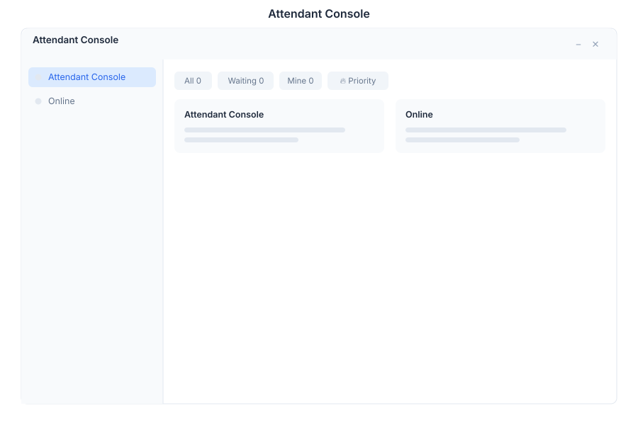

# Attendant 🟡 BETA - Human Agent Console

> **AI-assisted customer support**



---

## Overview

Attendant is the human agent console in General Bots Suite. Accept conversations transferred from bots, view customer history, and respond in real time. Attendant provides AI-assisted suggestions, queue management, and seamless bot-to-human handoff for exceptional customer support.

---

## Features

### Queue

| Status | Description |
|--------|-------------|
| 🟢 Waiting | New conversations awaiting acceptance |
| 🟡 In Progress | Conversations being handled |
| 🔴 Escalated | Urgent or complex issues |
| ⚪ Offline | Agents currently unavailable |

### Chat

| Feature | Description |
|---------|-------------|
| Message Area | Real-time conversation view |
| AI Suggestions | Bot-generated response drafts |
| Quick Replies | Predefined response templates |
| File Sharing | Send and receive attachments |
| Emoji | Express tone with reactions |

### Info Panel

| Section | Description |
|---------|-------------|
| User Details | Name, email, phone, company |
| History | Previous conversations and tickets |
| Context | Current bot session data |
| Notes | Internal agent notes |
| Tags | Conversation categorization |

### Status

| State | Icon | Description |
|-------|------|-------------|
| Online | 🟢 | Available for new conversations |
| Away | 🟡 | Temporary unavailability |
| Offline | ⚪ | Not accepting conversations |
| Do Not Disturb | 🔴 | No notifications |

### Transfer

| Step | Action |
|------|--------|
| 1 | Bot detects escalation trigger |
| 2 | Conversation enters agent queue |
| 3 | Agent accepts from queue |
| 4 | Full context transfers to agent |
| 5 | Agent handles conversation |
| 6 | Agent returns to bot or closes |

---

## Keyboard Shortcuts

| Shortcut | Action |
|----------|--------|
| `1`-`9` | Select queue item by position |
| `Enter` | Accept selected conversation |
| `Escape` | Release conversation back to queue |
| `Tab` | Toggle between chat and info panel |
| `Ctrl+Enter` | Send message |
| `Ctrl+Shift+A` | Accept all waiting conversations |
| `Ctrl+Shift+R` | Refresh queue |

---

## Attendant via Chat

### Bot-to-Human Transfer

<div class="wa-chat">
  <div class="wa-message user">
    <div class="wa-bubble">
      <p>I need to speak with a human agent</p>
      <div class="wa-time">09:00</div>
    </div>
  </div>
  <div class="wa-message bot">
    <div class="wa-bubble">
      <p>🔄 I'm transferring you to a human agent now.</p>
      <p>Please hold while I connect you with the next available representative.</p>
      <div class="wa-time">09:00</div>
    </div>
  </div>
  <div class="wa-message bot">
    <div class="wa-bubble">
      <p>👋 You're now connected with <strong>Agent Maria</strong>.</p>
      <p>I have your full conversation history. How can I help?</p>
      <div class="wa-time">09:01</div>
    </div>
  </div>
</div>

### Agent Accepting a Queue Item

<div class="wa-chat">
  <div class="wa-message user">
    <div class="wa-bubble">
      <p>How do I reset my password?</p>
      <div class="wa-time">09:15</div>
    </div>
  </div>
  <div class="wa-message bot">
    <div class="wa-bubble">
      <p>🤖 I can help with basic password questions, but for security-related resets I'll connect you with a specialist.</p>
      <p>Transferring now...</p>
      <div class="wa-time">09:15</div>
    </div>
  </div>
</div>

### Agent Following Up

<div class="wa-chat">
  <div class="wa-message bot">
    <div class="wa-bubble">
      <p>👤 <strong>Agent Maria</strong> has joined the conversation.</p>
      <p>Hi! I see you're having trouble with a password reset. I've verified your identity and can proceed with the reset now. You'll receive an email shortly.</p>
      <div class="wa-time">09:16</div>
    </div>
  </div>
  <div class="wa-message user">
    <div class="wa-bubble">
      <p>Thank you, that worked!</p>
      <div class="wa-time">09:17</div>
    </div>
  </div>
  <div class="wa-message bot">
    <div class="wa-bubble">
      <p>Great! Is there anything else I can help you with today?</p>
      <div class="wa-time">09:17</div>
    </div>
  </div>
</div>

---

## API Endpoints

| Endpoint | Method | Description |
|----------|--------|-------------|
| `/api/attendant/queue` | GET | List conversations in queue |
| `/api/attendant/accept/:id` | POST | Accept a conversation |
| `/api/attendant/release/:id` | POST | Release back to queue |
| `/api/attendant/close/:id` | POST | Close conversation |
| `/api/attendant/transfer/:id` | POST | Transfer to another agent |
| `/api/attendant/messages/:id` | GET | Get conversation messages |
| `/api/attendant/messages/:id` | POST | Send a message |
| `/api/attendant/status` | PUT | Update agent status |
| `/api/attendant/stats` | GET | Agent performance stats |
| `/api/attendant/history/:user_id` | GET | User conversation history |

### Queue Response

```json
{
    "queue": [
        {
            "id": "conv-789",
            "user": {
                "id": "usr-123",
                "name": "John Doe",
                "email": "john@example.com"
            },
            "status": "waiting",
            "bot_messages": 5,
            "escalation_reason": "complex_issue",
            "wait_time_seconds": 45,
            "priority": "high"
        }
    ],
    "total_waiting": 3,
    "agents_online": 2
}
```

### Accept Request

```json
{
    "agent_id": "agent-456",
    "notes": "Handling password reset request"
}
```

### Message Response

```json
{
    "id": "msg-012",
    "conversation_id": "conv-789",
    "sender": {
        "type": "agent",
        "name": "Maria",
        "id": "agent-456"
    },
    "content": "I've verified your identity and can proceed.",
    "timestamp": "2025-05-15T09:16:30Z"
}
```

---

## Configuration

Attendant settings can be configured in `config.csv`:

```csv
key,value
max-concurrent-chats,5
queue-timeout-seconds,300
auto-assign,true
escalation-keywords,billing,security,complaint
```

---

## Troubleshooting

### Queue Not Populating

1. Verify bot escalation rules are configured
2. Check that the attendant service is running
3. Ensure agents are set to Online status
4. Review bot logs for transfer errors

### Messages Not Delivering

1. Check WebSocket connection stability
2. Verify conversation hasn't been closed
3. Check for rate limiting on message API
4. Review agent permissions

### Context Not Transferring

1. Verify the bot session is still active
2. Check Redis connection for session data
3. Ensure the conversation ID matches
4. Review the transfer payload in logs

---

## See Also

- [Suite Manual](../suite-manual.md) - Complete user guide
- [Chat App](./chat.md) - Direct messaging
- [Tickets](./tickets.md) - Support ticket management
- [BASIC Transfer Keyword](../../04-basic-scripting/keyword-transfer.md) - Script integration
