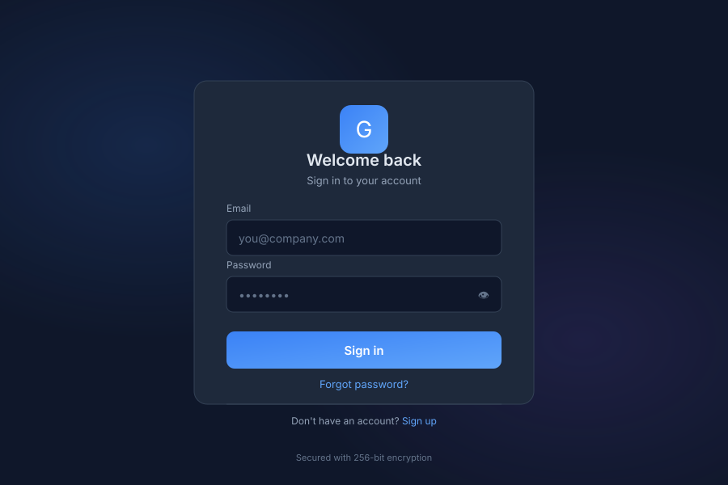

# Auth 🟡 BETA - Login

> **Secure authentication**

---

## Overview

Auth provides secure authentication for General Bots Suite. Manage user login, registration, password recovery, and account bootstrap. Auth supports multiple authentication methods including email/password, SSO, and multi-factor authentication.

---

## Features

### Login

| Method | Description |
|--------|-------------|
| **Email/Password** | Standard credential authentication |
| **SSO** | Single Sign-On via SAML/OAuth |
| **MFA** | Multi-factor authentication |
| **Remember Me** | Persistent session option |
| **Social Login** | Google, Microsoft, GitHub |

### Register

| Field | Description |
|-------|-------------|
| **Email** | User email address |
| **Password** | Secure password requirements |
| **Name** | Full name |
| **Organization** | Optional org invitation |
| **Terms** | Accept terms of service |

### Forgot Password

| Step | Description |
|------|-------------|
| **Enter Email** | Provide registered email |
| **Receive Link** | Get password reset email |
| **Click Link** | Follow secure reset link |
| **New Password** | Set new password |
| **Confirm** | Verify and save |

### Reset Password

| Field | Description |
|-------|-------------|
| **Current Password** | Verify current password |
| **New Password** | Enter new password |
| **Confirm Password** | Re-enter for verification |
| **Strength Indicator** | Password strength feedback |

### Bootstrap

| Feature | Description |
|---------|-------------|
| **Initial Setup** | First-time system configuration |
| **Admin User** | Create initial admin account |
| **Organization** | Set up organization details |
| **License** | Enter license key |
| **Configuration** | Basic system settings |

---

## Bootstrap via Chat

### Initial Setup

  

    

      
System bootstrap

      
08:00

    

  

  

    

      
🔧 System Bootstrap

      
📋 Initial setup required

      
👤 Create admin user

      
🏢 Configure organization

      
📝 Enter license key

      
⚙️ Set basic preferences

      
08:00

    

  

---

## API Reference

| Endpoint | Method | Description |
|----------|--------|-------------|
| `/api/auth/login` | POST | User login |
| `/api/auth/logout` | POST | User logout |
| `/api/auth/register` | POST | Create account |
| `/api/auth/forgot-password` | POST | Request password reset |
| `/api/auth/reset-password` | POST | Reset password |
| `/api/auth/refresh` | POST | Refresh access token |
| `/api/auth/verify` | GET | Verify authentication |
| `/api/auth/bootstrap` | POST | Initial system setup |

---

## Related Pages

- [Admin](admin.md) — User administration
- [RBAC Overview](../../09-security/rbac-overview.md) — Role-based access control
- [Permissions Matrix](../../09-security/permissions-matrix.md) — Detailed permissions
- [Suite](suite.md) — Suite navigation