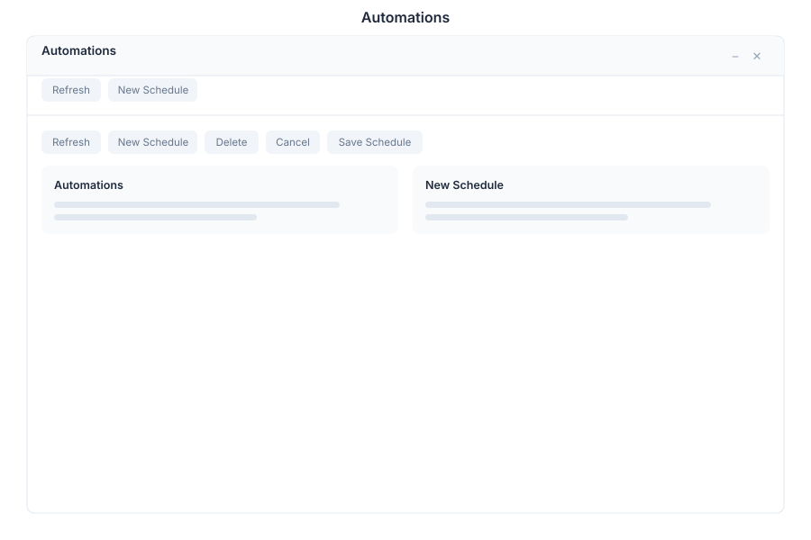

# Automations 🟡 PREVIEW

> **Preview application.** Usable today, not yet part of the supported surface. See [stability](./README.md#what-is-stable-and-what-is-preview).

Automations is the suite's scheduler. It runs an agent on a cron schedule and delivers the result to a channel, without anyone typing a request.

## What it does

| Capability | Detail |
|---|---|
| **Scheduled runs** | Define a schedule with a cron expression, for example `*/15 * * * *` for every quarter hour |
| **Natural-language setup** | Describe the job in words; the assistant turns it into a schedule |
| **Run dashboard** | Each schedule lists its runs and their outcomes, refreshed on demand |
| **Delivery channels** | Results are delivered to a channel rather than only shown in the app |

A typical entry is a recurring report — an inventory digest, a nightly summary, a periodic check — expressed once and then left to run.

## Opening it

Automations is a **preview** application: it does not appear in the launcher until Preview mode is on. Turn on the **Preview** switch in the left sidebar, then open **Automations** from the app menu.

## Relationship to other scheduling surfaces

| Surface | Use it for |
|---|---|
| **Automations** app | Recurring jobs you want to see, edit and monitor in one place |
| `SET SCHEDULE` in BASIC | Scheduling inside a bot script, when the logic belongs with the bot |
| `CREATE_TASK` | One-off work assigned to a person or agent |

## Limits

- Schedules are configured per bot; there is no cross-bot schedule view.
- Delivery channels depend on which channels the bot has configured.

## See Also

- [Tasks](./tasks.md) - Task management with Autotask execution
- [Autonomous Tasks](../../02-architecture-packages/autonomous-tasks.md) - How scheduled agents execute
- [Apps overview](./README.md) - Stability classification for the whole suite
