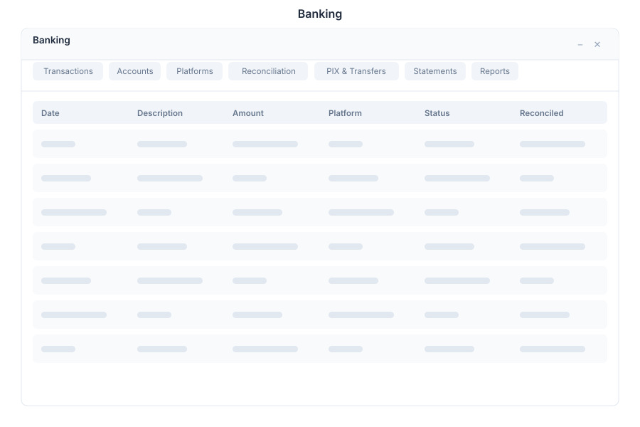

# Banking 🟡 BETA - Financial Reconciliation

> **Transaction matching & reconciliation**

---

## Overview

Banking is a financial reconciliation system within General Bots Suite. Connect to banking platforms, import transactions, match them with internal records, and generate reconciliation reports. Banking automates the matching process while providing manual override for complex cases.

---

## Features

### Transactions

| Action | Description |
|--------|-------------|
| **List** | View all transactions |
| **Filter** | By date, amount, status, or type |
| **Search** | Full-text search across fields |
| **Sort** | Order by any column |
| **Details** | View transaction details |

### Platforms

| Action | Description |
|--------|-------------|
| **Connect** | Link banking accounts |
| **Configure** | Set import rules |
| **Sync** | Manual data synchronization |
| **Status** | Monitor connection health |
| **Disconnect** | Remove platform connection |

### Reconciliation

| Feature | Description |
|---------|-------------|
| **Auto-Match** | AI-powered transaction matching |
| **Manual Match** | Override or confirm matches |
| **Rules** | Define matching rules |
| **Exceptions** | Handle unmatched transactions |
| **History** | View reconciliation history |

### Reports

| Report | Description |
|--------|-------------|
| **Summary** | Reconciliation overview |
| **Detailed** | Transaction-level breakdown |
| **Discrepancies** | Unmatched transactions |
| **Export** | Download as PDF or Excel |
| **Schedule** | Automated report generation |

### Matching Rules

| Rule Type | Description |
|-----------|-------------|
| **Exact Match** | Amount and reference match |
| **Fuzzy Match** | Similar amount with tolerance |
| **Date Range** | Match within time window |
| **Reference** | Match by invoice or reference |
| **Manual** | User-assigned matches |

---

## Keyboard Shortcuts

| Shortcut | Action |
|----------|--------|
| `G` then `T` | Go to Transactions |
| `G` then `R` | Go to Reconciliation |
| `G` then `P` | Go to Platforms |
| `A` | Auto-match all |
| `M` | Manual match selected |
| `/` | Focus search |
| `Ctrl+F` | Advanced filter |
| `Esc` | Close details |

---

## Banking via Chat

### Viewing Transactions

  

    

      
Show unmatched transactions

      
15:00

    

  

  

    

      
💳 Unmatched Transactions (12):

      
📊 Total: R$ 45,230.00

      
1. Invoice #1001 - R$ 1,250.00

      
2. Invoice #1002 - R$ 3,400.00

      
3. Transfer Ref: TXF-456 - R$ 8,900.00

      
... and 9 more

      
15:00

    

  

### Running Reconciliation

  

    

      
Run reconciliation

      
15:05

    

  

  

    

      
🔄 Reconciliation Started

      
📊 Processing 156 transactions

      
🤖 Auto-matching in progress...

      
✅ 142 matched (91%)

      
⚠️ 14 exceptions flagged

      
📋 Report generated

      
15:05

    

  

---

## API Reference

| Endpoint | Method | Description |
|----------|--------|-------------|
| `/api/banking/transactions` | GET | List transactions |
| `/api/banking/transactions/:id` | GET | Get transaction details |
| `/api/banking/platforms` | GET | List connected platforms |
| `/api/banking/platforms` | POST | Connect new platform |
| `/api/banking/platforms/:id/sync` | POST | Sync platform data |
| `/api/banking/reconciliation` | GET | Get reconciliation status |
| `/api/banking/reconciliation/run` | POST | Run reconciliation |
| `/api/banking/reconciliation/match` | POST | Manual match |
| `/api/banking/reports` | GET | List reports |
| `/api/banking/reports/:id/download` | GET | Download report |

---

## Related Pages

- [Billing](billing.md) — Subscription and payments
- [Analytics](analytics.md) — Financial analytics
- [Dashboards](dashboards.md) — Real-time monitoring
- [Paper](paper.md) — Document management