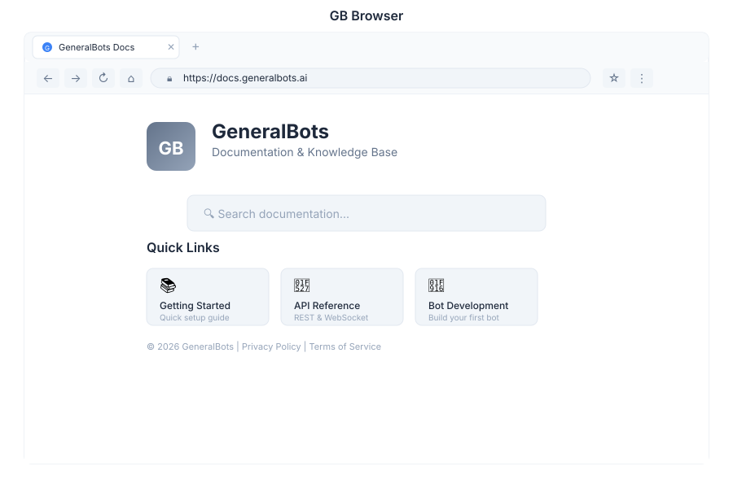

# Browser - Web Browser

> **Built-in web browser**

---

## Overview

Browser is the built-in web browser module in General Bots Suite. Browse the web, research information, and capture screenshots without leaving the Suite environment. Browser integrates seamlessly with other apps for research and content gathering.

---

## Features

### Tabs

Manage multiple browser tabs for multitasking.

| Action | Description |
|--------|-------------|
| **Open Tab** | Create new browser tab |
| **Close Tab** | Close current or specific tab |
| **Switch Tabs** | Navigate between open tabs |
| **Reopen Tab** | Restore recently closed tabs |
| **Tab Groups** | Organize tabs into logical groups |

### Navigation

Standard browser navigation controls.

| Action | Description |
|--------|-------------|
| **Back** | Return to previous page |
| **Forward** | Go to next page in history |
| **Refresh** | Reload current page |
| **Home** | Return to homepage |
| **Stop** | Cancel page loading |

### URL Bar

Address bar with search and navigation capabilities.

| Feature | Description |
|---------|-------------|
| **URL Entry** | Type URLs directly |
| **Search** | Search using default search engine |
| **Autocomplete** | Suggestions from history and bookmarks |
| **Security Indicator** | Shows HTTPS status |
| **Page Title** | Displays current page title |

### Bookmarks

Save and organize favorite websites.

| Action | Description |
|--------|-------------|
| **Add Bookmark** | Save current page |
| **Bookmark Bar** | Quick access toolbar |
| **Bookmark Folders** | Organize bookmarks in folders |
| **Import Bookmarks** | Import from other browsers |
| **Export Bookmarks** | Export bookmarks for backup |

### Screenshots

Capture web page screenshots for documentation.

| Feature | Description |
|---------|-------------|
| **Full Page** | Capture entire scrollable page |
| **Visible Area** | Capture current viewport only |
| **Element** | Capture specific page element |
| **Save to Drive** | Save screenshots to Drive |
| **Share** | Share screenshots via chat or email |

---

## Keyboard Shortcuts

| Shortcut | Action |
|----------|--------|
| `Ctrl+T` | New tab |
| `Ctrl+W` | Close tab |
| `Ctrl+L` | Focus URL bar |
| `Ctrl+R` | Refresh page |
| `Ctrl+Shift+R` | Hard refresh |
| `F11` | Fullscreen toggle |
| `Ctrl+D` | Bookmark page |
| `Ctrl+Shift+I` | Developer tools |

---

## Browser via Chat

### Opening a Website

  

    

      
Open GitHub

      
09:00

    

  

  

    

      
🌐 Opening GitHub:

      
URL: https://github.com

      
Tab: GitHub (1 of 3)

      
✅ Page loaded successfully

      
09:00

    

  

### Taking a Screenshot

  

    

      
Take a screenshot

      
14:30

    

  

  

    

      
📸 Screenshot captured:

      
📁 Saved to: Drive/Screenshots/github-2024-01-15.png

      
📐 Size: 1920x1080

      
🔗 Share or attach to a document?

      
14:30

    

  

---

## API Reference

Browser operations are available via REST API:

| Endpoint | Method | Description |
|----------|--------|-------------|
| `/api/browser/tabs` | GET | List open tabs |
| `/api/browser/tabs` | POST | Open new tab |
| `/api/browser/tabs/:id` | DELETE | Close tab |
| `/api/browser/tabs/:id/navigate` | POST | Navigate to URL |
| `/api/browser/tabs/:id/screenshot` | POST | Capture screenshot |
| `/api/browser/tabs/:id/back` | POST | Go back |
| `/api/browser/tabs/:id/forward` | POST | Go forward |
| `/api/browser/tabs/:id/refresh` | POST | Refresh page |
| `/api/browser/bookmarks` | GET | List bookmarks |
| `/api/browser/bookmarks` | POST | Add bookmark |

---

## Related Pages

- [Research App](./research.md) — Advanced research tools
- [Drive App](./drive.md) — Store screenshots and files
- [Chat App](./chat.md) — AI assistance for web research
- [Paper App](./paper.md) — Document creation with web content
- [Suite Manual](../suite-manual.md) — Full Suite overview