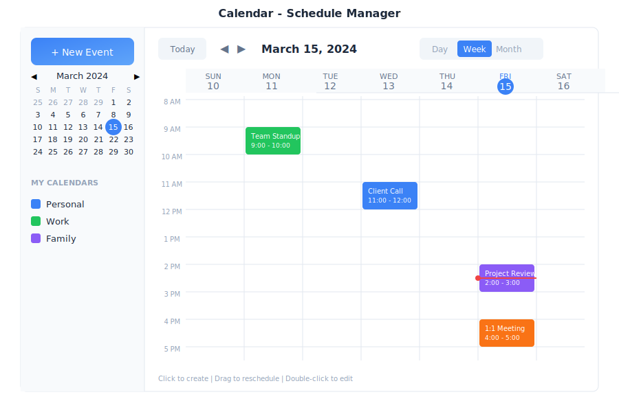

# Calendar - Scheduling

> **Your personal scheduling assistant**



---

## Overview

Calendar is your scheduling hub in General Bots Suite. Create events, manage appointments, schedule meetings, and let the AI help you find the perfect time. Calendar syncs with your other apps so you never miss an important date.

---

## Features

### Views

| View | Description |
|------|-------------|
| **Day** | Hourly breakdown of single day |
| **Week** | 7-day overview |
| **Month** | Full month grid |
| **Agenda** | List of upcoming events |

### Calendars

| Calendar | Icon | Use For |
|----------|------|---------|
| Personal | 🟢 | Private appointments |
| Work | 🔵 | Professional meetings |
| Team | 🟣 | Shared team events |
| Holidays | 🔴 | Public holidays |

### Event Types

| Type | Icon | Description |
|------|------|-------------|
| Meeting | 👥 | Group meetings |
| Call | 📞 | Phone/video calls |
| Reminder | 🔔 | Personal reminders |
| All-Day | 📅 | Full day events |
| Recurring | 🔄 | Repeating events |

---

## Keyboard Shortcuts

| Shortcut | Action |
|----------|--------|
| `C` | Create new event |
| `T` | Go to today |
| `D` | Day view |
| `W` | Week view |
| `M` | Month view |
| `←` / `→` | Previous / Next period |
| `Delete` | Delete selected event |
| `Enter` | Open event details |

---

## Scheduling via Chat

### Creating an Event

<div class="wa-chat">
  <div class="wa-message user">
    <div class="wa-bubble">
      <p>Schedule a meeting with Sarah tomorrow at 2pm</p>
      <div class="wa-time">10:30</div>
    </div>
  </div>
  <div class="wa-message bot">
    <div class="wa-bubble">
      <p>✅ Meeting scheduled!</p>
      <p>👥 Meeting with Sarah</p>
      <p>📅 Tomorrow at 2:00 PM</p>
      <p>⏱️ Duration: 1 hour</p>
      <p>Invitation sent to Sarah.</p>
      <div class="wa-time">10:30</div>
    </div>
  </div>
</div>

### Checking Your Schedule

<div class="wa-chat">
  <div class="wa-message user">
    <div class="wa-bubble">
      <p>What's on my calendar today?</p>
      <div class="wa-time">08:00</div>
    </div>
  </div>
  <div class="wa-message bot">
    <div class="wa-bubble">
      <p>📅 Today's Schedule (May 15):</p>
      <p>09:00 AM - Team Standup (30 min)</p>
      <p>11:00 AM - Client Call (1 hour)</p>
      <p>02:00 PM - Project Review (1 hour)</p>
      <p>04:30 PM - 1:1 with Manager (30 min)</p>
      <p>You have 4 events today.</p>
      <div class="wa-time">08:00</div>
    </div>
  </div>
</div>

### Finding Available Time

<div class="wa-chat">
  <div class="wa-message user">
    <div class="wa-bubble">
      <p>When am I free this week for a 2-hour meeting?</p>
      <div class="wa-time">09:15</div>
    </div>
  </div>
  <div class="wa-message bot">
    <div class="wa-bubble">
      <p>🗓️ Available 2-hour slots this week:</p>
      <p>• Tuesday 3:00 PM - 5:00 PM</p>
      <p>• Wednesday 10:00 AM - 12:00 PM</p>
      <p>• Thursday 2:00 PM - 4:00 PM</p>
      <p>• Friday 9:00 AM - 11:00 AM</p>
      <p>Would you like to book one of these?</p>
      <div class="wa-time">09:15</div>
    </div>
  </div>
</div>

### Rescheduling Events

<div class="wa-chat">
  <div class="wa-message user">
    <div class="wa-bubble">
      <p>Move my 2pm meeting to 4pm</p>
      <div class="wa-time">13:30</div>
    </div>
  </div>
  <div class="wa-message bot">
    <div class="wa-bubble">
      <p>✅ Meeting rescheduled!</p>
      <p>👥 Project Review</p>
      <p>📅 Today at 4:00 PM (was 2:00 PM)</p>
      <p>Updated invitations sent to attendees.</p>
      <div class="wa-time">13:30</div>
    </div>
  </div>
</div>

### Setting Reminders

<div class="wa-chat">
  <div class="wa-message user">
    <div class="wa-bubble">
      <p>Remind me about the dentist appointment on Friday at 9am</p>
      <div class="wa-time">11:00</div>
    </div>
  </div>
  <div class="wa-message bot">
    <div class="wa-bubble">
      <p>✅ Reminder set!</p>
      <p>🔔 Dentist appointment</p>
      <p>📅 Friday at 9:00 AM</p>
      <p>⏰ I'll remind you 1 hour before.</p>
      <div class="wa-time">11:00</div>
    </div>
  </div>
</div>

---

## API Endpoints

| Endpoint | Method | Description |
|----------|--------|-------------|
| `/api/calendar/events` | GET | List events |
| `/api/calendar/events` | POST | Create event |
| `/api/calendar/events/:id` | GET | Get event details |
| `/api/calendar/events/:id` | PATCH | Update event |
| `/api/calendar/events/:id` | DELETE | Delete event |
| `/api/calendar/availability` | GET | Check free/busy |

### Query Parameters

| Parameter | Values | Default |
|-----------|--------|---------|
| `start` | ISO date | Today |
| `end` | ISO date | +30 days |
| `calendar` | Calendar name | All |
| `view` | `day`, `week`, `month` | `month` |

### Create Event Request

```json
{
    "title": "Team Meeting",
    "start": "2025-05-16T14:00:00Z",
    "end": "2025-05-16T15:00:00Z",
    "calendar": "work",
    "attendees": ["sarah@company.com"],
    "location": "Conference Room A",
    "reminder": 15,
    "recurrence": null
}
```

### Event Response

```json
{
    "id": "evt-123",
    "title": "Team Meeting",
    "start": "2025-05-16T14:00:00Z",
    "end": "2025-05-16T15:00:00Z",
    "calendar": "work",
    "attendees": [
        {
            "email": "sarah@company.com",
            "status": "accepted"
        }
    ],
    "location": "Conference Room A",
    "reminder": 15,
    "created": "2025-05-15T10:30:00Z"
}
```

---

## Integration with Tasks

Tasks with due dates automatically appear on your calendar. When you complete a task, it's marked as done on the calendar too.

---

## Troubleshooting

### Events Not Syncing

1. Refresh the calendar
2. Check internet connection
3. Verify calendar is enabled in sidebar
4. Wait a few minutes for sync

### Can't Create Events

1. Verify you have write access to the calendar
2. Check that start time is before end time
3. Ensure date is not in the past

### Missing Invitations

1. Check spam/junk folder in email
2. Verify attendee email addresses
3. Check notification settings

---

## See Also

- [Suite Manual](../suite-manual.md) - Complete user guide
- [Tasks App](./tasks.md) - Task integration
- [Meet App](./meet.md) - Video meetings
- [Calendar API](../../08-rest-api-tools/calendar-api.md) - API reference