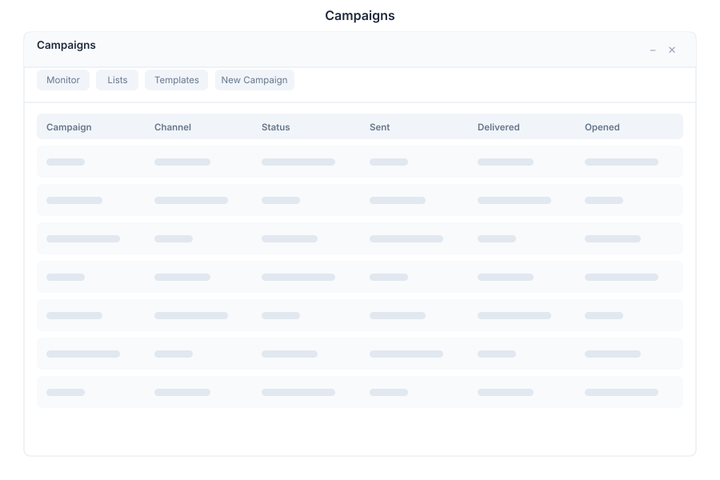

# Campaigns - Marketing

> **Multi-channel campaign management**



---

## Overview

Campaigns is the marketing campaign manager in General Bots Suite. Create, schedule, and track campaigns across Email, WhatsApp, and Social channels. Design templates, manage contact lists, and analyze performance with open rates, click rates, and conversion metrics.

---

## Features

### Campaigns

| Action | Description |
|--------|-------------|
| Create | Start a new campaign |
| Schedule | Set future delivery date/time |
| Pause | Temporarily halt delivery |
| Resume | Continue paused campaign |
| Cancel | Stop and archive campaign |
| Duplicate | Clone an existing campaign |

### Channels

| Channel | Capabilities |
|---------|-------------|
| Email | HTML templates, attachments, tracking |
| WhatsApp | Rich messages, media, buttons |
| Social | Posts to LinkedIn, Twitter, Facebook |
| SMS | Text message campaigns |
| Push | Browser push notifications |

### Templates

| Action | Description |
|--------|-------------|
| Design | Visual drag-and-drop editor |
| Preview | Desktop and mobile preview |
| Variables | Dynamic content placeholders |
| Import | Upload HTML template |
| Gallery | Browse template library |
| Save | Save as reusable template |

### Lists

| Feature | Description |
|---------|-------------|
| Segments | Filter contacts by criteria |
| Tags | Categorize contacts |
| Import | CSV/JSON contact import |
| Export | Download contact lists |
| Merge | Combine multiple lists |
| Deduplicate | Remove duplicate contacts |

### Analytics

| Metric | Description |
|--------|-------------|
| Open Rate | Percentage of emails opened |
| Click Rate | Percentage of links clicked |
| Conversion | Goal completion rate |
| Bounce Rate | Failed delivery percentage |
| Unsubscribe | Opt-out rate |
| Revenue | Attributed sales |

---

## Keyboard Shortcuts

| Shortcut | Action |
|----------|--------|
| `N` | New campaign |
| `Ctrl+S` | Save draft |
| `Ctrl+P` | Preview campaign |
| `Ctrl+Enter` | Send/Schedule |
| `Escape` | Cancel editing |
| `Tab` | Next field |
| `Ctrl+Shift+T` | Open template selector |

---

## Campaigns via Chat

### Creating an Email Campaign

<div class="wa-chat">
  <div class="wa-message user">
    <div class="wa-bubble">
      <p>Create an email campaign for our summer sale</p>
      <div class="wa-time">09:00</div>
    </div>
  </div>
  <div class="wa-message bot">
    <div class="wa-bubble">
      <p>📧 Campaign created: <strong>Summer Sale 2025</strong></p>
      <p>Channel: Email</p>
      <p>Subject: "Summer Sale - Up to 50% Off!"</p>
      <p>Recipients: 2,450 contacts</p>
      <p>Schedule: Draft (not yet scheduled)</p>
      <p>[Edit Campaign] [Choose Template] [Schedule]</p>
      <div class="wa-time">09:00</div>
    </div>
  </div>
</div>

### Viewing Campaign Performance

<div class="wa-chat">
  <div class="wa-message user">
    <div class="wa-bubble">
      <p>Show campaign performance</p>
      <div class="wa-time">10:30</div>
    </div>
  </div>
  <div class="wa-message bot">
    <div class="wa-bubble">
      <p>📊 <strong>Campaign Performance</strong></p>
      <p><strong>Summer Sale 2025</strong> (Email)</p>
      <p>• Sent: 2,450 | Delivered: 2,412 (98.4%)</p>
      <p>• Opened: 1,205 (49.8%)</p>
      <p>• Clicked: 387 (15.9%)</p>
      <p>• Converted: 94 (3.8%)</p>
      <p>• Revenue: $12,450</p>
      <p>[View Details] [A/B Test] [Create Follow-up]</p>
      <div class="wa-time">10:30</div>
    </div>
  </div>
</div>

### Scheduling a Campaign

<div class="wa-chat">
  <div class="wa-message user">
    <div class="wa-bubble">
      <p>Schedule the summer sale for tomorrow at 9am</p>
      <div class="wa-time">11:00</div>
    </div>
  </div>
  <div class="wa-message bot">
    <div class="wa-bubble">
      <p>⏰ Campaign scheduled:</p>
      <p><strong>Summer Sale 2025</strong></p>
      <p>Send time: June 16, 2025 at 9:00 AM</p>
      <p>Timezone: America/Sao_Paulo</p>
      <p>Recipients: 2,450 contacts</p>
      <p>[Modify Schedule] [Cancel] [Preview Email]</p>
      <div class="wa-time">11:00</div>
    </div>
  </div>
</div>

---

## API Endpoints

| Endpoint | Method | Description |
|----------|--------|-------------|
| `/api/crm/campaigns` | GET | List all campaigns |
| `/api/crm/campaigns` | POST | Create new campaign |
| `/api/crm/campaigns/:id` | GET | Get campaign details |
| `/api/crm/campaigns/:id` | PATCH | Update campaign |
| `/api/crm/campaigns/:id` | DELETE | Delete campaign |
| `/api/crm/campaigns/:id/send` | POST | Send/Schedule campaign |
| `/api/crm/campaigns/:id/pause` | POST | Pause campaign |
| `/api/crm/campaigns/:id/resume` | POST | Resume campaign |
| `/api/crm/campaigns/:id/stats` | GET | Get campaign analytics |
| `/api/crm/campaigns/:id/contacts` | GET | Get campaign contacts |
| `/api/crm/campaigns/templates` | GET | List templates |
| `/api/crm/campaigns/templates` | POST | Create template |
| `/api/crm/lists` | GET | List contact lists |
| `/api/crm/lists` | POST | Create contact list |

### Create Campaign Request

```json
{
    "name": "Summer Sale 2025",
    "channel": "email",
    "subject": "Summer Sale - Up to 50% Off!",
    "list_id": "list-abc",
    "template_id": "tpl-123",
    "schedule": null,
    "content": {
        "html": "<h1>Summer Sale</h1><p>Up to 50% off all items!</p>",
        "text": "Summer Sale - Up to 50% off all items!"
    },
    "settings": {
        "from_name": "Marketing Team",
        "from_email": "sales@company.com",
        "reply_to": "support@company.com"
    }
}
```

### Campaign Response

```json
{
    "id": "campaign-789",
    "name": "Summer Sale 2025",
    "channel": "email",
    "status": "sent",
    "subject": "Summer Sale - Up to 50% Off!",
    "recipients": 2450,
    "stats": {
        "delivered": 2412,
        "opened": 1205,
        "clicked": 387,
        "converted": 94,
        "bounced": 38,
        "unsubscribed": 12
    },
    "revenue": 12450.00,
    "scheduled_at": "2025-06-16T09:00:00Z",
    "sent_at": "2025-06-16T09:00:05Z",
    "created_at": "2025-06-15T09:00:00Z"
}
```

---

## Configuration

Campaigns settings can be configured in `config.csv`:

```csv
key,value
default-sender-name,Marketing Team
default-sender-email,marketing@company.com
max-recipients,50000
send-rate-limit,1000/hour
tracking-enabled,true
```

---

## Troubleshooting

### Campaign Not Sending

1. Verify sender email is verified
2. Check contact list isn't empty
3. Ensure scheduled time hasn't passed
4. Review bounce rate for delivery issues

### Low Open Rates

1. Check subject line quality
2. Verify sender reputation
3. Review send time optimization
4. Test different subject lines

### Analytics Not Updating

1. Allow 24 hours for full tracking
2. Verify tracking pixels are enabled
3. Check that recipients haven't blocked images
4. Review analytics processing queue

---

## See Also

- [Suite Manual](../suite-manual.md) - Complete user guide
- [Mail](./mail.md) - Email sending
- [CRM](./crm.md) - Contact management
- [BASIC SEND MAIL Keyword](../../04-basic-scripting/keyword-send-mail.md) - Script integration
