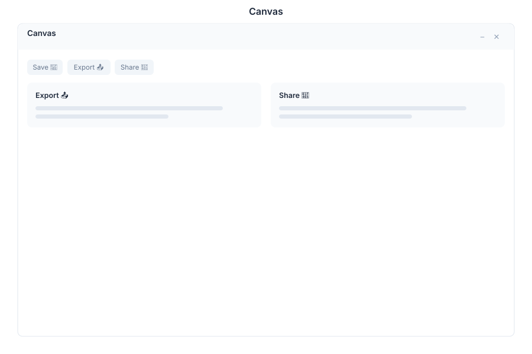

# Canvas 🟡 BETA - Whiteboard

> **Collaborative visual workspace**



---

## Overview

Canvas is the collaborative whiteboard in General Bots Suite. Draw diagrams, create flowcharts, sketch ideas, and collaborate in real time with your team. Use drawing tools, shapes, text, and layers to build visual representations of complex concepts and systems.

---

## Features

### Tools

| Tool | Description |
|------|-------------|
| Select | Move, resize, rotate elements |
| Pen | Freehand drawing |
| Rectangle | Draw rectangles and squares |
| Ellipse | Draw circles and ovals |
| Line | Draw straight lines |
| Arrow | Draw arrows for flowcharts |
| Text | Add text labels |
| Eraser | Remove elements |

### Colors

| Option | Description |
|--------|-------------|
| Palette | Predefined color palette |
| Custom | Full RGB color picker |
| Opacity | Transparency control |
| Fill | Shape fill color |
| Stroke | Outline/border color |
| Width | Line thickness |

### Layers

| Action | Description |
|--------|-------------|
| Add Layer | Create new layer |
| Delete Layer | Remove layer |
| Reorder | Change layer stacking |
| Visibility | Toggle layer visibility |
| Lock | Prevent edits to layer |
| Rename | Label layers for clarity |

### Export

| Format | Description |
|--------|-------------|
| PNG | Raster image export |
| SVG | Vector scalable export |
| PDF | High-quality document |
| JSON | Editable board data |

### Collaborate

| Feature | Description |
|---------|-------------|
| Real-time | Multiple users editing simultaneously |
| Cursor View | See other users' cursors |
| Presence | Active collaborator list |
| History | View edit history |
| Permissions | View/edit access control |

---

## Keyboard Shortcuts

| Shortcut | Action |
|----------|--------|
| `V` | Select tool |
| `P` | Pen tool |
| `R` | Rectangle tool |
| `E` | Ellipse tool |
| `L` | Line tool |
| `A` | Arrow tool |
| `T` | Text tool |
| `X` | Eraser tool |
| `Ctrl+Z` | Undo |
| `Ctrl+Y` | Redo |
| `Ctrl+A` | Select all |
| `Ctrl+G` | Group selected elements |
| `Ctrl+Shift+G` | Ungroup elements |
| `Delete` | Delete selected |
| `Ctrl+S` | Save board |

---

## Canvas via Chat

### Creating a Flowchart

<div class="wa-chat">
  <div class="wa-message user">
    <div class="wa-bubble">
      <p>Create a flowchart for user registration</p>
      <div class="wa-time">09:00</div>
    </div>
  </div>
  <div class="wa-message bot">
    <div class="wa-bubble">
      <p>📊 I've created a flowchart: <strong>User Registration Flow</strong></p>
      <p>Elements added:</p>
      <p>1. Start (oval)</p>
      <p>2. Enter Email (rectangle)</p>
      <p>3. Validate Email (diamond)</p>
      <p>4. Send Verification (rectangle)</p>
      <p>5. Verify Code (diamond)</p>
      <p>6. Complete Registration (rectangle)</p>
      <p>7. End (oval)</p>
      <p>[Open in Canvas] [Edit via Chat] [Export as PNG]</p>
      <div class="wa-time">09:00</div>
    </div>
  </div>
</div>

### Drawing a System Diagram

<div class="wa-chat">
  <div class="wa-message user">
    <div class="wa-bubble">
      <p>Draw a system diagram showing BotServer connecting to PostgreSQL and Valkey</p>
      <div class="wa-time">10:30</div>
    </div>
  </div>
  <div class="wa-message bot">
    <div class="wa-bubble">
      <p>📐 System diagram created:</p>
      <p>• BotServer (rectangle) — center</p>
      <p>• PostgreSQL (cylinder) — left, connected with arrow</p>
      <p>• Valkey (cylinder) — right, connected with arrow</p>
      <p>• Arrows labeled: "queries" and "cache"</p>
      <p>[Edit Elements] [Add More Components] [Export]</p>
      <div class="wa-time">10:30</div>
    </div>
  </div>
</div>

### Adding Text Labels

<div class="wa-chat">
  <div class="wa-message user">
    <div class="wa-bubble">
      <p>Add a title "System Architecture" to the diagram</p>
      <div class="wa-time">11:00</div>
    </div>
  </div>
  <div class="wa-message bot">
    <div class="wa-bubble">
      <p>✅ Added text label: <strong>"System Architecture"</strong></p>
      <p>Position: Top center of the canvas</p>
      <p>Font size: 24px, Bold</p>
      <p>[Edit Text] [Change Style] [Move]</p>
      <div class="wa-time">11:00</div>
    </div>
  </div>
</div>

---

## API Endpoints

| Endpoint | Method | Description |
|----------|--------|-------------|
| `/api/canvas` | GET | List all boards |
| `/api/canvas` | POST | Create new board |
| `/api/canvas/:id` | GET | Get board data |
| `/api/canvas/:id` | PATCH | Update board |
| `/api/canvas/:id` | DELETE | Delete board |
| `/api/canvas/:id/elements` | POST | Add element |
| `/api/canvas/:id/elements/:el_id` | PATCH | Update element |
| `/api/canvas/:id/elements/:el_id` | DELETE | Delete element |
| `/api/canvas/:id/layers` | GET | Get layers |
| `/api/canvas/:id/layers` | POST | Create layer |
| `/api/canvas/:id/export` | GET | Export board |
| `/api/canvas/:id/collaborators` | GET | Get collaborators |
| `/api/canvas/search` | GET | Search boards |

### Create Board Request

```json
{
    "title": "User Registration Flow",
    "width": 1200,
    "height": 800,
    "elements": [
        {
            "type": "oval",
            "x": 500,
            "y": 50,
            "width": 200,
            "height": 60,
            "fill": "#4CAF50",
            "text": "Start"
        },
        {
            "type": "arrow",
            "x1": 600,
            "y1": 110,
            "x2": 600,
            "y2": 160,
            "stroke": "#333333"
        }
    ],
    "layers": [
        {
            "name": "Main",
            "visible": true,
            "locked": false
        }
    ]
}
```

### Board Response

```json
{
    "id": "board-abc123",
    "title": "User Registration Flow",
    "width": 1200,
    "height": 800,
    "elements": [
        {
            "id": "el-001",
            "type": "oval",
            "x": 500,
            "y": 50,
            "width": 200,
            "height": 60,
            "fill": "#4CAF50",
            "text": "Start",
            "layer": "Main"
        }
    ],
    "layers": [
        {
            "name": "Main",
            "visible": true,
            "locked": false
        }
    ],
    "collaborators": [],
    "created_at": "2025-05-15T09:00:00Z",
    "updated_at": "2025-05-15T11:00:00Z"
}
```

---

## Configuration

Canvas settings can be configured in `config.csv`:

```csv
key,value
max-elements,1000
auto-save-interval,30
default-canvas-width,1200
default-canvas-height,800
collaboration-enabled,true
```

---

## Troubleshooting

### Board Not Loading

1. Check internet connection
2. Verify board data isn't corrupted
3. Check browser WebGL support
4. Refresh the page

### Elements Not Syncing

1. Verify WebSocket connection is active
2. Check collaboration permissions
3. Ensure board isn't locked by another user
4. Refresh to re-sync

### Export Quality Issues

1. Check canvas dimensions
2. Verify all elements are visible
3. Ensure fonts are loaded
4. Try different export format

---

## See Also

- [Suite Manual](../suite-manual.md) - Complete user guide
- [Drive](./drive.md) - File storage for exports
- [Chat App](./chat.md) - Create boards via chat
- [BASIC File Keywords](../../04-basic-scripting/keyword-file.md) - Script integration
