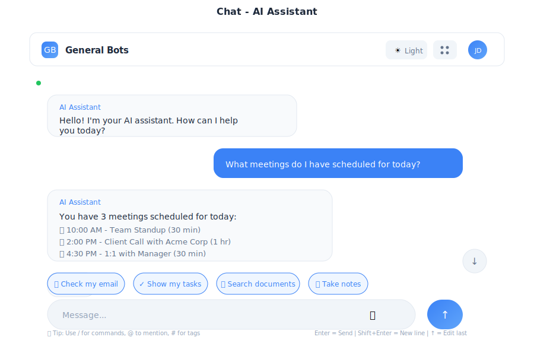

# Chat - AI Assistant

> **Your intelligent conversation partner**



---

## Overview

Chat is the heart of General Bots Suite - your AI-powered assistant that understands context, remembers conversations, and helps you get things done. Built with WebSocket for real-time communication and HTMX for seamless updates.

---

## Features

### Real-Time Messaging

Messages are sent and received instantly via WebSocket connection.

<div class="wa-chat">
  <div class="wa-message bot">
    <div class="wa-bubble">
      <p>Hello! How can I help you today?</p>
      <div class="wa-time">10:30</div>
    </div>
  </div>
  <div class="wa-message user">
    <div class="wa-bubble">
      <p>What meetings do I have today?</p>
      <div class="wa-time">10:31</div>
    </div>
  </div>
  <div class="wa-message bot">
    <div class="wa-bubble">
      <p>You have 2 meetings scheduled:</p>
      <p>• 2:00 PM - Team Standup (30 min)</p>
      <p>• 4:00 PM - Project Review (1 hour)</p>
      <div class="wa-time">10:31</div>
    </div>
  </div>
</div>

### Voice Input

Click the microphone button to speak your message:

1. Click **🎤** to start recording
2. Speak your message clearly
3. Click again to stop
4. Message converts to text automatically

### Quick Suggestions

Pre-built action chips for common requests:

| Chip | Action |
|------|--------|
| 📊 Tasks | Show your task list |
| 📧 Check mail | Display unread emails |
| 📅 Schedule | Today's calendar |
| ❓ Help | Available commands |

### Response Format Switchers

Persistent toggle buttons that control how AI formats responses. Unlike suggestions, switchers stay active until deactivated and can be combined.

**Available Format Options:**

| ID | Label | Description | Example Use Case |
|----|--------|-------------|------------------|
| tables | Tabelas | Responses as structured HTML tables | Comparisons, data summaries |
| infographic | Infográfico | Visual SVG and progress bar representations | Statistics, metrics, dashboards |
| cards | Cards | Card-based HTML layout with borders and shadows | Profiles, items, entities |
| list | Lista | Bulleted and numbered HTML lists | Steps, features, options |
| comparison | Comparação | Side-by-side HTML grid comparisons | Pros/cons, alternatives |
| timeline | Timeline | Chronological HTML timeline with border markers | History, events, milestones |
| markdown | Markdown | Standard CommonMark formatting | Documentation, code |
| chart | Gráfico | SVG charts (line, bar, pie, area) with axes and legends | Data visualization |

**Custom Switchers:**
You can also add custom format instructions:
```
ADD SWITCHER "sempre mostrar 10 perguntas" AS "Mostrar Perguntas"
```

**Using Switchers:**
1. Click any format chip to toggle it ON
2. Active switchers are highlighted with their color
3. Multiple switchers can be active simultaneously
4. Click again to toggle OFF
5. Format applies to all responses until deactivated

**Example Workflow:**

<div class="wa-chat">
  <div class="wa-message bot">
    <div class="wa-bubble">
      <p>[📊 Tabelas] [📈 Infográfico]</p>
      <p>Hello! How can I help you today?</p>
      <div class="wa-time">10:30</div>
    </div>
  </div>
  <div class="wa-message user">
    <div class="wa-bubble">
      <p>Compare the three course options</p>
      <div class="wa-time">10:31</div>
    </div>
  </div>
  <div class="wa-message bot">
    <div class="wa-bubble">
      <p><strong>Course Comparison Table:</strong></p>
      <table>
        <tr><th>Course</th><th>Duration</th><th>Price</th></tr>
        <tr><td>Basic</td><td>40h</td><td>$299</td></tr>
        <tr><td>Advanced</td><td>80h</td><td>$599</td></tr>
        <tr><td>Premium</td><td>120h</td><td>$999</td></tr>
      </table>
      <div class="wa-time">10:31</div>
    </div>
  </div>
</div>

**Technical Implementation:**
- Switchers are defined in start.bas using: `ADD SWITCHER "id" AS "Label"`
- Standard switchers use predefined IDs that map to backend prompts
- Custom switchers allow any instruction string: `ADD SWITCHER "custom prompt" AS "Label"`
- Frontend injects active switcher prompts into every user message
- Prompts are prepended with "---" separator
- Bot passes the enhanced message directly to LLM (no parsing needed)
- LLM follows the REGRAS DE FORMATO instructions to format output
- State is maintained during conversation session
- Each format has distinct color coding for easy identification
- Multiple switchers can be active simultaneously (all prompts concatenated)

### Message History

- Auto-loads previous messages on page open
- Scroll up to load older messages
- Click "Scroll to bottom" button to return to latest

### Markdown Support

Bot responses support full Markdown rendering:

- **Bold** and *italic* text
- `code snippets` and code blocks
- Bullet and numbered lists
- Links and images
- Tables

---

## Keyboard Shortcuts

| Shortcut | Action |
|----------|--------|
| `Enter` | Send message |
| `Shift+Enter` | New line (without sending) |
| `↑` (Up arrow) | Edit last message |
| `/` | Open command menu |
| `Escape` | Cancel current action |

---

## API Endpoints

### WebSocket Connection

```
ws://your-server:9000/ws
```

**Message Types:**
- `TEXT (1)` - Regular text messages
- `VOICE (2)` - Voice messages
- `CONTINUE (3)` - Continue interrupted responses
- `CONTEXT (4)` - Context changes
- `SYSTEM (5)` - System messages

### REST Endpoints

| Endpoint | Method | Description |
|----------|--------|-------------|
| `/api/sessions` | GET | List sessions |
| `/api/sessions/current/message` | POST | Send message (current session) |
| `/api/sessions/current/history` | GET | Get chat history (current session) |
| `/api/sessions/:id` | GET | Get session details |
| `/api/sessions/:id/history` | GET | Get chat history by ID |
| `/api/sessions/:id/start` | POST | Start session |
| `/api/sessions/:id/end` | POST | End session |
| `/api/voice/start` | POST | Start voice recording |
| `/api/voice/stop` | POST | Stop voice recording |
| `/api/voice/status` | GET | Get voice status |

> **Note:** The frontend uses `/api/sessions/current/*` endpoints which resolve to the active session automatically.

---

## Example Conversations

### Getting Information

<div class="wa-chat">
  <div class="wa-message user">
    <div class="wa-bubble">
      <p>What's the weather like today?</p>
      <div class="wa-time">10:30</div>
    </div>
  </div>
  <div class="wa-message bot">
    <div class="wa-bubble">
      <p>Currently in your area:</p>
      <p>🌤 Partly cloudy, 72°F (22°C)</p>
      <p>Wind: 8 mph from the west</p>
      <p>Humidity: 45%</p>
      <div class="wa-time">10:30</div>
    </div>
  </div>
</div>

### Creating Tasks

<div class="wa-chat">
  <div class="wa-message user">
    <div class="wa-bubble">
      <p>Remind me to call John tomorrow at 3pm</p>
      <div class="wa-time">14:20</div>
    </div>
  </div>
  <div class="wa-message bot">
    <div class="wa-bubble">
      <p>✅ Task created:</p>
      <p>📋 Call John</p>
      <p>📅 Tomorrow at 3:00 PM</p>
      <p>Would you like me to set a notification?</p>
      <div class="wa-time">14:20</div>
    </div>
  </div>
</div>

### Drafting Emails

<div class="wa-chat">
  <div class="wa-message user">
    <div class="wa-bubble">
      <p>Write an email declining the meeting tomorrow</p>
      <div class="wa-time">09:15</div>
    </div>
  </div>
  <div class="wa-message bot">
    <div class="wa-bubble">
      <p>Here's a draft:</p>
      <p><strong>Subject:</strong> Unable to Attend Tomorrow's Meeting</p>
      <p>Hi [Name],</p>
      <p>Thank you for the invitation. Unfortunately, I have a scheduling conflict and won't be able to attend tomorrow's meeting.</p>
      <p>Would it be possible to reschedule, or could someone share the meeting notes with me afterward?</p>
      <p>Best regards, [Your name]</p>
      <p>[📧 Send] [✏️ Edit] [🗑 Discard]</p>
      <div class="wa-time">09:15</div>
    </div>
  </div>
</div>

---

## Accessibility

- Full keyboard navigation
- Screen reader announcements for new messages
- High contrast mode support
- Adjustable font sizes
- ARIA labels on all interactive elements

---

## Troubleshooting

### Messages Not Sending

1. Check connection status indicator
2. Verify WebSocket is connected
3. Try refreshing the page
4. Check browser console for errors

### Voice Not Working

1. Allow microphone permissions in browser
2. Check device microphone settings
3. Try a different browser
4. Ensure HTTPS connection (required for voice)

### History Not Loading

1. Check network connection
2. Verify API endpoint is accessible
3. Clear browser cache
4. Check for JavaScript errors

---

## See Also

- [HTMX Architecture](../htmx-architecture.md) — How Chat uses HTMX
- [Suite Manual](../suite-manual.md) — Complete user guide
- [Tasks App](./tasks.md) — Create tasks from chat
- [Mail App](./mail.md) — Email integration