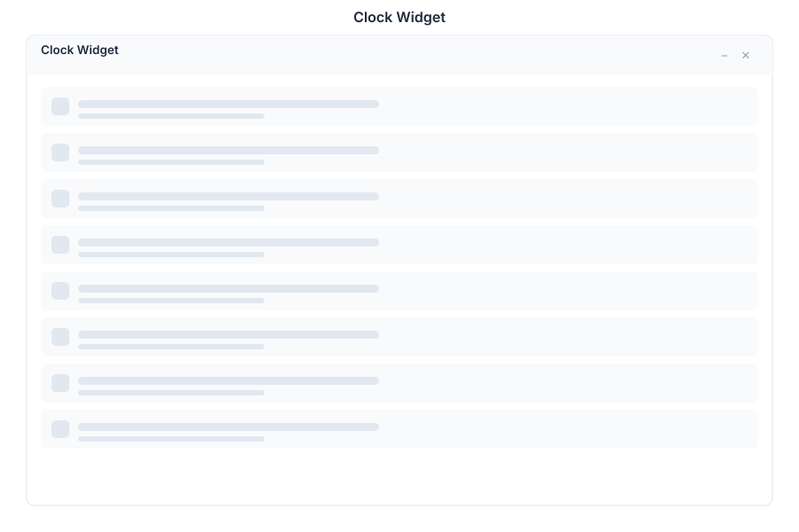

# Clock Widget 🟡 PREVIEW

> **Preview application.** Usable today, not yet part of the supported surface.

The Clock is a **desktop widget**, not an application window. It sits on the desktop and shows the current local time and date, refreshing continuously.

## What it does

| Capability | Detail |
|---|---|
| **Always visible** | Occupies a tile on the desktop rather than opening as a window |
| **Live** | Refreshes every second |
| **Small footprint** | Two grid cells wide by one tall |

## Widgets versus apps

The catalog distinguishes the two, and the launcher treats them differently:

| Kind | Behaviour |
|---|---|
| **App** | Opens as a window when launched |
| **Widget** | Rendered directly on the desktop; also windowable and isolable |

Widgets are excluded from the start menu, so the Clock does not appear in the apps list — it is placed on the desktop instead.

## See Also

- [Desktop](./desktop.md) - The shell widgets live on
- [Timer](./timer.md) - Countdown timer
- [Apps overview](./README.md) - Stability classification for the whole suite
