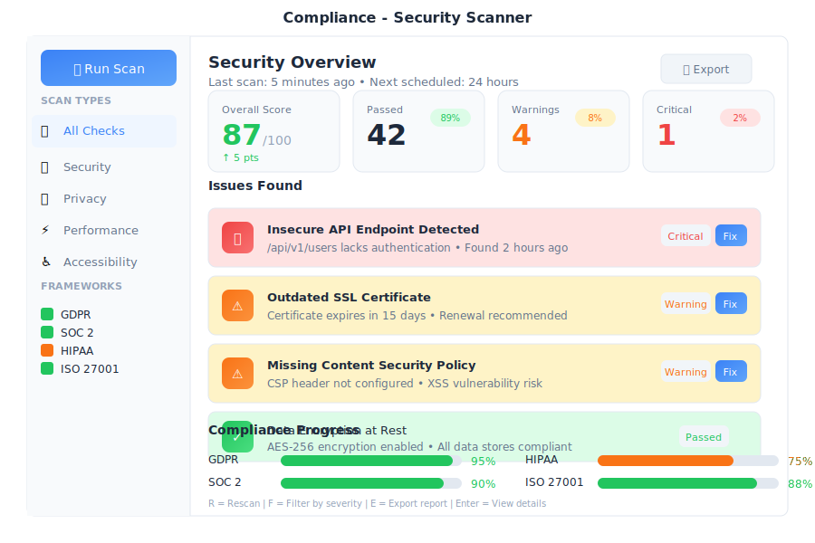

# Compliance Center

> **Your privacy, security, and data governance guardian**



---

## Overview

Compliance Center is the comprehensive security, privacy, and data governance app in General Bots Suite. Monitor data handling, manage consent, respond to data subject requests, prevent data loss, manage legal holds, classify sensitive information, and ensure your bots comply with regulations like LGPD, GDPR, HIPAA, and CCPA.

**Key Capabilities:**
- **DLP (Data Loss Prevention)** - Detect and prevent sensitive data leaks
- **eDiscovery** - Legal holds, content search, and case management
- **Information Protection** - Classify and protect sensitive documents
- **Compliance Scanning** - Automated regulatory compliance checks
- **Data Subject Requests** - Handle GDPR/LGPD rights requests

---

## Features

### Compliance Dashboard

The dashboard gives you an at-a-glance view of your compliance status:

| Metric | Description |
|--------|-------------|
| **Overall Score** | Percentage score with color indicator |
| **Open Requests** | Pending data subject requests |
| **Data Breaches** | Count in last 90 days |
| **Consent Rate** | Percentage of users with active consent |

**Score Breakdown by Area:**
- Data Protection
- Consent Management
- Access Controls
- Data Retention
- Breach Response
- Documentation

**Score Meanings:**

| Score | Status | Action Needed |
|-------|--------|---------------|
| 90-100% | ✓ Excellent | Maintain current practices |
| 70-89% | ⚠ Good | Address minor issues |
| 50-69% | ⚠ Fair | Prioritize improvements |
| Below 50% | ✗ Poor | Immediate action required |

---

---

## Data Loss Prevention (DLP)

Automatically detect and prevent sensitive data from being shared inappropriately.

### Sensitive Data Types Detected

| Type | Examples | Severity |
|------|----------|----------|
| **Credit Card** | Visa, MasterCard, Amex | Critical |
| **SSN/CPF** | Social Security, Brazilian CPF | Critical |
| **Health ID** | Medicare, Medical Record Numbers | Critical |
| **Bank Account** | Account numbers, IBAN | High |
| **API Keys** | AWS, Azure, GCP credentials | Critical |
| **Private Keys** | RSA, SSH, PGP keys | Critical |
| **JWT Tokens** | Authentication tokens | High |
| **Email** | Email addresses | Medium |
| **Phone** | Phone numbers | Medium |
| **IP Address** | IPv4, IPv6 addresses | Low |

### DLP Policies

Create policies to control how sensitive data is handled:

**Policy Actions:**

| Action | Description |
|--------|-------------|
| **Allow** | Log but permit the action |
| **Warn** | Show warning to user |
| **Redact** | Mask sensitive data automatically |
| **Block** | Prevent the action entirely |
| **Quarantine** | Hold for manual review |

**Example Policy:**
```
Name: Block Credit Cards in External Emails
Data Types: Credit Card
Scope: Outbound emails
Action: Block
Severity Threshold: High
```

### DLP Scanning Integration

DLP scans are integrated with:
- **Mail** - Inbound and outbound email scanning
- **Drive** - File upload scanning
- **Chat** - Message content scanning
- **Social** - Post content scanning

---

## eDiscovery

Manage legal holds, search content, and export data for legal proceedings.

### Case Management

Create and manage legal cases:

1. **Create Case** - Name, description, matter ID
2. **Add Custodians** - Users whose data to preserve
3. **Apply Legal Hold** - Prevent data deletion
4. **Search Content** - Find relevant documents
5. **Review & Tag** - Mark documents as relevant
6. **Export** - Generate production packages

### Legal Hold

Legal holds prevent data deletion for specified users:

| Status | Description |
|--------|-------------|
| **Active** | Data is preserved, deletion blocked |
| **Released** | Hold removed, normal retention applies |
| **Pending** | Awaiting approval |

**What's Preserved:**
- Emails and attachments
- Chat messages
- Drive files
- Calendar events
- Social posts
- Conversation logs

### Content Search

Search across all data sources:

**Search Operators:**

| Operator | Example | Description |
|----------|---------|-------------|
| `AND` | contract AND confidential | Both terms required |
| `OR` | contract OR agreement | Either term |
| `NOT` | contract NOT draft | Exclude term |
| `"..."` | "final agreement" | Exact phrase |
| `from:` | from:john@company.com | Sender filter |
| `to:` | to:legal@company.com | Recipient filter |
| `date:` | date:2024-01-01..2024-12-31 | Date range |
| `type:` | type:pdf | File type filter |

### Export Formats

| Format | Use Case |
|--------|----------|
| **PST** | Email archives for Outlook |
| **PDF** | Document production |
| **Native** | Original file formats |
| **ZIP** | Bulk download |
| **Load File** | Litigation support systems |

---

## Information Protection

Classify and protect documents based on sensitivity levels.

### Sensitivity Labels

| Label | Icon | Description | Protections |
|-------|------|-------------|-------------|
| **Public** | 🟢 | Can be shared externally | None |
| **Internal** | 🔵 | Employees only | Watermark |
| **Confidential** | 🟡 | Restricted groups | Encrypt, watermark |
| **Highly Confidential** | 🔴 | Need-to-know basis | Encrypt, no copy/print, expire |

### Auto-Labeling Rules

Automatically classify documents based on content:

| Rule | Trigger | Label Applied |
|------|---------|---------------|
| Contains "salary" or "compensation" | Keywords | Confidential |
| Contains CPF/SSN | PII detection | Highly Confidential |
| Contains "public announcement" | Keywords | Public |
| Medical records | Content type | Highly Confidential |
| Financial statements | Content type | Confidential |

### Protection Actions

Based on label, apply protections:

| Protection | Description |
|------------|-------------|
| **Encryption** | AES-256 encryption at rest |
| **Watermark** | Visual marking with user info |
| **No Copy** | Disable copy/paste |
| **No Print** | Disable printing |
| **No Forward** | Prevent email forwarding |
| **Expiration** | Auto-revoke access after date |
| **Audit** | Log all access attempts |

### Label Inheritance

- Files inherit labels from parent folders
- Attachments inherit labels from emails
- Exports maintain original labels

---

### Security Scanner

Automatically scan your bots and data for compliance issues.

#### Running a Scan

1. Click **Scan Now** in the top right
2. Select scan type:
   - **Quick** - Basic checks (5 minutes)
   - **Full** - Complete audit (30 minutes)
   - **Custom** - Select specific areas
3. Choose scan targets:
   - All bots
   - Knowledge bases
   - User data
   - Conversation logs
   - External integrations
4. Click **Start Scan**

#### Scan Results

Results are categorized by severity:

| Severity | Icon | Description |
|----------|------|-------------|
| **Critical** | ✗ | Requires immediate attention |
| **Warning** | ⚠ | Should be addressed soon |
| **Passed** | ✓ | No issues found |

**Common Issues Found:**
- Unencrypted PII in logs
- Consent records needing renewal
- Missing retention policies
- Missing privacy policy links

---

### Data Subject Requests (DSR)

Handle user requests for their data rights.

#### Request Types

| Type | Icon | Description | Deadline |
|------|------|-------------|----------|
| **Data Access** | 📥 | User wants copy of their data | 15-30 days |
| **Data Deletion** | 🗑️ | User wants data erased | 15-30 days |
| **Data Portability** | 📤 | User wants data in machine format | 15-30 days |
| **Rectification** | ✏️ | User wants to correct data | 15-30 days |
| **Processing Objection** | ✋ | User objects to data processing | Immediate |
| **Consent Withdrawal** | 🚫 | User withdraws consent | Immediate |

#### Processing a Request

1. Verify user identity
2. Review data found:
   - User Profile
   - Conversation History
   - Consent Records
   - Activity Logs
3. Generate data package (for access requests)
4. Send to user or complete deletion
5. Mark request as complete

---

### Consent Management

Track and manage user consent.

**Consent Types:**

| Type | Required | Description |
|------|----------|-------------|
| **Terms of Service** | Yes | Agreement to terms and conditions |
| **Marketing** | No | Promotional communications |
| **Analytics** | No | Usage data collection |
| **Third-Party Sharing** | No | Sharing with partners |

**Consent Record Information:**
- User ID and email
- Consent status (given/denied/withdrawn)
- Timestamp
- Collection method (web, chat, email)
- IP address and browser info

---

### Data Mapping

See where personal data is stored:

| Category | Data Types | Storage Locations | Retention |
|----------|------------|-------------------|-----------|
| **Personal Identifiers** | Names, emails, phones | Users table, conversation logs | 3 years |
| **Communication Data** | Messages, attachments | Conversation logs, MinIO, Qdrant | 1 year |
| **Behavioral Data** | Page views, clicks | Analytics events, preferences | 90 days |

---

### Policy Management

Manage your compliance policies:

**Policy Types:**
- Privacy Policy
- Data Retention Policy
- Cookie Policy

**Data Retention Rules:**

| Data Type | Retention | Action |
|-----------|-----------|--------|
| Conversation logs | 1 year | Auto-delete |
| User profiles | 3 years | Anonymize |
| Analytics data | 90 days | Auto-delete |
| Consent records | 5 years | Archive |
| Audit logs | 7 years | Archive |

---

## Keyboard Shortcuts

| Shortcut | Action |
|----------|--------|
| `S` | Start scan |
| `R` | View reports |
| `D` | Open data map |
| `P` | View policies |
| `N` | New request |
| `/` | Search |
| `Ctrl+E` | Export report |
| `Escape` | Close dialog |

---

## Tips & Tricks

### Staying Compliant

💡 **Schedule regular scans** - Weekly scans catch issues early

💡 **Set up alerts** - Get notified of critical issues immediately

💡 **Document everything** - Keep records of all compliance decisions

💡 **Train your team** - Everyone should understand data handling rules

### Handling Requests

💡 **Respond quickly** - Start processing within 24 hours

💡 **Verify identity** - Confirm requestor is the data subject

💡 **Be thorough** - Check all data sources before responding

💡 **Keep records** - Document how each request was handled

### Data Protection

💡 **Minimize data collection** - Only collect what you need

💡 **Enable encryption** - Protect data at rest and in transit

💡 **Use anonymization** - Remove PII when possible

💡 **Regular audits** - Review who has access to what data

---

## Troubleshooting

### Scan finds false positives

**Possible causes:**
1. Pattern matching too aggressive
2. Test data flagged as real PII
3. Encrypted data misidentified

**Solution:**
1. Review and dismiss false positives
2. Add test data locations to exclusion list
3. Configure scan sensitivity in settings
4. Report issues to improve detection

---

### DSR deadline approaching

**Possible causes:**
1. Complex request requiring manual review
2. Data spread across multiple systems
3. Identity verification pending

**Solution:**
1. Prioritize the request immediately
2. Use automated data collection tools
3. Contact user if verification needed
4. Document reason if extension required

---

### Consent not recording

**Possible causes:**
1. Consent widget not configured
2. JavaScript error on page
3. Database connection issue

**Solution:**
1. Check consent configuration in settings
2. Test consent flow in preview mode
3. Check error logs for issues
4. Verify database connectivity

---

### Data not deleting automatically

**Possible causes:**
1. Retention policy not applied
2. Scheduled job not running
3. Data referenced by other records

**Solution:**
1. Verify policy is active and applied to bot
2. Check scheduled job status in settings
3. Review dependencies that prevent deletion
4. Manually delete if needed

---

## BASIC Integration

Use Compliance features in your dialogs:

### Check Consent

```botserver/docs/src/07-user-interface/apps/compliance-consent.basic
hasConsent = CHECK CONSENT user.id FOR "marketing"

IF hasConsent THEN
    TALK "I can send you our newsletter!"
ELSE
    TALK "Would you like to receive our newsletter?"
    HEAR response AS BOOLEAN
    IF response THEN
        RECORD CONSENT user.id FOR "marketing"
        TALK "Great! You're now subscribed."
    END IF
END IF
```

### Request Data Access

```botserver/docs/src/07-user-interface/apps/compliance-access.basic
TALK "I can help you access your personal data."
HEAR email AS EMAIL "Please confirm your email address"

IF email = user.email THEN
    request = CREATE DSR REQUEST
        TYPE "access"
        USER user.id
        EMAIL email
    
    TALK "Your request #" + request.id + " has been submitted."
    TALK "You'll receive your data within 15 days."
ELSE
    TALK "Email doesn't match. Please contact support."
END IF
```

### Delete User Data

```botserver/docs/src/07-user-interface/apps/compliance-delete.basic
TALK "Are you sure you want to delete all your data?"
TALK "This action cannot be undone."
HEAR confirm AS BOOLEAN

IF confirm THEN
    request = CREATE DSR REQUEST
        TYPE "deletion"
        USER user.id
    
    TALK "Deletion request submitted: #" + request.id
    TALK "Your data will be deleted within 30 days."
ELSE
    TALK "No problem. Your data remains safe."
END IF
```

### Log Compliance Event

```botserver/docs/src/07-user-interface/apps/compliance-log.basic
' Log when sensitive data is accessed
LOG COMPLIANCE EVENT
    TYPE "data_access"
    USER user.id
    DATA_TYPE "order_history"
    REASON "User requested order status"
    BOT "support"

TALK "Here's your order history..."
```

---

## API Endpoint: /api/compliance

The Compliance API allows programmatic access to compliance features.

### Endpoints Summary

| Endpoint | Method | Description |
|----------|--------|-------------|
| `/api/compliance/scan` | POST | Start a compliance scan |
| `/api/compliance/scan/{id}` | GET | Get scan results |
| `/api/compliance/dsr` | POST | Create DSR request |
| `/api/compliance/dsr/{id}` | GET | Get DSR status |
| `/api/compliance/consent` | POST | Record consent |
| `/api/compliance/consent/{userId}` | GET | Get user consent |
| `/api/compliance/report` | GET | Generate compliance report |

### Authentication

All endpoints require API key authentication:

```botserver/docs/src/07-user-interface/apps/compliance-auth.txt
Authorization: Bearer your-api-key
```

### Example: Check User Consent

```botserver/docs/src/07-user-interface/apps/compliance-api-example.json
GET /api/compliance/consent/usr_abc123

Response:
{
  "userId": "usr_abc123",
  "consents": [
    {
      "type": "terms_of_service",
      "status": "given",
      "timestamp": "2025-01-15T10:32:00Z"
    },
    {
      "type": "marketing",
      "status": "withdrawn",
      "timestamp": "2025-03-22T15:15:00Z"
    }
  ]
}
```

---

---

## API Endpoints Summary

### DLP Endpoints

| Endpoint | Method | Description |
|----------|--------|-------------|
| `/api/compliance/dlp/scan` | POST | Scan content for sensitive data |
| `/api/compliance/dlp/policies` | GET/POST | List or create DLP policies |
| `/api/compliance/dlp/policies/{id}` | PUT/DELETE | Update or delete policy |
| `/api/compliance/dlp/violations` | GET | List DLP violations |

### eDiscovery Endpoints

| Endpoint | Method | Description |
|----------|--------|-------------|
| `/api/compliance/ediscovery/cases` | GET/POST | List or create cases |
| `/api/compliance/ediscovery/cases/{id}` | GET/PUT | Get or update case |
| `/api/compliance/ediscovery/cases/{id}/holds` | POST | Apply legal hold |
| `/api/compliance/ediscovery/cases/{id}/search` | POST | Search case content |
| `/api/compliance/ediscovery/cases/{id}/export` | POST | Export case data |

### Information Protection Endpoints

| Endpoint | Method | Description |
|----------|--------|-------------|
| `/api/compliance/protection/labels` | GET/POST | List or create labels |
| `/api/compliance/protection/labels/{id}` | PUT/DELETE | Update or delete label |
| `/api/compliance/protection/classify` | POST | Classify a document |
| `/api/compliance/protection/rules` | GET/POST | Auto-labeling rules |

---

## See Also

- [Compliance API Reference](./compliance-api.md) - Full API documentation
- [Analytics App](./analytics.md) - Monitor compliance metrics
- [Dashboards App](./dashboards.md) - Create compliance dashboards
- [Sources App](./sources.md) - Configure bot policies
- [How To: Monitor Your Bot](../how-to/monitor-sessions.md)