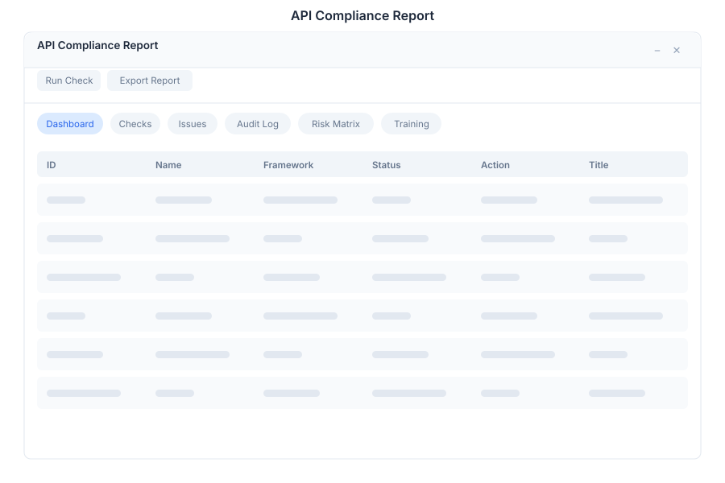

# Compliance - ISO 27001

> **Information security compliance**

---

## Overview

Compliance is an ISO 27001 information security compliance management system within General Bots Suite. Run compliance checks, track issues, manage audit logs, assess risks, assign training, and monitor compliance posture. Compliance provides comprehensive tools for maintaining information security standards.

---

## Features

### Checks

| Action | Description |
|--------|-------------|
| **Run** | Execute compliance checks |
| **Schedule** | Automate periodic checks |
| **Custom** | Create custom check rules |
| **Results** | View detailed check results |
| **History** | Track check execution history |

### Issues

| Action | Description |
|--------|-------------|
| **Track** | Monitor open compliance issues |
| **Assign** | Assign issues to team members |
| **Resolve** | Mark issues as resolved |
| **Escalate** | Escalate critical issues |
| **Report** | Generate issue reports |

### Audit Log

| Feature | Description |
|---------|-------------|
| **Search** | Full-text search across events |
| **Filter** | By date, user, action, or category |
| **Export** | Download as CSV or JSON |
| **Retention** | Configurable retention policies |
| **Compliance** | LGPD/GDPR audit support |

### Risk Matrix

| Feature | Description |
|---------|-------------|
| **Assess** | Evaluate risk likelihood and impact |
| **Mitigate** | Define mitigation strategies |
| **Track** | Monitor risk status |
| **Visualize** | Risk heat map |
| **Review** | Periodic risk reassessment |

### Training

| Feature | Description |
|---------|-------------|
| **Assign** | Create training assignments |
| **Track** | Monitor completion status |
| **Reminders** | Automated reminders |
| **Certificates** | Issue completion certificates |
| **Reports** | Training compliance reports |

### Dashboard

| Metric | Description |
|--------|-------------|
| **Score** | Overall compliance score |
| **Trends** | Score changes over time |
| **Issues** | Open/closed issues |
| **Training** | Completion percentages |
| **Deadlines** | Upcoming compliance deadlines |

---

## Keyboard Shortcuts

| Shortcut | Action |
|----------|--------|
| `G` then `C` | Go to Checks |
| `G` then `I` | Go to Issues |
| `G` then `A` | Go to Audit Log |
| `G` then `R` | Go to Risk Matrix |
| `G` then `T` | Go to Training |
| `N` | Create new issue |
| `/` | Focus search |
| `Ctrl+R` | Run compliance check |

---

## Compliance via Chat

### Running Compliance Check

  

    

      
Run compliance check

      
16:00

    

  

  

    

      
🔍 Compliance Check Started

      
📋 Running ISO 27001 checks...

      
✅ Access Control: PASS

      
✅ Data Encryption: PASS

      
⚠️ Backup Verification: WARNING

      
❌ Incident Response Plan: FAIL

      
📊 Overall: 85% compliant

      
16:00

    

  

### Viewing Compliance Score

  

    

      
Show compliance score

      
16:05

    

  

  

    

      
📊 Compliance Dashboard

      
🎯 Score: 85/100

      
📈 Trend: +3 points (last 30 days)

      
⚠️ Open Issues: 4

      
✅ Resolved This Month: 12

      
📅 Next Audit: 2024-02-15

      
16:05

    

  

---

## API Reference

| Endpoint | Method | Description |
|----------|--------|-------------|
| `/api/compliance/checks` | GET | List compliance checks |
| `/api/compliance/checks/run` | POST | Run compliance check |
| `/api/compliance/issues` | GET | List compliance issues |
| `/api/compliance/issues` | POST | Create issue |
| `/api/compliance/issues/:id` | PUT | Update issue |
| `/api/compliance/audit` | GET | Query audit log |
| `/api/compliance/audit/export` | GET | Export audit log |
| `/api/compliance/risks` | GET | List risks |
| `/api/compliance/risks` | POST | Create risk assessment |
| `/api/compliance/training` | GET | List training assignments |
| `/api/compliance/training` | POST | Create training assignment |
| `/api/compliance/dashboard` | GET | Get compliance dashboard |

---

## Related Pages

- [Tools](tools.md) — Security dashboard
- [Admin](admin.md) — System administration
- [Compliance API](compliance-api.md) — Compliance REST API
- [RBAC Overview](../../09-security/rbac-overview.md) — Role-based access control