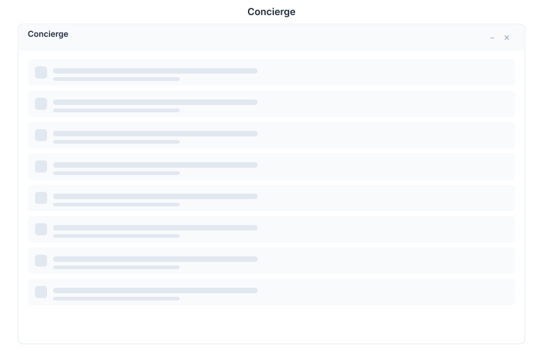

# Concierge 🟡 PREVIEW

> **Preview application.** Usable today, not yet part of the supported surface.

Concierge is an AI front door: you state a goal in natural language and it works out which applications to drive to reach it, instead of you opening each app in turn.

## What it does

| Capability | Detail |
|---|---|
| **Goal-oriented entry** | Describe the outcome ("prepare the monthly summary and send it to the team") rather than the steps |
| **Cross-app execution** | Plans actions across the suite rather than inside one application |
| **Confirmation before side effects** | Actions that change or send data are surfaced for approval rather than applied silently |

Concierge is the conversational counterpart to the UI-automation surface: both let the assistant act on apps, one from a chat and one from a plan.

## Opening it

Concierge is a **preview** application. Turn on the **Preview** switch in the left sidebar, then open **Concierge** from the app menu.

## Limits

- It is an early surface. Treat its plans as proposals and review them before relying on the outcome.
- What it can do is bounded by the applications that expose actions to it.

## See Also

- [Chat](./chat.md) - The conversational surface
- [Vibe](./vibe.md) - The agentic project workspace
- [Apps overview](./README.md) - Stability classification for the whole suite
