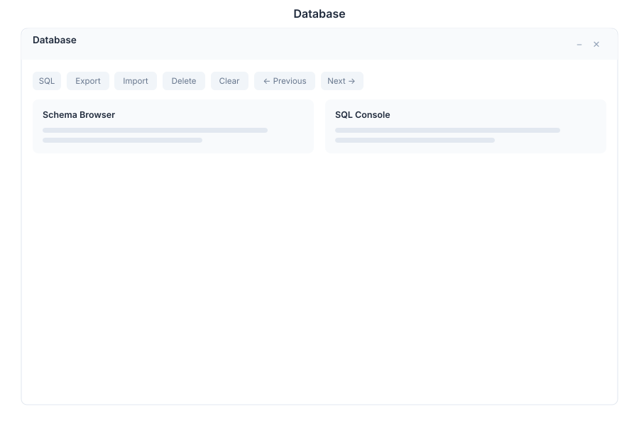

# Database 🟡 BETA - Schema Browser

> **Browse and edit database tables**

---

## Overview

Database is your visual database management tool for General Bots Suite. Browse schemas, query data with SQL, edit records inline, and import or export CSV files. It provides a clean data grid interface for quick inspection and manipulation of database tables without leaving the Suite.

---

## Features

### Schema Browser

Explore all database tables and their structure:

- **Tables** — List all tables in the connected database
- **Columns** — View column names, types, constraints, and defaults
- **Indexes** — Inspect primary keys, unique indexes, and foreign keys
- **Relationships** — See foreign key relationships between tables

### Data Grid

View and edit table contents directly in the browser:

- **Inline Editing** — Click a cell to edit its value in place
- **Sorting** — Click column headers to sort ascending or descending
- **Filtering** — Apply per-column filters to narrow results
- **Row Selection** — Select individual rows or all rows for bulk operations

### SQL Query Editor

Write and execute custom SQL queries:

- **Syntax Highlighting** — Color-coded SQL keywords and identifiers
- **Auto-Complete** — Suggest table and column names as you type
- **Execute** — Run the query and view results in the grid
- **Save Queries** — Store frequently used queries for quick access
- **Query History** — Re-run previous queries from history

### Import / Export CSV

Move data between CSV files and database tables:

- **Import** — Upload a CSV file and map columns to the target table
- **Export** — Download table data or query results as CSV
- **Delimiter Options** — Support for comma, semicolon, and tab delimiters
- **Encoding** — UTF-8, Latin-1, and other character encodings

### Pagination

Navigate large result sets efficiently:

- **Page Size** — Choose rows per page (25, 50, 100, 500)
- **Page Navigation** — First, Previous, Next, Last page buttons
- **Total Count** — Display total row count for the query

### Column Filters

Apply quick filters on any column:

- **Text Columns** — Contains, equals, starts with, ends with
- **Numeric Columns** — Equals, greater than, less than, between
- **Date Columns** — Before, after, between dates
- **Null Filters** — Show only null or non-null values

---

## Keyboard Shortcuts

| Shortcut | Action |
|----------|--------|
| `Ctrl+Enter` | Execute SQL query |
| `Ctrl+S` | Save current query |
| `Ctrl+N` | New query tab |
| `/` | Focus search / filter |
| `Escape` | Close modal or cancel edit |
| `↑` `↓` | Navigate rows in grid |
| `F2` | Edit selected cell |
| `Delete` | Delete selected row |

---

## Database via Chat

  

    

      
Show me the users table

      
10:30

    

  

  

    

      
Here is the <code>users</code> table with 1,247 rows:

      
| id | name | email | created_at |

      
| 1 | Jane Doe | jane@example.com | 2025-01-15 |

      
| 2 | John Smith | john@example.com | 2025-02-03 |

      
| 3 | Maria Silva | maria@example.com | 2025-03-12 |

      
10:30

    

  

  

    

      
Query: SELECT * FROM orders WHERE total > 1000

      
10:31

    

  

  

    

      
The query returned 38 rows where <code>total</code> exceeds 1,000:

      
| id | user_id | total | status | date |

      
| 102 | 5 | 2,450.00 | paid | 2025-05-10 |

      
| 118 | 12 | 1,890.00 | pending | 2025-05-12 |

      
| 134 | 3 | 3,100.00 | paid | 2025-05-14 |

      
10:31

    

  

---

## API Reference

| Endpoint | Method | Description |
|----------|--------|-------------|
| `/api/database/tables` | GET | List all tables in the database |
| `/api/database/tables/:name` | GET | Get table schema (columns, types, constraints) |
| `/api/database/tables/:name/rows` | GET | Query table rows with pagination and filters |
| `/api/database/tables/:name/rows` | POST | Insert a new row |
| `/api/database/tables/:name/rows/:id` | PUT | Update a row by primary key |
| `/api/database/tables/:name/rows/:id` | DELETE | Delete a row by primary key |
| `/api/database/query` | POST | Execute a custom SQL query |
| `/api/database/query/saved` | GET | List saved queries |
| `/api/database/query/saved` | POST | Save a new query |
| `/api/database/query/history` | GET | Get query execution history |
| `/api/database/import/csv` | POST | Import CSV data into a table |
| `/api/database/export/csv` | GET | Export table or query results as CSV |

---

## Related Pages

- [Analytics](./analytics.md) — Visualize database data with charts and dashboards
- [CRM](./crm.md) — Customer relationship data stored in database tables
- [Sources](./sources.md) — Configure external database connections
- [Admin](./admin.md) — Database administration and user permissions
