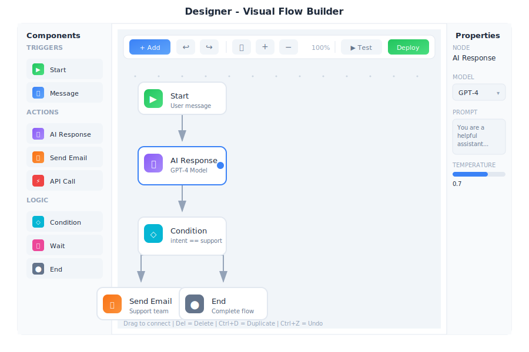

# Designer - Visual Builder

> **Your no-code bot building studio**



---

## Overview

Designer is the visual bot builder in General Bots Suite. Create conversation flows, design user interfaces, and build automations without writing code. Designer uses a drag-and-drop interface that makes bot development accessible to everyone.

---

## Features

### Creating a New Flow

**Step 1: Open Designer**

1. Click the apps menu (⋮⋮⋮)
2. Select **Designer**
3. Click **+ New Flow**

**Step 2: Configure Flow**

| Setting | Description |
|---------|-------------|
| **Flow Name** | Descriptive title (e.g., "Customer Support") |
| **Description** | Brief explanation of what the flow does |
| **Start from** | Blank canvas, Template, or Import from file |

**Step 3: Add Components**

Drag components from the left panel onto the canvas.

**Step 4: Connect Components**

Click and drag from one component's output to another's input.

---

### Component Types

#### Communication Components

| Component | Icon | Purpose |
|-----------|------|---------|
| **Talk** | 💬 | Send a message to the user |
| **Hear** | 👂 | Wait for user input |
| **Ask** | ❓ | Ask a question and capture response |
| **Show** | 🖼️ | Display an image, card, or media |
| **Menu** | 📋 | Show clickable options |

**Talk Component Options:**
- Message text with variations (AI picks randomly)
- Use AI to personalize
- Include typing indicator
- Delay before sending

**Ask Component Options:**
- Question text
- Variable name to save response
- Expected type: Text, Number, Email, Phone, Date, Yes/No, Multiple Choice
- Validation message for invalid input

---

#### Logic Components

| Component | Icon | Purpose |
|-----------|------|---------|
| **Branch** | 🔀 | Conditional logic (if/else) |
| **Loop** | 🔄 | Repeat actions |
| **Switch** | 🔃 | Multiple conditions |
| **Wait** | ⏱️ | Pause execution |
| **End** | 🏁 | End the flow |

**Branch Configuration:**
- Set condition using variable comparisons
- Add multiple AND/OR conditions
- TRUE and FALSE output paths

---

#### Action Components

| Component | Icon | Purpose |
|-----------|------|---------|
| **Action** | ⚡ | Execute a BASIC keyword |
| **API Call** | 🌐 | Call external API |
| **Database** | 🗄️ | Query or update data |
| **Email** | ✉️ | Send an email |
| **Set Variable** | 📝 | Store a value |

**Action Error Handling:**
- Stop flow and show error
- Continue to error path
- Retry N times

---

#### AI Components

| Component | Icon | Purpose |
|-----------|------|---------|
| **AI Chat** | 🤖 | Natural language conversation |
| **Search KB** | 🔍 | Search knowledge base |
| **Generate** | ✨ | Generate text with AI |
| **Classify** | 🏷️ | Categorize user input |
| **Extract** | 📤 | Extract data from text |

**Classify Example Categories:**
- `support` - Customer needs help with a problem
- `sales` - Customer interested in buying
- `billing` - Payment or invoice questions
- `feedback` - Customer giving feedback
- `other` - Anything else

---

### Working with the Canvas

#### Navigation

| Action | How To |
|--------|--------|
| **Pan** | Click and drag on empty space |
| **Zoom in** | Scroll up or click [+] |
| **Zoom out** | Scroll down or click [-] |
| **Fit to screen** | Click [⌖] or press `F` |
| **Select multiple** | Hold Shift and click |
| **Box select** | Hold Ctrl and drag |

#### Canvas Controls

| Control | Purpose |
|---------|---------|
| **[+] [-]** | Zoom in/out |
| **[⌖]** | Fit to view |
| **Grid** | Show/hide grid |
| **Snap** | Snap to grid |
| **Auto** | Auto-arrange components |

---

### Using Variables

Variables store information during the conversation.

**System Variables (read-only):**

| Variable | Description |
|----------|-------------|
| `{{user.name}}` | User's display name |
| `{{user.email}}` | User's email address |
| `{{user.phone}}` | User's phone number |
| `{{channel}}` | Current channel (web, whatsapp, etc) |
| `{{today}}` | Today's date |
| `{{now}}` | Current date and time |
| `{{botName}}` | Name of this bot |

**Flow Variables:** Variables you create using Ask or Set Variable components.

Reference variables with double curly braces: `{{variableName}}`

---

### Testing Your Flow

**Preview Mode:**

1. Click **Preview** button
2. A chat window opens
3. Test the conversation
4. Watch the flow highlight active steps

The Preview panel shows:
- Flow visualization with active step highlighted
- Test conversation area
- Current variable values
- Clear and Reset buttons

---

### Deploying Your Flow

When your flow is ready:

1. Click **Deploy**
2. Choose deployment options:
   - **Production** or **Staging only**
   - **Immediate** or **Scheduled**
3. Configure triggers:
   - Specific phrases (e.g., "help", "support")
   - As default fallback
   - On schedule
4. Review changes since last deploy
5. Confirm deployment

---

### Templates

Start faster with pre-built templates:

| Template | Description |
|----------|-------------|
| **📋 FAQ Bot** | Answer common questions from knowledge base |
| **🎫 Support** | Ticket creation and tracking |
| **💰 Sales** | Lead capture and qualification |
| **📅 Appointment** | Schedule meetings and appointments |
| **📝 Feedback** | Collect customer feedback |
| **🚀 Onboarding** | New user welcome and setup guide |

---

## Keyboard Shortcuts

### Canvas

| Shortcut | Action |
|----------|--------|
| `Space + Drag` | Pan canvas |
| `Ctrl + +` | Zoom in |
| `Ctrl + -` | Zoom out |
| `Ctrl + 0` | Reset zoom |
| `F` | Fit to screen |
| `G` | Toggle grid |
| `Delete` | Delete selected |
| `Ctrl + D` | Duplicate selected |
| `Ctrl + Z` | Undo |
| `Ctrl + Y` | Redo |

### Components

| Shortcut | Action |
|----------|--------|
| `T` | Add Talk component |
| `H` | Add Hear component |
| `A` | Add Ask component |
| `B` | Add Branch component |
| `E` | Edit selected component |
| `Ctrl + C` | Copy component |
| `Ctrl + V` | Paste component |
| `Ctrl + X` | Cut component |

### Flow

| Shortcut | Action |
|----------|--------|
| `Ctrl + S` | Save flow |
| `Ctrl + P` | Preview flow |
| `Ctrl + Enter` | Deploy flow |
| `Ctrl + E` | Export flow |
| `Ctrl + I` | Import flow |

---

## Tips & Tricks

### Design Tips

💡 **Keep flows simple** - Break complex flows into smaller sub-flows

💡 **Use descriptive names** - "Ask for Email" is better than "Step 3"

💡 **Add comments** - Right-click any component to add notes

💡 **Test often** - Preview after every few changes

### Organization Tips

💡 **Use folders** to organize related flows

💡 **Version your flows** - Save before major changes

💡 **Use templates** for consistent starting points

💡 **Color-code paths** - Use colors for different intents

### Performance Tips

💡 **Minimize API calls** - Cache results when possible

💡 **Use AI classification early** - Route users quickly

💡 **Set timeouts** - Don't let flows hang indefinitely

💡 **Handle errors** - Always add error paths

---

## Troubleshooting

### Flow not triggering

**Possible causes:**
1. Flow not deployed
2. Trigger words not matching
3. Another flow has priority

**Solution:**
1. Click Deploy and confirm it's active
2. Check trigger configuration
3. Review flow priority in settings
4. Test with exact trigger phrases

---

### Variables not working

**Possible causes:**
1. Typo in variable name
2. Variable not set yet in flow
3. Wrong scope

**Solution:**
1. Check spelling matches exactly (case-sensitive)
2. Ensure variable is set before being used
3. Use Preview mode to watch variable values
4. Check the Variables panel for current values

---

### Component errors

**Possible causes:**
1. Missing required configuration
2. Invalid connection
3. Action failed

**Solution:**
1. Click the red error icon for details
2. Fill in all required fields
3. Check that connections make logical sense
4. Review error logs in Preview mode

---

### Preview not matching production

**Possible causes:**
1. Changes not deployed
2. Different data in production
3. External service differences

**Solution:**
1. Deploy latest changes
2. Test with same data as production
3. Check API connections are identical
4. Review production logs

---

## BASIC Integration

Designer flows generate BASIC code. You can view and customize it.

### View Generated Code

Right-click any component and select "View Code":

```botserver/docs/src/07-user-interface/apps/designer-generated.basic
' Generated from "Customer Support" flow

TALK "Hello! How can I help you today?"

HEAR userMessage AS TEXT

intent = CLASSIFY userMessage INTO ["support", "sales", "billing", "other"]

IF intent = "support" THEN
    TALK "I'm sorry to hear you're having issues!"
    HEAR orderNumber AS TEXT "What's your order number?"
    result = SEARCH KB "order " + orderNumber
    TALK result.answer
ELSE IF intent = "sales" THEN
    ' ... sales flow
END IF
```

### Mix Designer and Code

Use the **Code** component to add custom BASIC:

```botserver/docs/src/07-user-interface/apps/designer-custom.basic
' Custom calculation
discount = 0

IF userType = "premium" THEN
    discount = orderTotal * 0.15
ELSE IF orderTotal > 100 THEN
    discount = orderTotal * 0.05
END IF

finalPrice = orderTotal - discount
```

---

## See Also

- [Sources App](./sources.md) - Manage prompts and templates
- [Chat App](./chat.md) - Test your flows
- [How To: Write Your First Dialog](../how-to/write-first-dialog.md)
- [BASIC Keywords Reference](../../04-basic-scripting/keywords-reference.md)