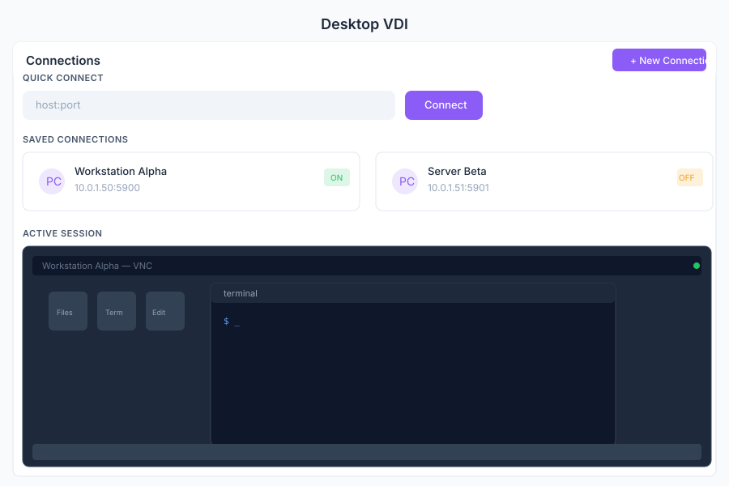

# Desktop 🟡 BETA - Virtual Desktop

> **Remote desktop via VNC**

---

## Overview

Desktop provides remote desktop access to virtual machines and servers directly from General Bots Suite. Connect via VNC, control the remote session with full keyboard and mouse support, and manage your saved connections for quick access.

---

## Features

### Connections

Manage your saved VNC connections:

- **Quick Connect** — Enter a host and port for a one-time connection
- **Saved Connections** — Store frequently used hosts with credentials
- **Connection Groups** — Organize connections by environment (dev, staging, prod)
- **Auto-Reconnect** — Automatically reconnect on network interruption
- **Connection History** — View recently connected hosts

### VNC Session

Full remote desktop control:

- **Keyboard Input** — Send keystrokes including special keys
- **Mouse Control** — Full mouse movement, click, and scroll support
- **Clipboard Sync** — Copy and paste between local and remote
- **Screenshot** — Capture the current remote screen
- **Disconnect** — Gracefully end the session

### Resolution

Configure the remote desktop resolution:

- **Auto** — Match the browser viewport size
- **Custom** — Set a specific resolution (e.g., 1920x1080)
- **Fullscreen** — Expand to fill the entire browser window

### Scaling

Adjust the remote desktop display:

- **Fit to Window** — Scale the remote screen to fit the browser
- **Original Size** — Display at native resolution (scrollable)
- **Custom Zoom** — Manually adjust the zoom level

### Ctrl+Alt+Del

Send special key combinations to the remote session:

- **Ctrl+Alt+Del** — Trigger the system menu on Windows hosts
- **Ctrl+Alt+Esc** — Alternative system menu
- **Ctrl+Alt+Backspace** — Reset X server on Linux hosts
- **Custom Combo** — Send any key combination via dropdown

---

## Keyboard Shortcuts

| Shortcut | Action |
|----------|--------|
| `F11` | Toggle fullscreen mode |
| `Ctrl+Alt+D` | Send Ctrl+Alt+Del to remote |
| `Ctrl+Alt+F` | Toggle fit-to-window scaling |
| `Ctrl+Shift+C` | Copy to clipboard |
| `Ctrl+Shift+V` | Paste from clipboard |
| `Escape` | Release mouse capture |
| `N` | New connection |
| `/` | Search connections |

---

## Desktop via Chat

  

    

      
Connect to my desktop

      
10:30

    

  

  

    

      
Establishing VNC connection to <code>desktop1.pragmatismo.com.br</code>...

      
Session started. You now have full control of the remote desktop.

      
10:30

    

  

  

    

      
Go fullscreen

      
10:31

    

  

  

    

      
Fullscreen mode activated. Press <code>Escape</code> to exit.

      
10:31

    

  

---

## API Reference

| Endpoint | Method | Description |
|----------|--------|-------------|
| `/api/desktop/connections` | GET | List saved connections |
| `/api/desktop/connections` | POST | Save a new connection |
| `/api/desktop/connections/:id` | GET | Get connection details |
| `/api/desktop/connections/:id` | PUT | Update connection |
| `/api/desktop/connections/:id` | DELETE | Delete connection |
| `/api/desktop/connect` | POST | Start a new VNC session |
| `/api/desktop/connect/:id` | POST | Connect to a saved connection |
| `/api/desktop/sessions` | GET | List active VNC sessions |
| `/api/desktop/sessions/:id` | DELETE | Disconnect an active session |
| `/api/desktop/sessions/:id/screenshot` | GET | Capture current screen |

---

## Related Pages

- [Admin](./admin.md) — Server and container management
- [ITSM](./itsm.md) — Incident management for remote support
- [Chat](./chat.md) — Discuss issues while sharing a remote session
