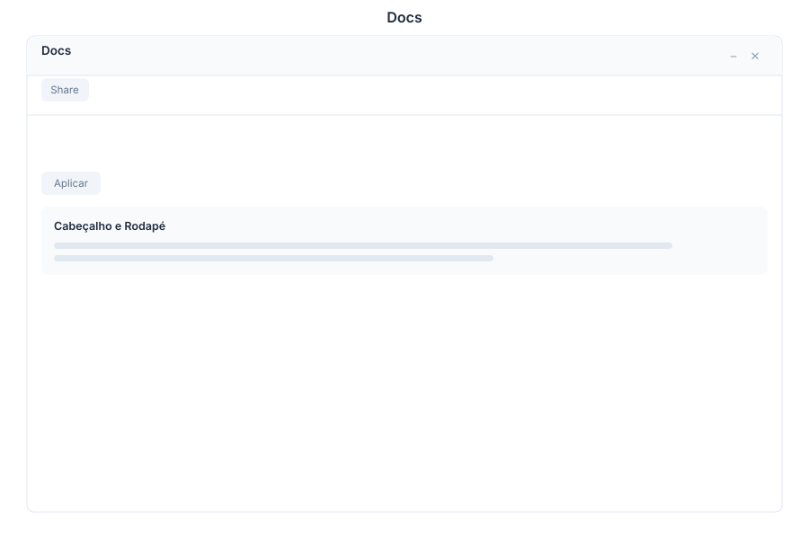

# Docs - AI Writing

> **Intelligent document editor**



---

## Overview

Docs is the AI-powered document editor in General Bots Suite. Create, format, and collaborate on rich text documents with intelligent writing assistance. Use the toolbar for traditional formatting or leverage AI to rewrite, summarize, and expand your content.

---

## Features

### Toolbar

| Action | Description |
|--------|-------------|
| Bold | Make text bold |
| Italic | Make text italic |
| Underline | Underline text |
| Headings | H1, H2, H3, H4 levels |
| Quote | Block quote formatting |
| Code | Inline code formatting |
| Link | Insert hyperlink |

### Font

| Setting | Options |
|---------|---------|
| Family | Sans, Serif, Mono, Handwriting |
| Size | 10px to 48px |
| Color | Full color picker |
| Highlight | Background color for text |

### Alignment

| Option | Description |
|--------|-------------|
| Left | Align text left |
| Center | Center text |
| Right | Align text right |
| Justify | Full justification |

### Lists

| Type | Description |
|------|-------------|
| Bullet | Unordered list |
| Numbered | Ordered list |
| Checklist | Task list with checkboxes |
| Indent | Increase list level |
| Outdent | Decrease list level |

### Insert

| Element | Description |
|---------|-------------|
| Image | Upload or embed images |
| Table | Insert configurable tables |
| Link | Hyperlink to web pages |
| Divider | Horizontal rule |
| Code Block | Multi-line code with syntax |
| Embed | External content embeds |

### AI Assist

| Action | Description |
|--------|-------------|
| Rewrite | Improve writing quality |
| Summarize | Condense to key points |
| Expand | Elaborate on ideas |
| Fix Grammar | Correct grammar and spelling |
| Change Tone | Adjust formality level |
| Translate | Translate to another language |

---

## Keyboard Shortcuts

| Shortcut | Action |
|----------|--------|
| `Ctrl+B` | Bold |
| `Ctrl+I` | Italic |
| `Ctrl+U` | Underline |
| `Ctrl+S` | Save document |
| `Ctrl+Z` | Undo |
| `Ctrl+Y` | Redo |
| `Ctrl+Shift+H` | Cycle heading levels |
| `Ctrl+K` | Insert link |
| `Ctrl+Shift+I` | Insert image |
| `Ctrl+Enter` | AI assist (when focused on AI panel) |
| `Escape` | Close AI panel |

---

## Docs via Chat

### Creating a Document

<div class="wa-chat">
  <div class="wa-message user">
    <div class="wa-bubble">
      <p>Create a project proposal</p>
      <div class="wa-time">09:00</div>
    </div>
  </div>
  <div class="wa-message bot">
    <div class="wa-bubble">
      <p>📝 I've created a new document: <strong>Project Proposal</strong></p>
      <p>Here's a draft structure:</p>
      <p>1. Executive Summary</p>
      <p>2. Project Objectives</p>
      <p>3. Scope & Deliverables</p>
      <p>4. Timeline</p>
      <p>5. Budget Estimate</p>
      <p>[Open in Docs] [Edit via Chat]</p>
      <div class="wa-time">09:00</div>
    </div>
  </div>
</div>

### Summarizing a Document

<div class="wa-chat">
  <div class="wa-message user">
    <div class="wa-bubble">
      <p>Summarize this document</p>
      <div class="wa-time">10:30</div>
    </div>
  </div>
  <div class="wa-message bot">
    <div class="wa-bubble">
      <p>📋 <strong>Document Summary</strong></p>
      <p>This proposal outlines a 3-month project to deploy a new CRM system. Key points:</p>
      <p>• Budget: $45,000</p>
      <p>• Team: 5 developers, 1 project manager</p>
      <p>• Deadline: August 30, 2025</p>
      <p>• Risk: Integration with legacy APIs</p>
      <p>[Add Summary to Top] [Create Brief Version]</p>
      <div class="wa-time">10:30</div>
    </div>
  </div>
</div>

### Improving Writing

<div class="wa-chat">
  <div class="wa-message user">
    <div class="wa-bubble">
      <p>Make the executive summary more professional</p>
      <div class="wa-time">11:00</div>
    </div>
  </div>
  <div class="wa-message bot">
    <div class="wa-bubble">
      <p>✍️ Here's the improved version:</p>
      <p>"This proposal presents a comprehensive plan for the implementation of a customer relationship management system, designed to enhance operational efficiency and customer engagement across all departments."</p>
      <p>[Replace Original] [Keep Both] [Edit Further]</p>
      <div class="wa-time">11:00</div>
    </div>
  </div>
</div>

---

## API Endpoints

| Endpoint | Method | Description |
|----------|--------|-------------|
| `/api/docs` | GET | List all documents |
| `/api/docs` | POST | Create new document |
| `/api/docs/:id` | GET | Get document content |
| `/api/docs/:id` | PATCH | Update document content |
| `/api/docs/:id` | DELETE | Delete document |
| `/api/docs/:id/share` | POST | Share with users |
| `/api/docs/:id/export` | GET | Export as PDF/DOCX/HTML |
| `/api/docs/search` | GET | Search documents |

### Create Document Request

```json
{
    "title": "Project Proposal",
    "content": "<h1>Executive Summary</h1><p>This proposal outlines...</p>",
    "folder_id": "folder-abc",
    "tags": ["project", "proposal"]
}
```

### Document Response

```json
{
    "id": "doc-456",
    "title": "Project Proposal",
    "content": "<h1>Executive Summary</h1><p>This proposal outlines...</p>",
    "created_at": "2025-05-15T09:00:00Z",
    "updated_at": "2025-05-15T11:00:00Z",
    "author": {
        "id": "usr-123",
        "name": "Marketing Lead"
    },
    "word_count": 1250,
    "collaborators": []
}
```

---

## Configuration

Docs settings can be configured in `config.csv`:

```csv
key,value
auto-save-interval,30
max-document-size,10MB
ai-assist-enabled,true
default-font,sans
```

---

## Troubleshooting

### Document Not Saving

1. Check internet connection
2. Verify document size is under limit
3. Check for conflicting edits
4. Refresh the page and retry

### AI Assist Not Responding

1. Verify AI service is enabled in config
2. Check API key for LLM provider
3. Ensure text selection is valid
4. Try with shorter content

### Formatting Lost

1. Check if content was pasted from external source
2. Verify the export format supports the formatting
3. Use paste-as-plain-text for external content
4. Check browser compatibility

---

## See Also

- [Suite Manual](../suite-manual.md) - Complete user guide
- [Drive](./drive.md) - File storage
- [Chat App](./chat.md) - Create docs via chat
- [BASIC File Keywords](../../04-basic-scripting/keyword-file.md) - Script integration
