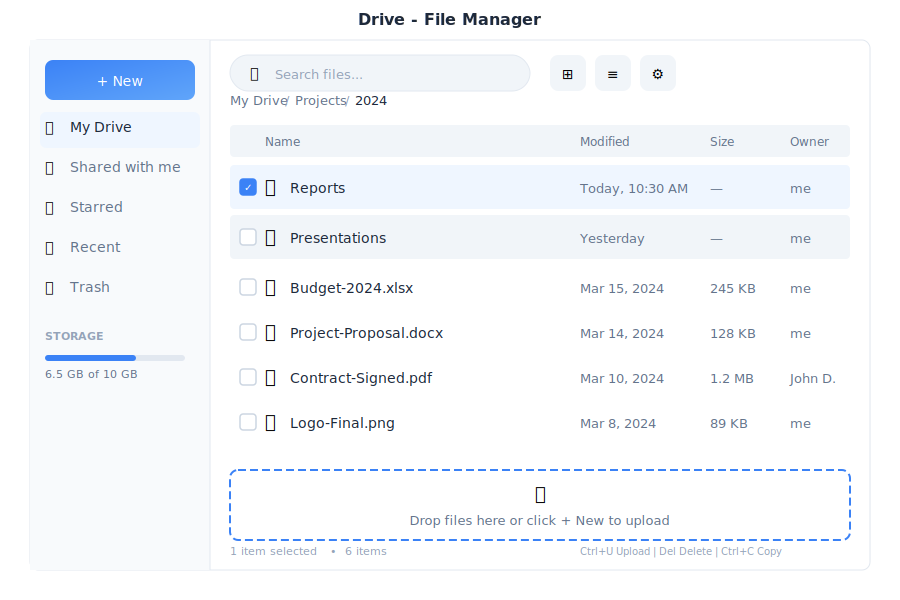

# Drive - File Management

> **Your cloud storage workspace**



---

## Overview

Drive is your personal cloud storage within General Bots Suite. Upload, organize, and share files with a familiar interface. Built with HTMX for smooth interactions and SeaweedFS for reliable object storage.

---

## Features

### Upload Files

**Drag and Drop:**
1. Drag files from your computer
2. Drop anywhere in the file area
3. Upload progress shows automatically

**Click to Upload:**
1. Click **+ New** button
2. Select **Upload Files** or **Upload Folder**
3. Choose files from file picker

### File Operations

| Action | How to Access |
|--------|---------------|
| **Open** | Double-click file |
| **Download** | Right-click > Download |
| **Rename** | Right-click > Rename |
| **Copy** | Right-click > Copy |
| **Move** | Right-click > Move to |
| **Star** | Right-click > Star |
| **Share** | Right-click > Share |
| **Delete** | Right-click > Delete |

### View Modes

| Mode | Description |
|------|-------------|
| **Grid** | Large thumbnails with previews |
| **List** | Detailed table with columns |

### Navigation

- **Breadcrumb**: Click any folder in the path to jump back
- **Sidebar**: Quick access to My Drive, Starred, Recent, Trash
- **Search**: Find files by name or content

### Labels & Organization

| Label | Icon | Use For |
|-------|------|---------|
| Work | 🔵 | Professional files |
| Personal | 🟢 | Private documents |
| Projects | 🟡 | Project-specific files |
| Custom | 🟣 | Create your own |

### File Sync (Desktop Only)

The desktop app provides bidirectional file synchronization between your local machine and cloud Drive using [rclone](https://rclone.org/).

**Requirements:**
- General Bots desktop app (Tauri)
- rclone installed on your system

**Setup:**
1. Install rclone: `https://rclone.org/install/`
2. Open Drive in the desktop app
3. Click **Settings** → **Sync**
4. Configure your sync folder (default: `~/GeneralBots`)
5. Click **Start Sync**

**Sync Controls:**
Located in the Drive sidebar under "Sync Status"

| Control | Description |
|---------|-------------|
| **Start** | Begin synchronization |
| **Stop** | Stop current sync |
| **Status** | Shows idle, syncing, or error |

**Sync Modes:**

| Mode | Description |
|------|-------------|
| **Push** | Local → Cloud only |
| **Pull** | Cloud → Local only |
| **Bisync** | Bidirectional (default) |

**Note:** Sync features are only available in the desktop app. Web users see an "unavailable" status as sync requires local filesystem access.

---

## Keyboard Shortcuts

| Shortcut | Action |
|----------|--------|
| `Enter` | Open selected file |
| `Delete` | Move to trash |
| `Ctrl+C` | Copy selected |
| `Ctrl+V` | Paste |
| `Ctrl+X` | Cut selected |
| `Ctrl+A` | Select all |
| `F2` | Rename selected |
| `Ctrl+F` | Search files |
| `Ctrl+U` | Upload files |
| `↑` / `↓` | Navigate files |

---

## Managing Files via Chat

<div class="wa-chat">
  <div class="wa-message user">
    <div class="wa-bubble">
      <p>Upload the quarterly report</p>
      <p>📎 Q4-Report.pdf</p>
      <div class="wa-time">10:30</div>
    </div>
  </div>
  <div class="wa-message bot">
    <div class="wa-bubble">
      <p>✅ File uploaded successfully!</p>
      <p>📄 Q4-Report.pdf (2.4 MB)</p>
      <p>📁 Saved to: My Drive</p>
      <div class="wa-time">10:30</div>
    </div>
  </div>
</div>

### Finding Files

<div class="wa-chat">
  <div class="wa-message user">
    <div class="wa-bubble">
      <p>Find the budget spreadsheet</p>
      <div class="wa-time">14:15</div>
    </div>
  </div>
  <div class="wa-message bot">
    <div class="wa-bubble">
      <p>📁 Found 2 files matching "budget":</p>
      <p>📊 Budget-2025.xlsx (245 KB)</p>
      <p>📊 Budget-Draft.xlsx (180 KB)</p>
      <p>Which one would you like to open?</p>
      <div class="wa-time">14:15</div>
    </div>
  </div>
  <div class="wa-message user">
    <div class="wa-bubble">
      <p>Open the 2025 one</p>
      <div class="wa-time">14:15</div>
    </div>
  </div>
  <div class="wa-message bot">
    <div class="wa-bubble">
      <p>📊 Opening Budget-2025.xlsx...</p>
      <p>View in Player or download?</p>
      <div class="wa-time">14:15</div>
    </div>
  </div>
</div>

### Sharing Files

<div class="wa-chat">
  <div class="wa-message user">
    <div class="wa-bubble">
      <p>Share the project proposal with Sarah</p>
      <div class="wa-time">09:00</div>
    </div>
  </div>
  <div class="wa-message bot">
    <div class="wa-bubble">
      <p>✅ File shared!</p>
      <p>📄 Project-Proposal.pdf</p>
      <p>👤 Shared with: Sarah</p>
      <p>🔗 Link: https://...</p>
      <p>Sarah will receive an email notification.</p>
      <div class="wa-time">09:00</div>
    </div>
  </div>
</div>

### Creating Folders

<div class="wa-chat">
  <div class="wa-message user">
    <div class="wa-bubble">
      <p>Create a folder called "2025 Projects"</p>
      <div class="wa-time">11:20</div>
    </div>
  </div>
  <div class="wa-message bot">
    <div class="wa-bubble">
      <p>✅ Folder created!</p>
      <p>📁 2025 Projects</p>
      <p>📍 Location: My Drive</p>
      <div class="wa-time">11:20</div>
    </div>
  </div>
</div>

---

## API Endpoints

| Endpoint | Method | Description |
|----------|--------|-------------|
| `/api/drive/list` | GET | List files |
| `/api/drive/upload` | POST | Upload file |
| `/api/drive/download/:path` | GET | Download file |
| `/api/drive/delete/:path` | DELETE | Delete file |
| `/api/drive/move` | POST | Move/rename file |
| `/api/drive/copy` | POST | Copy file |
| `/api/drive/mkdir` | POST | Create folder |
| `/api/drive/share` | POST | Share file |

### Query Parameters

| Parameter | Values | Default |
|-----------|--------|---------|
| `path` | Folder path | `/` |
| `sort` | `name`, `size`, `modified` | `name` |
| `order` | `asc`, `desc` | `asc` |
| `view` | `grid`, `list` | `grid` |
| `filter` | `starred`, `recent`, `trash` | none |

### Response Format

```json
{
    "path": "/Projects/2024",
    "files": [
        {
            "name": "Report.pdf",
            "type": "file",
            "size": 245000,
            "modified": "2024-03-15T10:30:00Z",
            "starred": false,
            "shared": true
        },
        {
            "name": "Documents",
            "type": "folder",
            "modified": "2024-03-14T09:00:00Z",
            "starred": true
        }
    ],
    "storage": {
        "used": 4500000000,
        "total": 10737418240
    }
}
```

---

## File Type Icons

| Type | Extensions | Icon |
|------|------------|------|
| Document | .pdf, .doc, .docx | 📄 |
| Spreadsheet | .xls, .xlsx, .csv | 📊 |
| Presentation | .ppt, .pptx | 📽️ |
| Image | .jpg, .png, .gif, .svg | 🖼️ |
| Video | .mp4, .webm, .mov | 🎬 |
| Audio | .mp3, .wav, .ogg | 🎵 |
| Archive | .zip, .tar, .gz | 📦 |
| Code | .js, .py, .rs, .html | 💻 |
| Folder | - | 📁 |

---

## Storage Backend

Drive uses SeaweedFS for object storage:

- **Scalable**: Grows with your needs
- **Redundant**: Data replicated across nodes
- **Fast**: Optimized for small and large files
- **S3 Compatible**: Works with standard S3 tools

Configure storage in `config.csv`:

```csv
key,value
drive-server,http://localhost:9000
drive-bucket,bot-files
drive-quota-gb,10
```

---

## Troubleshooting

### Upload Fails

1. Check file size (default limit: 100MB)
2. Verify storage quota isn't exceeded
3. Check network connection
4. Try smaller files or compress first

### Files Not Displaying

1. Refresh the page
2. Check folder path is correct
3. Verify file permissions
4. Clear browser cache

### Sharing Not Working

1. Verify recipient email address
2. Check sharing permissions
3. Ensure file isn't in Trash

---

## See Also

- [Suite Manual](../suite-manual.md) - Complete user guide
- [Admin vs User Views](../admin-user-views.md) - Permission levels
- [Chat App](./chat.md) - Upload files via chat
- [Player App](./player.md) - View files in Player
- [Storage API](../../08-rest-api-tools/storage-api.md) - API reference