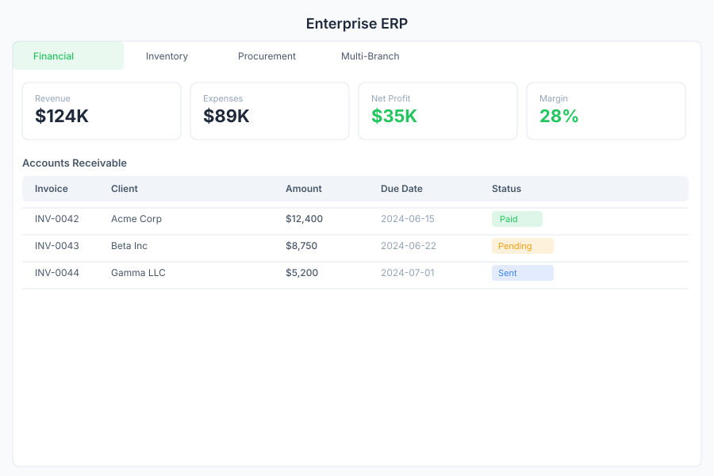

# ERP - Enterprise Resource Planning

> **Financial, inventory & procurement**

---

## Overview

ERP is the enterprise resource planning module of General Bots Suite. Manage financial operations, track inventory across multiple branches, handle procurement workflows, and gain visibility into your organization's resources from a single interface.

---

## Features

### Financial Management

Track revenue, expenses, accounts receivable, and accounts payable:

| Area | Capabilities |
|------|-------------|
| **Revenue** | Invoices, payments received, revenue forecasting |
| **Expenses** | Purchase receipts, expense reports, cost tracking |
| **Accounts Receivable** | Outstanding invoices, aging analysis, collections |
| **Accounts Payable** | Bills to pay, vendor balances, payment scheduling |

**Financial Summary Dashboard:**

| Metric | Description |
|--------|-------------|
| **Total Revenue** | Income for the current period |
| **Total Expenses** | Outgoings for the current period |
| **Net Profit** | Revenue minus expenses |
| **Outstanding AR** | Unpaid customer invoices |
| **Outstanding AP** | Unpaid vendor bills |
| **Cash Flow** | Net cash movement |

### Inventory Management

Monitor stock levels, movements, and valuations:

- **Stock Levels** — Current quantity on hand per item and location
- **Stock Movements** — Transfers, receipts, adjustments, and write-offs
- **Reorder Points** — Minimum stock thresholds with alerts
- **Valuation** — FIFO, weighted average, and standard cost methods
- **Lot Tracking** — Track items by batch or serial number

**Inventory Operations:**

| Operation | Description |
|-----------|-------------|
| **Receive** | Log incoming stock from purchase orders or returns |
| **Transfer** | Move stock between branches or warehouses |
| **Adjust** | Correct stock counts after physical counts |
| **Write-Off** | Remove damaged or expired stock |

### Procurement

Manage purchase orders and vendor relationships:

- **Purchase Orders** — Create and submit POs to vendors
- **Vendor Management** — Maintain vendor directory and contracts
- **Approval Workflow** — Multi-level approval for large purchases
- **Receipt Tracking** — Match received goods against POs
- **Three-Way Matching** — PO, receipt, and invoice reconciliation

**Purchase Order Statuses:**

| Status | Description |
|--------|-------------|
| **Draft** | PO being prepared |
| **Submitted** | Sent for approval |
| **Approved** | Authorized for purchase |
| **Received** | Goods received, pending invoice |
| **Completed** | Fully processed and matched |

### Multi-Branch Operations

Manage resources across multiple locations:

- **Branches** — Define and configure branch locations
- **Inter-Branch Transfers** — Move inventory, assets, or funds between branches
- **Consolidated Reporting** — View data across all branches or by individual branch
- **Centralized Control** — Standardize processes with branch-specific overrides

---

## Keyboard Shortcuts

| Shortcut | Action |
|----------|--------|
| `N` | New record (context-dependent) |
| `Ctrl+S` | Save current record |
| `Ctrl+P` | Print current document |
| `Escape` | Close modal or cancel edit |
| `/` | Focus search |
| `F1` | Open help |

---

## ERP via Chat

  

    

      
Show financial summary

      
10:30

    

  

  

    

      
Financial summary for May 2025:

      
- **Revenue:** $124,500.00

      
- **Expenses:** $89,200.00

      
- **Net Profit:** $35,300.00

      
- **Outstanding AR:** $42,100.00 (12 invoices)

      
- **Outstanding AP:** $28,750.00 (8 bills)

      
10:30

    

  

  

    

      
Check inventory levels

      
10:31

    

  

  

    

      
Current inventory status:

      
- **Total Items:** 342 SKUs

      
- **Low Stock (below reorder):** 18 items

      
- **Out of Stock:** 3 items

      
- **Total Valuation:** $567,800.00

      
Would you like to see the low-stock list?

      
10:31

    

  

---

## API Reference

| Endpoint | Method | Description |
|----------|--------|-------------|
| `/api/erp/financial/summary` | GET | Get financial summary for a period |
| `/api/erp/financial/revenue` | GET | List revenue records |
| `/api/erp/financial/expenses` | GET | List expense records |
| `/api/erp/financial/ar` | GET | Accounts receivable aging |
| `/api/erp/financial/ap` | GET | Accounts payable aging |
| `/api/erp/inventory` | GET | List inventory items with levels |
| `/api/erp/inventory/:id` | GET | Get item stock details |
| `/api/erp/inventory/movements` | GET | List stock movements |
| `/api/erp/inventory/transfer` | POST | Create inter-branch transfer |
| `/api/erp/procurement/po` | GET | List purchase orders |
| `/api/erp/procurement/po` | POST | Create a purchase order |
| `/api/erp/procurement/po/:id` | PUT | Update purchase order |
| `/api/erp/procurement/po/:id/approve` | POST | Approve a purchase order |
| `/api/erp/branches` | GET | List all branches |
| `/api/erp/branches/:id/consolidated` | GET | Consolidated view per branch |

---

## Related Pages

- [Billing](./billing.md) — Invoice and payment management
- [Products](./products.md) — Product catalog that feeds inventory
- [Analytics](./analytics.md) — ERP dashboards and reports
- [Database](./database.md) — Direct database access for ERP data
