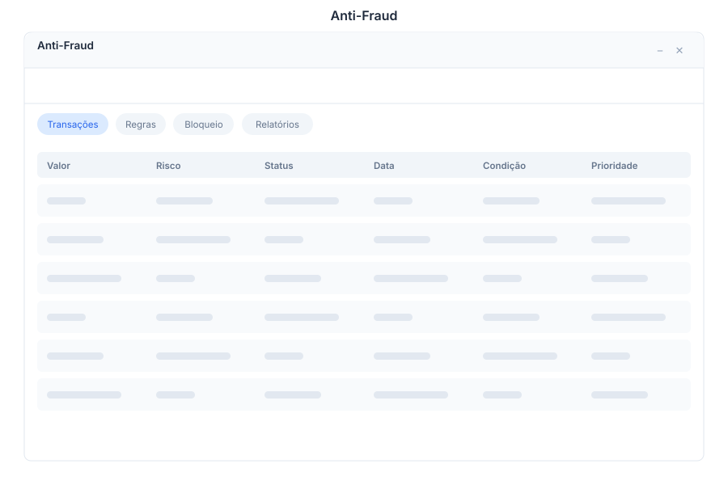

# Fraud - Anti-Fraud Engine

> **Transaction fraud detection**

---

## Overview

Fraud is the anti-fraud detection engine in General Bots Suite. Analyze transactions in real time, define detection rules, manage blocklists, and generate fraud reports. Protect your business by catching suspicious activity before it causes damage.

---

## Features

### Transaction Analysis

Review and act on flagged transactions:

- **Analyze** — Run a transaction through the detection engine
- **Approve** — Mark a flagged transaction as legitimate
- **Block** — Halt a transaction identified as fraudulent
- **Detail View** — See the full transaction history and risk indicators

**Transaction Statuses:**

| Status | Description |
|--------|-------------|
| **Pending Review** | Flagged for manual review |
| **Approved** | Reviewed and marked legitimate |
| **Blocked** | Confirmed fraudulent, transaction halted |
| **Appealed** | Under appeal by the account holder |

**Risk Indicators:**

| Indicator | Description |
|-----------|-------------|
| **Velocity** | Unusual number of transactions in short time |
| **Geo Mismatch** | Transaction location differs from recent activity |
| **Amount Anomaly** | Transaction amount significantly above average |
| **New Device** | Transaction from a previously unseen device |
| **Known Pattern** | Matches a known fraud pattern |

### Fraud Rules

Create and manage detection rules:

- **Rule Builder** — Define conditions using a visual rule editor
- **Enable / Disable** — Toggle rules on or off without deletion
- **Thresholds** — Set risk score thresholds for auto-blocking
- **Testing** — Test rules against historical data before enabling

**Rule Types:**

| Type | Description |
|------|-------------|
| **Velocity Rule** | Limit transactions per time window |
| **Amount Rule** | Flag transactions above or below a threshold |
| **Geographic Rule** | Block or flag transactions from specific regions |
| **Device Rule** | Flag transactions from new or blacklisted devices |
| **Composite Rule** | Combine multiple conditions with AND / OR logic |

### Blocklist

Manage blocked accounts, devices, and identifiers:

- **Add Entries** — Block by account ID, device ID, IP address, or email
- **Expiry** — Set automatic expiry dates for temporary blocks
- **Bulk Import** — Upload a CSV of entries to block
- **Reason Tracking** — Record why each entry was blocked

### Fraud Reports

Generate reports and view trends:

- **Statistics** — Total flagged, blocked, and approved transactions
- **Trends** — Fraud attempts over time (daily, weekly, monthly)
- **Top Patterns** — Most common fraud patterns detected
- **False Positive Rate** — Percentage of approved transactions that were initially flagged

### False Positive Tracking

Reduce unnecessary flags over time:

- **Mark False Positive** — Flag approved transactions as false positives
- **Trend Analysis** — Track false positive rates by rule
- **Rule Tuning** — Adjust rule thresholds based on false positive data
- **Feedback Loop** — Improve detection accuracy over time

---

## Keyboard Shortcuts

| Shortcut | Action |
|----------|--------|
| `A` | Approve selected transaction |
| `B` | Block selected transaction |
| `R` | Open rule builder |
| `N` | Create new rule |
| `Escape` | Close modal |
| `/` | Focus search |
| `Ctrl+E` | Export report |

---

## Fraud via Chat

  

    

      
Show blocked transactions

      
10:30

    

  

  

    

      
There are <strong>7 blocked transactions</strong> in the last 24 hours:

      
| ID | Amount | Reason | Date |

      
| TX-4521 | $2,400 | Velocity (12 in 5 min) | 2025-05-15 09:12 |

      
| TX-4538 | $890 | Geo mismatch | 2025-05-15 10:45 |

      
| TX-4542 | $5,100 | Amount anomaly | 2025-05-15 11:03 |

      
10:30

    

  

  

    

      
Create a fraud rule

      
10:31

    

  

  

    

      
What type of rule would you like to create?

      
1. <strong>Velocity</strong> — Limit transactions per time window

      
2. <strong>Amount</strong> — Flag transactions above a threshold

      
3. <strong>Geographic</strong> — Block or flag by region

      
4. <strong>Device</strong> — Flag new or blacklisted devices

      
5. <strong>Composite</strong> — Combine multiple conditions

      
10:31

    

  

---

## API Reference

| Endpoint | Method | Description |
|----------|--------|-------------|
| `/api/fraud/transactions` | GET | List flagged transactions with filters |
| `/api/fraud/transactions/:id` | GET | Get transaction details and risk indicators |
| `/api/fraud/transactions/:id/approve` | POST | Approve a flagged transaction |
| `/api/fraud/transactions/:id/block` | POST | Block a flagged transaction |
| `/api/fraud/rules` | GET | List all fraud rules |
| `/api/fraud/rules` | POST | Create a new fraud rule |
| `/api/fraud/rules/:id` | PUT | Update a fraud rule |
| `/api/fraud/rules/:id/toggle` | POST | Enable or disable a rule |
| `/api/fraud/rules/:id/test` | POST | Test rule against historical data |
| `/api/fraud/blocklist` | GET | List blocklist entries |
| `/api/fraud/blocklist` | POST | Add entry to blocklist |
| `/api/fraud/blocklist/:id` | DELETE | Remove entry from blocklist |
| `/api/fraud/blocklist/import` | POST | Bulk import blocklist from CSV |
| `/api/fraud/reports/stats` | GET | Fraud statistics summary |
| `/api/fraud/reports/trends` | GET | Fraud trends over time |
| `/api/fraud/reports/false-positives` | GET | False positive report |

---

## Related Pages

- [Compliance](./compliance.md) — Regulatory compliance and data governance
- [Billing](./billing.md) — Payment data feeds fraud detection
- [Analytics](./analytics.md) — Fraud dashboards and visualizations
- [Database](./database.md) — Direct access to transaction data
