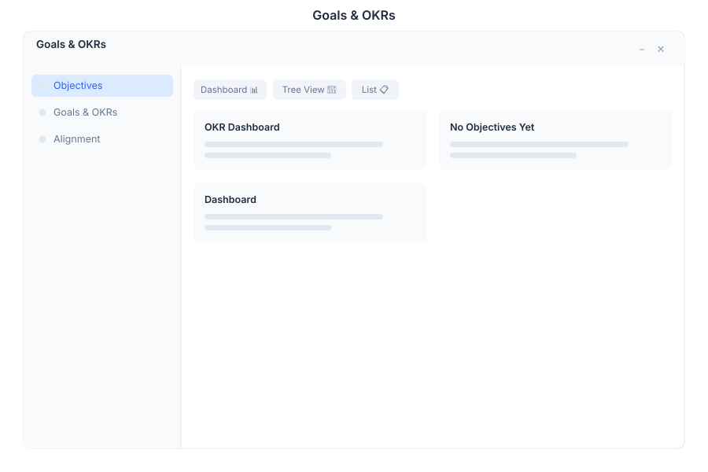

# Goals 🟡 BETA - OKR Management

> **Objectives & Key Results tracking**

---

## Overview

Goals is the OKR (Objectives & Key Results) management module in General Bots Suite. Create, align, and track strategic objectives across teams with clear key results and progress metrics. Goals helps organizations maintain focus and visibility on what matters most.

---

## Features

### Objectives

Create and manage strategic objectives with alignment and cascading support.

| Action | Description |
|--------|-------------|
| **Create Objective** | Define objective with title, description, and owner |
| **Align Objective** | Link to parent objective for cascading alignment |
| **Set Timeframe** | Assign to quarterly or annual period |
| **Assign Owner** | Designate responsible person or team |
| **Archive Objective** | Move completed or cancelled objectives to archive |

### Key Results

Track measurable outcomes that indicate objective achievement.

| Action | Description |
|--------|-------------|
| **Add Key Result** | Define measurable result with target value |
| **Update Progress** | Mark as on-track, at-risk, or off-track |
| **Set Metrics** | Define unit of measurement (%, $, count, etc.) |
| **Link to Objective** | Associate key result with parent objective |
| **Grade Results** | Score achievement at period end (0-1.0 scale) |

### Periods

Organize objectives by time periods for quarterly and annual planning.

| Period | Description |
|--------|-------------|
| **Q1-Q4** | Quarterly objectives with 3-month cycles |
| **Annual** | Year-long strategic objectives |
| **Custom** | Define custom timeframes for specific initiatives |
| **Rolling** | Continuously updating periods without fixed end dates |

### Alignment

Cascade objectives from company to team to individual level.

| Level | Description |
|-------|-------------|
| **Company** | Organization-wide strategic objectives |
| **Department** | Department-level supporting objectives |
| **Team** | Team-specific tactical objectives |
| **Individual** | Personal development and contribution goals |

### Dashboard

Visual overview of OKR progress across the organization.

| Metric | Description |
|--------|-------------|
| **Overall Progress** | Average completion across all active objectives |
| **On Track** | Percentage of objectives meeting targets |
| **At Risk** | Objectives requiring attention or intervention |
| **Completed** | Objectives successfully achieved this period |

---

## Keyboard Shortcuts

| Shortcut | Action |
|----------|--------|
| `N` | Create new objective |
| `E` | Edit selected objective |
| `P` | Update progress |
| `F` | Filter by status |
| `/` | Focus search |
| `?` | Show shortcuts |

---

## Goals via Chat

### Creating a New Objective

  

    

      
Create a new objective: Increase customer satisfaction to 95%

      
09:00

    

  

  

    

      
✅ Objective created:

      
🎯 Increase customer satisfaction to 95%

      
📅 Period: Q2 2024

      
👤 Owner: You

      
Would you like to add key results?

      
09:00

    

  

### Showing Team Progress

  

    

      
Show team progress

      
14:30

    

  

  

    

      
📊 Team OKR Progress (Q2 2024):

      
✅ On Track: 4 objectives (67%)

      
⚠️ At Risk: 1 objective (17%)

      
🔴 Off Track: 1 objective (17%)

      
🎯 Overall: 72% complete

      
14:30

    

  

---

## API Reference

Goals operations are available via REST API:

| Endpoint | Method | Description |
|----------|--------|-------------|
| `/api/goals/objectives` | GET | List all objectives |
| `/api/goals/objectives` | POST | Create new objective |
| `/api/goals/objectives/:id` | PUT | Update objective |
| `/api/goals/objectives/:id` | DELETE | Delete objective |
| `/api/goals/key-results` | GET | List all key results |
| `/api/goals/key-results` | POST | Create key result |
| `/api/goals/key-results/:id/progress` | PUT | Update progress |
| `/api/goals/periods` | GET | List time periods |
| `/api/goals/alignment` | GET | Get alignment hierarchy |

---

## Related Pages

- [Tasks App](./tasks.md) — Execute tasks related to objectives
- [Analytics App](./analytics.md) — Advanced OKR reporting and insights
- [Calendar App](./calendar.md) — Schedule OKR review meetings
- [Suite Manual](../suite-manual.md) — Full Suite overview