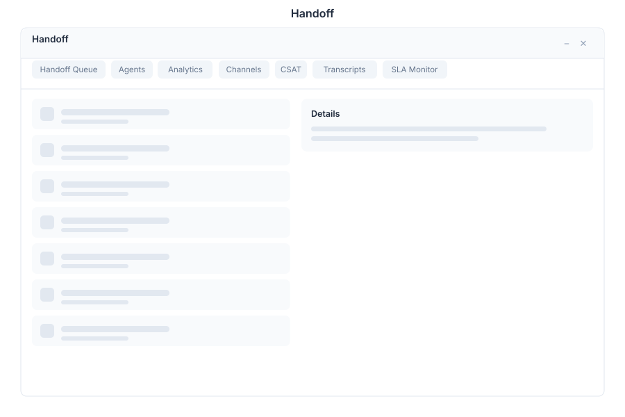

# Handoff - Chatbot Analytics

> **Bot-to-human handoff management**

---

## Overview

Handoff manages the transition from bot automation to human agents in General Bots Suite. Monitor the handoff queue, accept and transfer conversations, track resolution times, and measure customer satisfaction across all support channels.

---

## Features

### Handoff Queue

Manage conversations waiting for human attention:

- **Waiting Queue** — See all conversations pending human takeover
- **Accept** — Claim a conversation from the queue
- **Transfer** — Route a conversation to another agent or department
- **Priority** — Queue items sorted by priority and wait time

**Queue Statuses:**

| Status | Description |
|--------|-------------|
| **Waiting** | Bot escalated, waiting for an agent |
| **Assigned** | Agent claimed, transfer in progress |
| **In Progress** | Human agent actively handling |
| **Resolved** | Issue resolved, awaiting confirmation |
| **Closed** | Conversation completed and archived |

### Analytics

Track handoff performance metrics:

| Metric | Description |
|--------|-------------|
| **Average Wait Time** | Mean time before an agent accepts |
| **Average Resolution Time** | Mean time from acceptance to resolution |
| **Handoff Rate** | Percentage of conversations escalated to humans |
| **Agent Utilization** | Percentage of time agents spend on conversations |
| **First Contact Resolution** | Resolved without follow-up |

### Multi-Channel Support

Handle handoffs across all connected channels:

| Channel | Capabilities |
|---------|-------------|
| **WhatsApp** | Full handoff with media support |
| **Web Chat** | In-app chat with typing indicators |
| **Instagram** | DM handoff with image support |
| **Facebook** | Messenger handoff |
| **Email** | Thread-based handoff |
| **Telegram** | Direct message handoff |

### CSAT (Customer Satisfaction)

Measure satisfaction after handoff resolution:

- **Surveys** — Automatic satisfaction surveys sent after resolution
- **Scores** — 1-5 star rating system
- **Feedback** — Optional free-text comments
- **Trends** — Track satisfaction over time per agent and channel

**CSAT Score Distribution:**

| Score | Label | Meaning |
|-------|-------|---------|
| 5 | Excellent | Exceeded expectations |
| 4 | Good | Met expectations |
| 3 | Neutral | Acceptable |
| 2 | Poor | Below expectations |
| 1 | Terrible | Unacceptable |

---

## Keyboard Shortcuts

| Shortcut | Action |
|----------|--------|
| `A` | Accept next waiting conversation |
| `T` | Transfer selected conversation |
| `R` | Resolve selected conversation |
| `Escape` | Close modal |
| `/` | Focus search |
| `F` | Filter queue by channel |

---

## Handoff via Chat

  

    

      
Show handoff queue

      
10:30

    

  

  

    

      
Current handoff queue: <strong>5 conversations</strong> waiting

      
| # | Channel | User | Wait Time | Priority |

      
| 1 | WhatsApp | Maria S. | 2 min | High |

      
| 2 | Web Chat | John D. | 5 min | Medium |

      
| 3 | Instagram | Pedro L. | 8 min | Medium |

      
| 4 | WhatsApp | Ana R. | 12 min | Low |

      
| 5 | Web Chat | Carlos M. | 15 min | Low |

      
10:30

    

  

  

    

      
What's the average wait time?

      
10:31

    

  

  

    

      
Today's handoff metrics:

      
- **Average Wait Time:** 3m 42s

      
- **Average Resolution Time:** 12m 15s

      
- **Handoff Rate:** 18% (of total conversations)

      
- **CSAT Score:** 4.3 / 5.0 (127 responses)

      
10:31

    

  

---

## API Reference

| Endpoint | Method | Description |
|----------|--------|-------------|
| `/api/handoff/queue` | GET | List conversations in handoff queue |
| `/api/handoff/queue/:id/accept` | POST | Accept a conversation from the queue |
| `/api/handoff/queue/:id/transfer` | POST | Transfer to another agent or department |
| `/api/handoff/queue/:id/resolve` | POST | Mark conversation as resolved |
| `/api/handoff/queue/:id/close` | POST | Close conversation |
| `/api/handoff/agents` | GET | List available agents |
| `/api/handoff/agents/:id/status` | PUT | Update agent availability |
| `/api/handoff/conversations/:id` | GET | Get conversation details and history |
| `/api/handoff/analytics/overview` | GET | Handoff analytics overview |
| `/api/handoff/analytics/wait-time` | GET | Wait time statistics |
| `/api/handoff/analytics/resolution-time` | GET | Resolution time statistics |
| `/api/handoff/csat` | GET | Customer satisfaction scores |
| `/api/handoff/csat/trends` | GET | CSAT trends over time |

---

## Related Pages

- [Chat](./chat.md) — Bot conversation management
- [Tickets](./tickets.md) — Support case tracking
- [Analytics](./analytics.md) — Handoff dashboards and reports
- [CRM](./crm.md) — Customer data during handoff conversations
