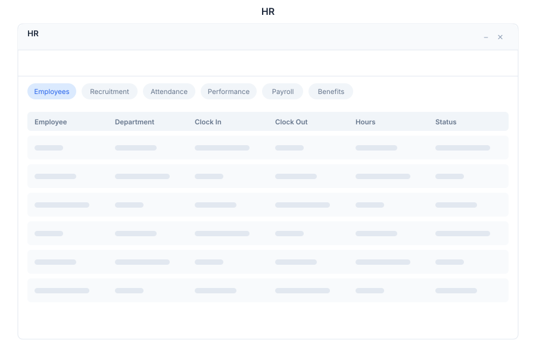

# HR 🟡 BETA - Human Resources

> **Employee management & payroll**

---

## Overview

HR is the human resources management module of General Bots Suite. Manage the employee lifecycle from recruitment to performance reviews, track attendance, handle time-off requests, and maintain a complete employee directory.

---

## Features

### Employee Directory

Maintain a searchable directory of all employees:

- **Profiles** — Full employee records with photo, contact info, and position
- **Organizational Chart** — Visual reporting structure
- **Search** — Find employees by name, department, or role
- **Onboarding** — Track new hire onboarding progress

**Employee Record Fields:**

| Field | Description |
|-------|-------------|
| **Name** | Full legal name |
| **Email** | Work email address |
| **Phone** | Contact phone number |
| **Department** | Assigned department |
| **Position** | Job title and level |
| **Manager** | Direct supervisor |
| **Start Date** | Employment start date |
| **Status** | Active, On Leave, Terminated |

### Recruitment

Manage job openings and candidates:

- **Job Postings** — Create and publish open positions
- **Candidates** — Track applicants through the pipeline
- **Pipeline Stages** — Screening, Interview, Offer, Hired
- **Interview Scheduling** — Coordinate interview sessions
- **Offer Letters** — Generate and send offer documents

**Recruitment Pipeline:**

| Stage | Description |
|-------|-------------|
| **Applied** | Candidate submitted application |
| **Screening** | Initial review of qualifications |
| **Interview** | Candidate scheduled for interview |
| **Offer** | Job offer extended |
| **Hired** | Candidate accepted and onboarded |
| **Rejected** | Not selected for the position |

### Attendance

Track daily attendance and time off:

- **Clock In / Out** — Record daily work hours
- **Overtime** — Track hours beyond standard schedule
- **Time-Off Requests** — Submit and approve leave requests
- **Leave Types** — Vacation, sick, personal, parental, bereavement

**Leave Balances:**

| Leave Type | Annual Allowance | Description |
|------------|-----------------|-------------|
| **Vacation** | 20 days | Paid time off |
| **Sick** | 10 days | Medical leave |
| **Personal** | 5 days | Personal matters |
| **Parental** | 90 days | Parental leave |
| **Bereavement** | 5 days | Family bereavement |

### Performance

Manage employee reviews and goal tracking:

- **Reviews** — Schedule and complete performance reviews
- **Goals** — Set and track individual and team goals
- **360 Feedback** — Collect feedback from peers and managers
- **Rating Scale** — Consistent performance rating system

**Performance Rating Scale:**

| Rating | Label | Description |
|--------|-------|-------------|
| 5 | Exceptional | Significantly exceeds expectations |
| 4 | Exceeds | Consistently exceeds expectations |
| 3 | Meets | Meets expectations |
| 2 | Below | Below expectations, improvement needed |
| 1 | Unsatisfactory | Does not meet expectations |

---

## Keyboard Shortcuts

| Shortcut | Action |
|----------|--------|
| `N` | New employee record |
| `C` | Clock in / Clock out |
| `T` | Submit time-off request |
| `Escape` | Close modal |
| `/` | Focus search |
| `Ctrl+P` | Print employee profile |

---

## HR via Chat

  

    

      
Show employee directory

      
10:30

    

  

  

    

      
Employee directory: <strong>87 active employees</strong>

      
| Name | Department | Position | Status |

      
| Jane Doe | Engineering | Senior Developer | Active |

      
| John Smith | Sales | Account Executive | Active |

      
| Maria Silva | Marketing | Content Manager | Active |

      
Showing 3 of 87. Would you like to filter by department?

      
10:30

    

  

  

    

      
Clock me in

      
10:31

    

  

  

    

      
Clocked in at <strong>10:31 AM</strong> on June 4, 2026.

      
Your current shift: 10:31 AM — ongoing

      
Don't forget to clock out at the end of your day.

      
10:31

    

  

---

## API Reference

| Endpoint | Method | Description |
|----------|--------|-------------|
| `/api/hr/employees` | GET | List employees with filters |
| `/api/hr/employees` | POST | Create new employee record |
| `/api/hr/employees/:id` | GET | Get employee details |
| `/api/hr/employees/:id` | PUT | Update employee record |
| `/api/hr/employees/:id/terminate` | POST | Terminate employee |
| `/api/hr/departments` | GET | List departments |
| `/api/hr/recruitment/jobs` | GET | List job postings |
| `/api/hr/recruitment/jobs` | POST | Create job posting |
| `/api/hr/recruitment/candidates` | GET | List candidates |
| `/api/hr/recruitment/candidates` | POST | Add candidate |
| `/api/hr/recruitment/candidates/:id/stage` | POST | Move candidate to next stage |
| `/api/hr/attendance/clock-in` | POST | Clock in current user |
| `/api/hr/attendance/clock-out` | POST | Clock out current user |
| `/api/hr/attendance/status` | GET | Get current attendance status |
| `/api/hr/leave` | GET | List leave requests |
| `/api/hr/leave` | POST | Submit leave request |
| `/api/hr/leave/:id/approve` | POST | Approve leave request |
| `/api/hr/leave/:id/reject` | POST | Reject leave request |
| `/api/hr/performance/reviews` | GET | List performance reviews |
| `/api/hr/performance/reviews` | POST | Create performance review |
| `/api/hr/performance/goals` | GET | List goals |
| `/api/hr/performance/goals` | POST | Create a goal |

---

## Related Pages

- [Tickets](./tickets.md) — HR support tickets and requests
- [Analytics](./analytics.md) — HR dashboards and headcount reports
- [Calendar](./calendar.md) — Schedule interviews and meetings
- [Chat](./chat.md) — Discuss HR matters with the bot
