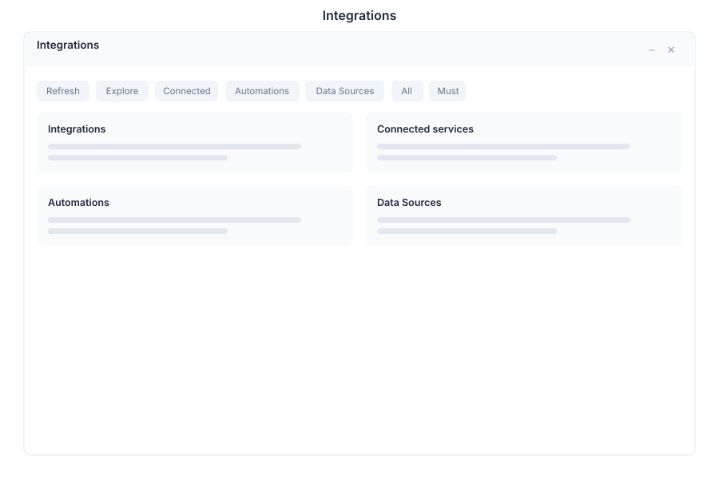

# Integrations - Connector Platform

> **Connect external services**

---

## Overview

Integrations is the connector platform of General Bots Suite. Browse available connectors, manage active integrations, create ETL jobs, and monitor data synchronization across all your connected services.

---

## Features

### Available Connectors

Browse and activate connectors for external services:

- **Catalog** — Browse all available connectors by category
- **Search** — Find connectors by name or service type
- **Details** — View connector documentation and requirements
- **Activate** — Enable a connector with your credentials

**Connector Categories:**

| Category | Examples |
|----------|----------|
| **CRM** | Salesforce, HubSpot, Dynamics 365 |
| **Communication** | Slack, Microsoft Teams, Twilio |
| **Email** | Gmail, Outlook, SendGrid |
| **Storage** | Google Drive, Dropbox, OneDrive, MinIO |
| **Finance** | Stripe, PayPal, QuickBooks |
| **Marketing** | Mailchimp, Sendinblue, ActiveCampaign |
| **Databases** | PostgreSQL, MySQL, MongoDB |
| **Social** | Instagram, Facebook, Twitter |

### Connected Services

Manage your active integrations:

- **Status** — Online, Offline, Error
- **Configuration** — Update credentials and settings
- **Disable** — Temporarily disable without deleting
- **Remove** — Disconnect and remove integration

### ETL Jobs

Create and schedule data transformation jobs:

- **Extract** — Pull data from source systems
- **Transform** — Apply mapping, filtering, and aggregation rules
- **Load** — Push transformed data to destination systems
- **Schedule** — Run jobs on a cron schedule or trigger

**ETL Job Statuses:**

| Status | Description |
|--------|-------------|
| **Draft** | Job configured but not scheduled |
| **Scheduled** | Waiting for next run time |
| **Running** | Currently executing |
| **Completed** | Finished successfully |
| **Failed** | Encountered an error |
| **Paused** | Temporarily suspended |

### Sync Monitoring

Track data synchronization status:

- **Sync Status** — Last sync result and duration
- **Sync History** — Log of all past sync operations
- **Conflict Resolution** — Handle data conflicts during sync
- **Error Log** — View and retry failed sync operations

---

## Keyboard Shortcuts

| Shortcut | Action |
|----------|--------|
| `N` | New ETL job |
| `R` | Refresh sync status |
| `E` | Edit selected integration |
| `Escape` | Close modal |
| `/` | Focus search |
| `Ctrl+J` | Run selected ETL job |

---

## Integrations via Chat

  

    

      
Show available integrations

      
10:30

    

  

  

    

      
Available connectors in the catalog:

      
| Connector | Category | Status |

      
| Salesforce | CRM | Available |

      
| Slack | Communication | Connected |

      
| Gmail | Email | Connected |

      
| Stripe | Finance | Available |

      
| PostgreSQL | Database | Connected |

      
Showing 5 of 42 connectors. Would you like to filter by category?

      
10:30

    

  

  

    

      
Create an ETL job

      
10:31

    

  

  

    

      
Let's create an ETL job. What would you like to do?

      
1. <strong>Extract</strong> — Pull data from a source

      
2. <strong>Transform</strong> — Apply rules to existing data

      
3. <strong>Load</strong> — Push data to a destination

      
4. <strong>Full Pipeline</strong> — Extract, transform, and load

      
Which option do you prefer?

      
10:31

    

  

---

## API Reference

| Endpoint | Method | Description |
|----------|--------|-------------|
| `/api/integrations/connectors` | GET | List available connectors |
| `/api/integrations/connectors/:id` | GET | Get connector details |
| `/api/integrations/connected` | GET | List active integrations |
| `/api/integrations/connected` | POST | Activate a new integration |
| `/api/integrations/connected/:id` | PUT | Update integration configuration |
| `/api/integrations/connected/:id` | DELETE | Remove integration |
| `/api/integrations/connected/:id/toggle` | POST | Enable or disable integration |
| `/api/integrations/etl` | GET | List ETL jobs |
| `/api/integrations/etl` | POST | Create ETL job |
| `/api/integrations/etl/:id` | GET | Get ETL job details |
| `/api/integrations/etl/:id` | PUT | Update ETL job |
| `/api/integrations/etl/:id/run` | POST | Trigger ETL job immediately |
| `/api/integrations/etl/:id/pause` | POST | Pause ETL job |
| `/api/integrations/etl/:id/history` | GET | Get ETL job run history |
| `/api/integrations/sync/status` | GET | Get sync status for all integrations |
| `/api/integrations/sync/history` | GET | Get sync operation history |
| `/api/integrations/sync/retry` | POST | Retry a failed sync operation |

---

## Related Pages

- [Sources](./sources.md) — Configure external data sources
- [Database](./database.md) — Direct database connections
- [Analytics](./analytics.md) — Visualize data from integrations
- [Admin](./admin.md) — Integration permissions and administration
