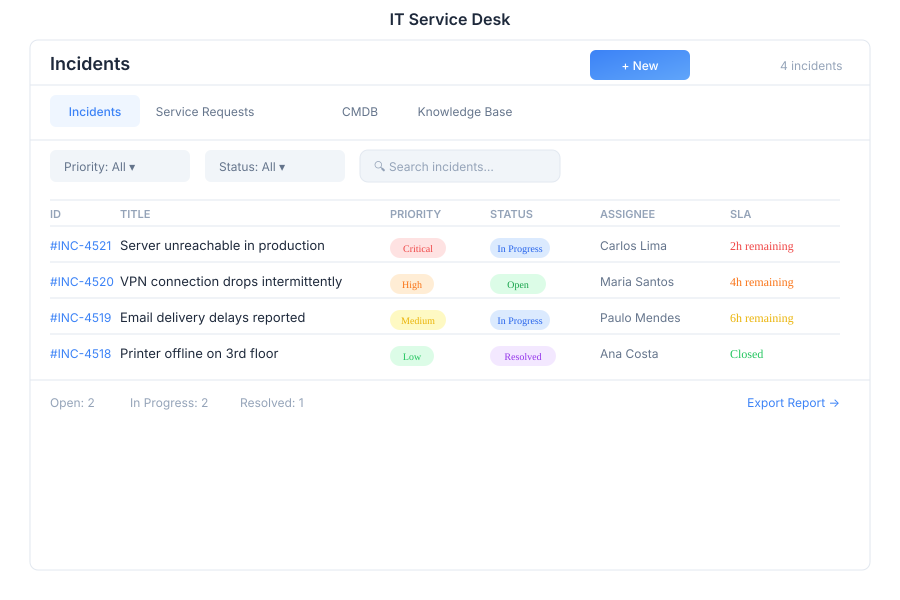

# ITSM - IT Service Desk

> **Incident & service management**

---

## Overview

ITSM is the IT service management module of General Bots Suite. Create and resolve incidents, manage service requests through a catalog, maintain a configuration management database (CMDB), and leverage a knowledge base to speed up resolution times.

---

## Features

### Incident Management

Track and resolve IT incidents:

- **Create** — Log new incidents with severity and category
- **Assign** — Route incidents to the appropriate resolver group
- **Resolve** — Document the resolution and close the incident
- **Escalate** — Escalate to higher support tiers

**Incident Priorities:**

| Priority | Description | Response SLA |
|----------|-------------|-------------|
| **P1 — Critical** | Service completely down | 15 minutes |
| **P2 — High** | Major functionality impaired | 1 hour |
| **P3 — Medium** | Minor functionality impaired | 4 hours |
| **P4 — Low** | Cosmetic or informational | 1 business day |

**Incident Statuses:**

| Status | Description |
|--------|-------------|
| **New** | Just created, awaiting triage |
| **Assigned** | Assigned to a resolver group |
| **In Progress** | Actively being worked on |
| **Pending** | Waiting on vendor, user, or change |
| **Resolved** | Fix applied, awaiting confirmation |
| **Closed** | Incident fully resolved and archived |

### Service Requests

Standard service requests through a catalog:

- **Catalog** — Browse available services and request options
- **Submit** — Request new access, hardware, software, or changes
- **Approval** — Multi-level approval workflows
- **Fulfillment** — Track request through to completion

**Service Catalog Categories:**

| Category | Examples |
|----------|----------|
| **Access** | New account, permissions change, VPN access |
| **Hardware** | Laptop, monitor, phone, peripherals |
| **Software** | Application install, license request |
| **Network** | WiFi access, firewall rule, DNS change |
| **Cloud** | VM provisioning, storage, backup |

### CMDB (Configuration Management Database)

Maintain a registry of IT assets and their relationships:

- **Assets** — Hardware, software, and cloud resources
- **Relationships** — Dependencies between configuration items (CIs)
- **Impact Analysis** — Assess impact before changes
- **Asset Lifecycle** — Track from procurement to retirement

**CI Types:**

| Type | Examples |
|------|----------|
| **Server** | Physical servers, VMs, containers |
| **Workstation** | Desktops, laptops |
| **Network Device** | Routers, switches, firewalls |
| **Software** | Applications, operating systems |
| **Service** | Business services and applications |
| **Cloud Resource** | S3 buckets, databases, functions |

### Knowledge Base

Searchable articles for common issues:

- **Articles** — Documented solutions and how-to guides
- **Search** — Full-text search across all articles
- **Linked to Incidents** — Attach KB articles to incidents
- **Feedback** — Rate article helpfulness

---

## Keyboard Shortcuts

| Shortcut | Action |
|----------|--------|
| `N` | Create new incident |
| `A` | Assign selected incident |
| `R` | Resolve selected incident |
| `E` | Escalate selected incident |
| `Escape` | Close modal |
| `/` | Focus search |
| `K` | Search knowledge base |
| `Ctrl+S` | Save current record |

---

## ITSM via Chat

  

    

      
Create an incident

      
10:30

    

  

  

    

      
Let's create an incident. Please provide:

      
1. <strong>Title</strong> — Brief description of the issue

      
2. <strong>Description</strong> — Detailed explanation

      
3. <strong>Priority</strong> — P1 (Critical), P2 (High), P3 (Medium), or P4 (Low)

      
4. <strong>Category</strong> — Hardware, Software, Network, Access, or Other

      
What is the issue?

      
10:30

    

  

  

    

      
Show open tickets

      
10:31

    

  

  

    

      
Open incidents: <strong>14 total</strong>

      
| ID | Title | Priority | Status | Assigned To |

      
| INC-2042 | Email server down | P1 | In Progress | Network Team |

      
| INC-2043 | VPN access request | P3 | Assigned | IT Support |

      
| INC-2044 | New laptop request | P4 | New | Unassigned |

      
Showing 3 of 14. Would you like to filter by priority?

      
10:31

    

  

---

## API Reference

| Endpoint | Method | Description |
|----------|--------|-------------|
| `/api/itsm/incidents` | GET | List incidents with filters |
| `/api/itsm/incidents` | POST | Create new incident |
| `/api/itsm/incidents/:id` | GET | Get incident details |
| `/api/itsm/incidents/:id` | PUT | Update incident |
| `/api/itsm/incidents/:id/assign` | POST | Assign incident to resolver group |
| `/api/itsm/incidents/:id/resolve` | POST | Resolve incident |
| `/api/itsm/incidents/:id/escalate` | POST | Escalate incident |
| `/api/itsm/incidents/:id/close` | POST | Close incident |
| `/api/itsm/incidents/:id/notes` | GET | Get incident notes |
| `/api/itsm/incidents/:id/notes` | POST | Add note to incident |
| `/api/itsm/requests` | GET | List service requests |
| `/api/itsm/requests` | POST | Submit service request |
| `/api/itsm/requests/:id` | GET | Get request details |
| `/api/itsm/requests/:id/approve` | POST | Approve request |
| `/api/itsm/catalog` | GET | List service catalog items |
| `/api/itsm/cmdb/assets` | GET | List CMDB assets |
| `/api/itsm/cmdb/assets` | POST | Register new asset |
| `/api/itsm/cmdb/assets/:id` | GET | Get asset details and relationships |
| `/api/itsm/cmdb/assets/:id/relationships` | GET | Get asset relationships |
| `/api/itsm/kb/articles` | GET | Search knowledge base articles |
| `/api/itsm/kb/articles` | POST | Create KB article |

---

## Related Pages

- [Tickets](./tickets.md) — Customer-facing support cases
- [Desktop](./desktop.md) — Remote desktop for incident troubleshooting
- [Analytics](./analytics.md) — ITSM dashboards and SLA reports
- [Database](./database.md) — CMDB data access
