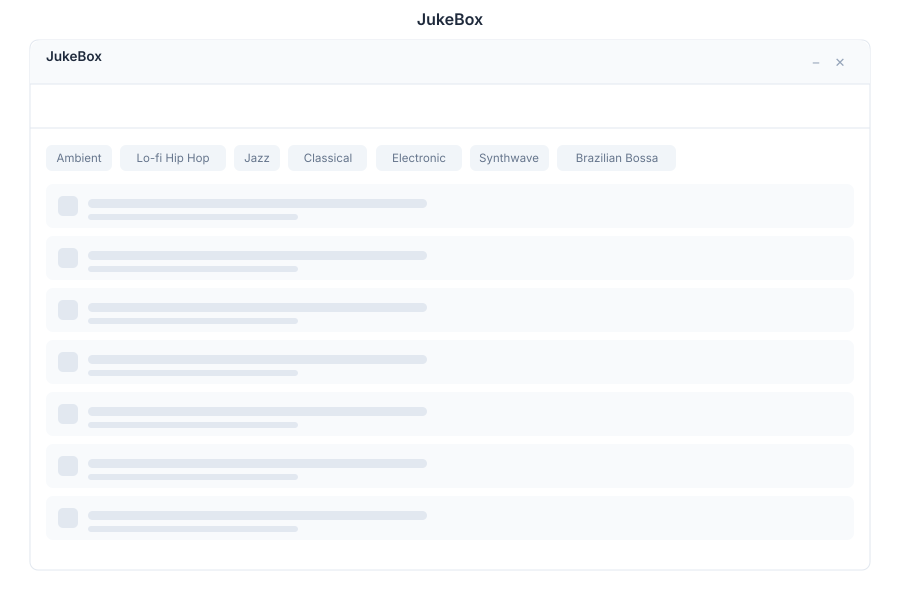

# JukeBox 🟡 PREVIEW

> **Preview application.** Usable today, not yet part of the supported surface.

JukeBox generates music. You describe what you want — a style, a mood, an instrumental bed — and it produces audio rather than searching for existing tracks.

## What it does

| Capability | Detail |
|---|---|
| **Generate songs** | Create a complete track from a description |
| **Instrumentals** | Start and stop a continuous instrumental station, for background work |
| **Vocal variations** | Produce variations on a generated piece rather than accepting the first result |

Generation uses the ACE-Step music model.

## Where it fits

| Need | Use |
|---|---|
| Music for a video or presentation | JukeBox, then attach the result in [Drive](./drive.md) |
| Playing an existing audio file | [Player](./player.md) |
| Generating video, not audio | [Video AI](./video.md) |

## Opening it

JukeBox is a **preview** application. Turn on the **Preview** switch in the left sidebar, then open **JukeBox** from the app menu.

## Limits

- Generation is compute-heavy; expect it to take noticeably longer than a text response.
- Availability depends on the model backend being deployed for this installation.

## See Also

- [Player](./player.md) - Play the result
- [Video AI](./video.md) - Generated video
- [Apps overview](./README.md) - Stability classification for the whole suite
