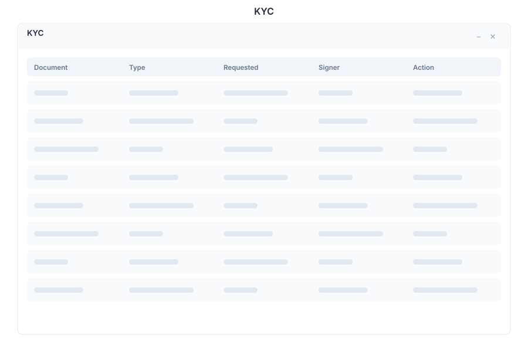

# KYC - Identity Verification

> **Know Your Customer verification**

---

## Overview

KYC is the identity verification module of General Bots Suite. Manage customer verification workflows, request and collect digital signatures, issue and verify certificates, and track the status of every verification request end to end.

---

## Features

### Verification Requests

Submit and track identity verifications:

- **Submit** — Start a new verification for a customer
- **Track** — Monitor verification progress in real time
- **Review** — Approve or reject submitted documents
- **Re-Request** — Ask for additional documents if needed

**Verification Statuses:**

| Status | Description |
|--------|-------------|
| **Pending** | Request created, awaiting document submission |
| **Documents Submitted** | Customer uploaded documents |
| **Under Review** | Being reviewed by compliance team |
| **Approved** | Identity verified successfully |
| **Rejected** | Verification failed or documents invalid |
| **Expired** | Verification window has passed |

**Document Types Accepted:**

| Document | Use Case |
|----------|----------|
| **Government ID** | Passport, national ID, driver's license |
| **Proof of Address** | Utility bill, bank statement |
| **Selfie** | Live photo for liveness check |
| **Business Registration** | Company incorporation documents |
| **Tax ID** | CPF, CNPJ, SSN, EIN |

### Digital Signatures

Request and manage electronic signatures:

- **Request** — Send a signature request to a customer or partner
- **Sign** — Provide your electronic signature on documents
- **Status** — Track who has signed and who is pending
- **Templates** — Use predefined signature templates

**Signature Statuses:**

| Status | Description |
|--------|-------------|
| **Draft** | Signature request being prepared |
| **Sent** | Request sent to signer |
| **Viewed** | Signer opened the document |
| **Signed** | Document electronically signed |
| **Declined** | Signer declined to sign |
| **Expired** | Signature request expired |

### Certificates

Issue and verify digital certificates:

- **Issue** — Generate certificates for verified customers
- **Verify** — Validate an existing certificate by ID
- **Revoke** — Revoke a compromised or invalid certificate
- **Expiry Tracking** — Monitor certificate expiration dates

**Certificate Types:**

| Type | Description |
|------|-------------|
| **Identity Verified** | Confirms identity check passed |
| **Business Verified** | Confirms business registration verified |
| **Accredited Investor** | Confirms investor accreditation |
| **Compliance Cleared** | Confirms regulatory compliance |

### Document Upload

Secure document management for verification:

- **Upload** — Accept documents via drag-and-drop or file picker
- **Formats** — PDF, JPEG, PNG, TIFF
- **Validation** — Automatic format and size checks
- **Encryption** — Documents encrypted at rest and in transit
- **Retention** — Configurable retention policies per document type

### Status Tracking

End-to-end visibility on every request:

- **Timeline** — Visual timeline of each verification step
- **Audit Trail** — Complete log of all actions taken
- **Notifications** — Alerts for status changes
- **Bulk View** — See all pending verifications at a glance

---

## Keyboard Shortcuts

| Shortcut | Action |
|----------|--------|
| `N` | New verification request |
| `S` | Request signature |
| `C` | Issue certificate |
| `Escape` | Close modal |
| `/` | Focus search |
| `Ctrl+F` | Filter verification list |

---

## KYC via Chat

  

    

      
Show pending verifications

      
10:30

    

  

  

    

      
Pending verifications: <strong>12 requests</strong>

      
| ID | Customer | Status | Submitted |

      
| KYC-1024 | Acme Corp | Documents Submitted | 2h ago |

      
| KYC-1025 | Jane Doe | Pending | 5h ago |

      
| KYC-1026 | TechStart Inc. | Under Review | 1d ago |

      
Showing 3 of 12. Would you like to review a specific one?

      
10:30

    

  

  

    

      
Request a signature

      
10:31

    

  

  

    

      
Let's send a signature request. Please provide:

      
1. <strong>Document</strong> — Which document needs signing?

      
2. <strong>Signer</strong> — Email address of the signer

      
3. <strong>Message</strong> — Optional message to include

      
What document would you like to send for signature?

      
10:31

    

  

---

## API Reference

| Endpoint | Method | Description |
|----------|--------|-------------|
| `/api/kyc/verifications` | GET | List verification requests |
| `/api/kyc/verifications` | POST | Create verification request |
| `/api/kyc/verifications/:id` | GET | Get verification details |
| `/api/kyc/verifications/:id/approve` | POST | Approve verification |
| `/api/kyc/verifications/:id/reject` | POST | Reject verification |
| `/api/kyc/verifications/:id/documents` | POST | Upload verification documents |
| `/api/kyc/verifications/:id/timeline` | GET | Get verification timeline |
| `/api/kyc/signatures` | GET | List signature requests |
| `/api/kyc/signatures` | POST | Create signature request |
| `/api/kyc/signatures/:id` | GET | Get signature request details |
| `/api/kyc/signatures/:id/sign` | POST | Submit signature |
| `/api/kyc/signatures/:id/decline` | POST | Decline signature request |
| `/api/kyc/certificates` | GET | List certificates |
| `/api/kyc/certificates` | POST | Issue new certificate |
| `/api/kyc/certificates/:id` | GET | Get certificate details |
| `/api/kyc/certificates/:id/verify` | POST | Verify a certificate |
| `/api/kyc/certificates/:id/revoke` | POST | Revoke a certificate |

---

## Related Pages

- [Compliance](./compliance.md) — Regulatory compliance and data governance
- [CRM](./crm.md) — Customer data linked to verification records
- [Billing](./billing.md) — Invoice verification-related fees
- [Analytics](./analytics.md) — KYC dashboards and verification metrics
