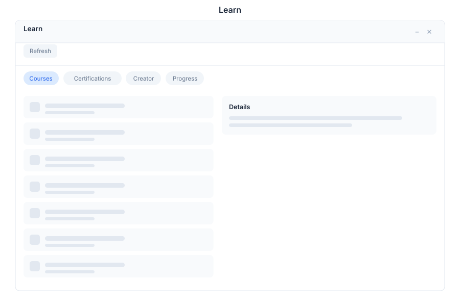

# Learn - E-Learning

> **Courses, certifications & progress**

---

## Overview

Learn is the e-learning and training module in General Bots Suite. Create, deliver, and track courses, certifications, and learning progress. Learn provides a comprehensive platform for organizational training and professional development.

---

## Features

### Courses

Create and manage learning courses with multimedia content.

| Action | Description |
|--------|-------------|
| **Create Course** | Define course with title, description, and objectives |
| **Enroll Users** | Register users for courses |
| **Track Progress** | Monitor completion status and scores |
| **Add Modules** | Organize content into lessons and sections |
| **Set Prerequisites** | Define required courses before enrollment |

### Certifications

Track professional certifications and credentials.

| Action | Description |
|--------|-------------|
| **Create Certification** | Define certification requirements and criteria |
| **Issue Certificates** | Award certificates upon completion |
| **Track Expiration** | Monitor certification renewal dates |
| **Verify Credentials** | Validate certification authenticity |
| **Export Certificates** | Download PDF certificates |

### Course Creator

Build interactive lessons with quizzes and assessments.

| Feature | Description |
|---------|-------------|
| **Lesson Builder** | Create lessons with text, images, and video |
| **Quiz Creator** | Build assessments with multiple question types |
| **Assignment Builder** | Create practical exercises and projects |
| **Content Library** | Reusable templates and media assets |
| **Preview Mode** | Test courses before publishing |

### Progress Tracking

Monitor learning progress with statistics and gamification.

| Metric | Description |
|--------|-------------|
| **Completion Rate** | Percentage of courses completed |
| **Time Spent** | Total learning hours tracked |
| **Scores** | Quiz and assessment results |
| **Streaks** | Consecutive days of learning activity |
| **Badges** | Achievement badges earned |
| **Leaderboard** | Top performers ranking |

### Learning Paths

Create structured learning journeys for role-based training.

| Feature | Description |
|---------|-------------|
| **Define Path** | Sequence courses for specific roles |
| **Set Requirements** | Mandatory vs optional courses |
| **Track Enrollment** | Monitor path completion |
| **Generate Reports** | Team and individual progress reports |

---

## Keyboard Shortcuts

| Shortcut | Action |
|----------|--------|
| `N` | Create new course |
| `E` | Edit selected course |
| `S` | Start learning |
| `P` | View progress |
| `F` | Focus search |
| `/` | Focus search |
| `?` | Show shortcuts |

---

## Learn via Chat

### Showing My Courses

  

    

      
Show my courses

      
09:00

    

  

  

    

      
📚 Your Courses (3 active):

      
✅ Python Fundamentals - Complete (100%)

      
🔄 Data Analysis with Pandas - In Progress (65%)

      
⏳ Machine Learning Basics - Not Started

      
📊 Overall Progress: 55%

      
09:00

    

  

### Checking Certifications

  

    

      
What certifications do I have?

      
14:30

    

  

  

    

      
🏆 Your Certifications (2 active):

      
✅ Python Developer - Issued: Jan 2024, Expires: Jan 2026

      
✅ Data Analyst - Issued: Mar 2024, Expires: Mar 2026

      
⏰ Upcoming: Machine Learning Engineer (Dec 2024)

      
14:30

    

  

---

## API Reference

Learn operations are available via REST API:

| Endpoint | Method | Description |
|----------|--------|-------------|
| `/api/courses` | GET | List all courses |
| `/api/courses` | POST | Create new course |
| `/api/courses/:id` | GET | Get course details |
| `/api/courses/:id` | PUT | Update course |
| `/api/courses/:id/enroll` | POST | Enroll user in course |
| `/api/courses/:id/progress` | GET | Get course progress |
| `/api/certifications` | GET | List all certifications |
| `/api/certifications` | POST | Create certification |
| `/api/certifications/:id/issue` | POST | Issue certificate |
| `/api/progress` | GET | Get user progress |
| `/api/progress/stats` | GET | Get learning statistics |

---

## Related Pages

- [Tasks App](./tasks.md) — Complete learning-related tasks
- [Goals App](./goals.md) — Align learning with development objectives
- [Analytics App](./analytics.md) — Training analytics and reports
- [Drive App](./drive.md) — Store course materials and certificates
- [Suite Manual](../suite-manual.md) — Full Suite overview