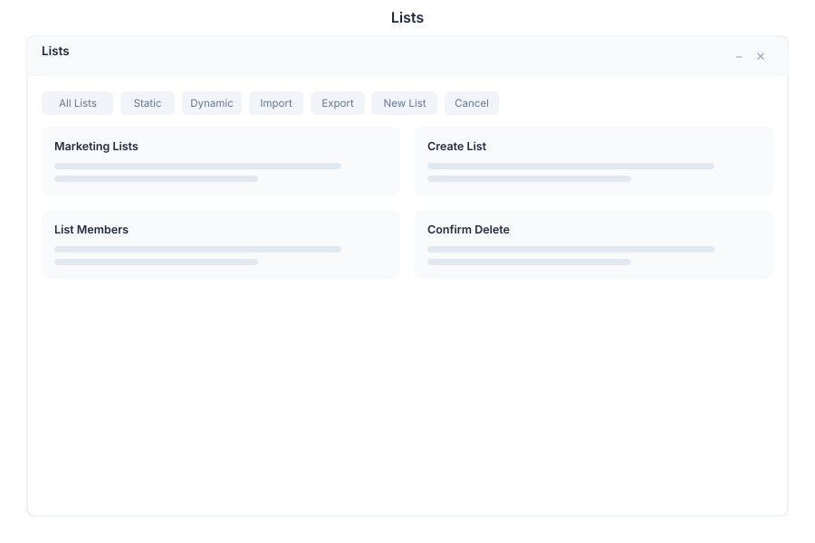

# Lists - Marketing Lists

> **Contact segments & lists**

---

## Overview

Lists is a contact management and segmentation system within General Bots Suite. Create, manage, and segment contact lists for marketing campaigns, communications, and analytics. Lists supports both static manual lists and dynamic rules-based segments for automated contact management.

---

## Features

### Lists

| Action | Description |
|--------|-------------|
| **Create** | Build new contact lists |
| **Edit** | Modify list properties and members |
| **Delete** | Remove unused lists |
| **Clone** | Duplicate lists for similar segments |
| **Merge** | Combine multiple lists into one |

### Static Lists

| Feature | Description |
|---------|-------------|
| **Manual Add** | Add contacts one by one |
| **Bulk Add** | Select multiple contacts |
| **Remove** | Remove specific contacts |
| **Sort** | Order by name, date, or custom field |
| **Filter** | Find contacts within list |

### Dynamic Lists

| Feature | Description |
|---------|-------------|
| **Rules-Based** | Define inclusion criteria |
| **Auto-Update** | Contacts added/removed automatically |
| **Complex Logic** | AND/OR conditions |
| **Real-Time** | Instant segment updates |
| **Preview** | See matching contacts before saving |

### Import CSV

| Feature | Description |
|---------|-------------|
| **Upload** | Drag-and-drop or file picker |
| **Column Mapping** | Match CSV columns to fields |
| **Validation** | Check data before import |
| **Duplicate Handling** | Skip, update, or merge duplicates |
| **Progress** | Real-time import progress |

### Export CSV

| Feature | Description |
|---------|-------------|
| **Full Export** | Download entire list |
| **Filtered Export** | Export based on criteria |
| **Custom Fields** | Select specific columns |
| **Schedule** | Automated export schedules |
| **Format** | CSV, Excel, or JSON |

### Segments

| Feature | Description |
|---------|-------------|
| **Create Segment** | Define audience segments |
| **Combine** | Union/intersection of lists |
| **Exclude** | Remove contacts from segments |
| **Track** | Monitor segment changes |
| **Analytics** | Segment performance metrics |

---

## Keyboard Shortcuts

| Shortcut | Action |
|----------|--------|
| `G` then `L` | Go to Lists |
| `N` | Create new list |
| `I` | Import CSV |
| `E` | Export list |
| `/` | Focus search |
| `Ctrl+A` | Select all contacts |
| `Del` | Remove selected |
| `Esc` | Close modal |

---

## Lists via Chat

### Creating a List

  

    

      
Create a list

      
09:00

    

  

  

    

      
📋 New List Created

      
✅ List ready

      
📝 Name: Untitled List

      
📌 Type: Static

      
👥 Contacts: 0

      
🔧 Edit to add contacts and configure

      
09:00

    

  

### Importing Contacts

  

    

      
Import contacts from CSV

      
09:05

    

  

  

    

      
📥 CSV Import Ready

      
📤 Upload your CSV file

      
📋 Supported columns:

      
- email, name, phone, company

      
- Custom fields supported

      
🔧 I'll help map columns after upload

      
09:05

    

  

---

## API Reference

| Endpoint | Method | Description |
|----------|--------|-------------|
| `/api/lists` | GET | List all lists |
| `/api/lists` | POST | Create new list |
| `/api/lists/:id` | GET | Get list details |
| `/api/lists/:id` | PUT | Update list |
| `/api/lists/:id` | DELETE | Delete list |
| `/api/lists/:id/contacts` | GET | Get list contacts |
| `/api/lists/:id/contacts` | POST | Add contacts to list |
| `/api/lists/:id/contacts/:contactId` | DELETE | Remove contact |
| `/api/lists/import` | POST | Import CSV |
| `/api/lists/:id/export` | GET | Export list |
| `/api/lists/segments` | GET | List all segments |

---

## Related Pages

- [Campaigns](campaigns.md) — Marketing campaign execution
- [CRM](crm.md) — Customer relationship management
- [Templates](templates.md) — Content templates
- [Analytics](analytics.md) — Contact analytics