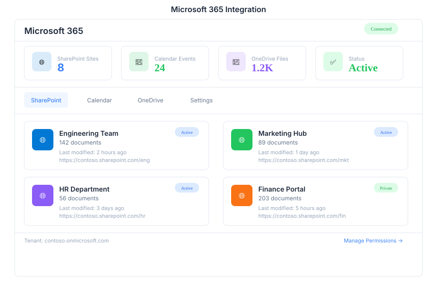

# M365 🟡 BETA - Microsoft 365

> **SharePoint, Calendar & OneDrive integration in a single interface**

---

## Overview

M365 provides seamless integration with Microsoft 365 services, allowing users to manage SharePoint sites, calendar events, and OneDrive files directly from the bot interface. Connect once and access all your Microsoft resources without switching between applications.

---

## Features

### SharePoint

| Capability | Description |
|------------|-------------|
| Sites | Browse and access SharePoint sites |
| Documents | View, upload, and manage documents |
| Lists | Interact with SharePoint lists |
| Search | Search across all accessible sites |

### Calendar

| Capability | Description |
|------------|-------------|
| Events | Create, view, and manage calendar events |
| Meetings | Schedule and join meetings |
| Invitations | Send and respond to meeting invitations |
| Availability | Check attendee availability |

### OneDrive

| Capability | Description |
|------------|-------------|
| Files | Browse, upload, and download files |
| Folders | Organize and manage folder structures |
| Sharing | Share files with colleagues |
| Sync | Keep files synchronized across devices |

### Settings

| Capability | Description |
|------------|-------------|
| Connect | Authenticate and connect M365 account |
| Permissions | Manage access levels and scopes |
| Notifications | Configure event and file notifications |
| Preferences | Set default behaviors and defaults |

---

## Keyboard Shortcuts

| Shortcut | Action |
|----------|--------|
| `Ctrl + S` | Open SharePoint |
| `Ctrl + E` | Open Calendar events |
| `Ctrl + D` | Open OneDrive files |
| `Ctrl + N` | Create new event |
| `Ctrl + U` | Upload file to OneDrive |
| `Ctrl + /` | Search across all M365 |
| `Esc` | Close current panel |

---

## M365 via Chat

**User:** Show SharePoint sites

**Bot:** Here are your accessible SharePoint sites:

- **Marketing Team** — marketing.sharepoint.com
- **Engineering Docs** — engineering.sharepoint.com
- **HR Portal** — hr.sharepoint.com

Which site would you like to explore?

---

**User:** Create a calendar event for tomorrow at 10am

**Bot:** I'll create the event for you. Please provide:

1. **Event title** — What is the meeting about?
2. **Duration** — How long will it last?
3. **Attendees** — Who should be invited?

---

## API Reference

| Endpoint | Method | Description |
|----------|--------|-------------|
| `/api/m365/sharepoint/sites` | GET | List accessible SharePoint sites |
| `/api/m365/sharepoint/documents` | GET | List documents in a site |
| `/api/m365/sharepoint/documents` | POST | Upload document to SharePoint |
| `/api/m365/calendar/events` | GET | List calendar events |
| `/api/m365/calendar/events` | POST | Create new calendar event |
| `/api/m365/calendar/events/{id}` | PUT | Update calendar event |
| `/api/m365/calendar/events/{id}` | DELETE | Delete calendar event |
| `/api/m365/onedrive/files` | GET | List OneDrive files |
| `/api/m365/onedrive/files` | POST | Upload file to OneDrive |
| `/api/m365/onedrive/files/{id}/download` | GET | Download file |
| `/api/m365/settings` | GET | Get M365 connection settings |
| `/api/m365/settings` | PUT | Update M365 settings |

---

## Related Pages

- [Calendar](../calendar.md) — Standalone calendar management
- [SharePoint](../sharepoint.md) — SharePoint document management
- [OneDrive](../onedrive.md) — Cloud file storage
- [Settings](../settings.md) — M365 connection and permissions
