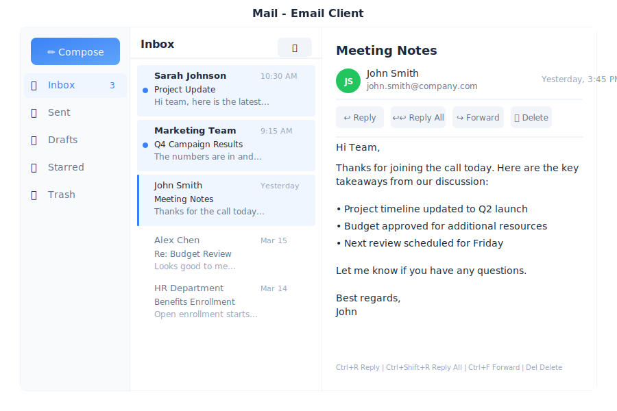

# Mail - Email Client

> **Your intelligent inbox**



---

## Overview

Mail is the email application in General Bots Suite. Read, compose, and organize your emails with AI assistance. Mail helps you write better emails, find important messages, and stay on top of your inbox without the clutter.

---

## Features

### Folders

| Folder | Description |
|--------|-------------|
| 📥 Inbox | Incoming messages |
| ⭐ Starred | Important emails |
| 📤 Sent | Sent messages |
| 📝 Drafts | Unsent drafts |
| 🗑️ Trash | Deleted emails |

### Labels

| Label | Icon | Use For |
|-------|------|---------|
| Urgent | 🔴 | Time-sensitive |
| Personal | 🟢 | Private emails |
| Work | 🔵 | Professional |
| Finance | 🟡 | Bills & money |
| Custom | 🟣 | Create your own |

### Email Actions

| Action | Description |
|--------|-------------|
| **Reply** | Respond to sender |
| **Reply All** | Respond to all recipients |
| **Forward** | Send to someone else |
| **Archive** | Remove from inbox |
| **Star** | Mark as important |
| **Label** | Organize with labels |
| **Delete** | Move to trash |

---

## Keyboard Shortcuts

| Shortcut | Action |
|----------|--------|
| `C` | Compose new email |
| `R` | Reply |
| `A` | Reply all |
| `F` | Forward |
| `E` | Archive |
| `S` | Star/unstar |
| `Delete` | Move to trash |
| `Ctrl+Enter` | Send email |
| `Escape` | Close/cancel |
| `↑` / `↓` | Navigate emails |

---

## Email via Chat

### Checking Your Inbox

<div class="wa-chat">
  <div class="wa-message user">
    <div class="wa-bubble">
      <p>Check my email</p>
      <div class="wa-time">09:00</div>
    </div>
  </div>
  <div class="wa-message bot">
    <div class="wa-bubble">
      <p>📥 You have 5 unread emails:</p>
      <p>⭐ Sarah Johnson - Q2 Report Review</p>
      <p>📧 Mike Chen - Meeting Tomorrow</p>
      <p>📧 LinkedIn - 5 new connections</p>
      <p>📧 Newsletter - Weekly Tech Digest</p>
      <p>📧 HR Team - Policy Update</p>
      <div class="wa-time">09:00</div>
    </div>
  </div>
</div>

### Reading an Email

<div class="wa-chat">
  <div class="wa-message user">
    <div class="wa-bubble">
      <p>Read the email from Sarah</p>
      <div class="wa-time">09:01</div>
    </div>
  </div>
  <div class="wa-message bot">
    <div class="wa-bubble">
      <p>📧 <strong>Q2 Report Review</strong></p>
      <p>From: Sarah Johnson</p>
      <p>Date: Today at 10:32 AM</p>
      <p>---</p>
      <p>Hi,</p>
      <p>Please review the attached Q2 report and let me know if you have any questions. I've highlighted the key metrics on page 3.</p>
      <p>📎 Q2-Report.pdf (2.4 MB)</p>
      <p>---</p>
      <p>[Reply] [Forward] [Archive]</p>
      <div class="wa-time">09:01</div>
    </div>
  </div>
</div>

### Composing an Email

<div class="wa-chat">
  <div class="wa-message user">
    <div class="wa-bubble">
      <p>Write an email to John about the project deadline</p>
      <div class="wa-time">10:30</div>
    </div>
  </div>
  <div class="wa-message bot">
    <div class="wa-bubble">
      <p>📝 Here's a draft:</p>
      <p><strong>To:</strong> john@company.com</p>
      <p><strong>Subject:</strong> Project Deadline Update</p>
      <p>---</p>
      <p>Hi John,</p>
      <p>I wanted to touch base regarding the project deadline. Could we schedule a quick call to discuss the timeline and any potential adjustments needed?</p>
      <p>Let me know your availability.</p>
      <p>Best regards</p>
      <p>---</p>
      <p>[📤 Send] [✏️ Edit] [🗑️ Discard]</p>
      <div class="wa-time">10:30</div>
    </div>
  </div>
  <div class="wa-message user">
    <div class="wa-bubble">
      <p>Send it</p>
      <div class="wa-time">10:31</div>
    </div>
  </div>
  <div class="wa-message bot">
    <div class="wa-bubble">
      <p>✅ Email sent to John!</p>
      <p>📤 Subject: Project Deadline Update</p>
      <div class="wa-time">10:31</div>
    </div>
  </div>
</div>

### AI-Assisted Writing

<div class="wa-chat">
  <div class="wa-message user">
    <div class="wa-bubble">
      <p>Write a polite email declining the meeting invitation for tomorrow</p>
      <div class="wa-time">14:20</div>
    </div>
  </div>
  <div class="wa-message bot">
    <div class="wa-bubble">
      <p>📝 Here's a polite decline:</p>
      <p><strong>Subject:</strong> Re: Meeting Tomorrow</p>
      <p>---</p>
      <p>Hi Mike,</p>
      <p>Thank you for the invitation. Unfortunately, I have a scheduling conflict and won't be able to attend tomorrow's meeting.</p>
      <p>Would it be possible to reschedule, or could someone share the meeting notes with me afterward?</p>
      <p>Thanks for understanding.</p>
      <p>Best regards</p>
      <p>---</p>
      <p>[📤 Send] [✏️ Edit] [🗑️ Discard]</p>
      <div class="wa-time">14:20</div>
    </div>
  </div>
</div>

### Searching Emails

<div class="wa-chat">
  <div class="wa-message user">
    <div class="wa-bubble">
      <p>Find emails about the budget from last month</p>
      <div class="wa-time">11:00</div>
    </div>
  </div>
  <div class="wa-message bot">
    <div class="wa-bubble">
      <p>🔍 Found 3 emails about "budget" from last month:</p>
      <p>📧 Finance Team - Q1 Budget Review (Apr 15)</p>
      <p>📧 Sarah - Budget Approval Needed (Apr 10)</p>
      <p>📧 John - Budget Questions (Apr 5)</p>
      <p>Which one would you like to read?</p>
      <div class="wa-time">11:00</div>
    </div>
  </div>
</div>

---

## API Endpoints

| Endpoint | Method | Description |
|----------|--------|-------------|
| `/api/email/inbox` | GET | List inbox messages |
| `/api/email/send` | POST | Send email |
| `/api/email/draft` | POST | Save draft |
| `/api/email/:id` | GET | Read email |
| `/api/email/:id` | DELETE | Delete email |
| `/api/email/:id/star` | POST | Toggle star |
| `/api/email/:id/label` | POST | Add label |
| `/api/email/search` | GET | Search emails |

### Query Parameters

| Parameter | Values | Default |
|-----------|--------|---------|
| `folder` | `inbox`, `sent`, `drafts`, `trash`, `starred` | `inbox` |
| `label` | Label name | none |
| `unread` | `true`, `false` | none |
| `limit` | 1-100 | 25 |
| `offset` | Number | 0 |

### Send Email Request

```json
{
    "to": ["john@company.com"],
    "cc": [],
    "bcc": [],
    "subject": "Project Update",
    "body": "Hi John,\n\nHere's the latest update...",
    "attachments": ["file-id-123"]
}
```

### Email Response

```json
{
    "id": "msg-456",
    "from": "sarah@company.com",
    "to": ["you@company.com"],
    "subject": "Q2 Report Review",
    "body": "Hi,\n\nPlease review the attached...",
    "date": "2025-05-15T10:32:00Z",
    "read": false,
    "starred": true,
    "labels": ["work"],
    "attachments": [
        {
            "id": "att-789",
            "name": "Q2-Report.pdf",
            "size": 2457600
        }
    ]
}
```

---

## Configuration

Configure email in `config.csv`:

```csv
key,value
smtp-server,smtp.gmail.com
smtp-port,587
imap-server,imap.gmail.com
imap-port,993
email-from,Your Name <you@gmail.com>
```

**Note:** Use app-specific passwords for Gmail, not your main password.

---

## Troubleshooting

### Emails Not Loading

1. Check internet connection
2. Verify email credentials
3. Check IMAP settings
4. Refresh the page

### Send Fails

1. Check recipient address
2. Verify SMTP settings
3. Check attachment size (max 25MB)
4. Try again in a moment

### Missing Emails

1. Check spam/junk folder
2. Verify filters aren't hiding emails
3. Check trash folder
4. Sync may take a few minutes

---

## Integration Features

### Snooze
Hide an email until later. Click the snooze button in the toolbar to pick a time (later today, tomorrow, next week). The email reappears automatically at the chosen time via `POST /api/email/snooze`.

### CRM Panel
When viewing an email, the CRM panel automatically looks up the sender via `GET /api/crm/contact/by-email/:email` and shows linked deals. Click **Log to CRM** to record the email against a contact or opportunity.

### AI Lead Suggestion
If the email looks like a sales inquiry, an AI banner appears offering to create a lead via `POST /api/ai/extract-lead`.

### Campaign Actions
Add the sender to a marketing list directly from the email via `POST /api/crm/lists/:id`.

### Smart Replies
AI-suggested short replies appear below the email content.

## Enabling Mail

Add `mail` to `apps=` in `botserver/.product`:

```
apps=...,mail
```

## See Also

- [Suite Manual](../suite-manual.md) - Complete user guide
- [Chat App](./chat.md) - Send quick emails via chat
- [Email API](../../08-rest-api-tools/email-api.md) - API reference
- [SEND MAIL Keyword](../../04-basic-scripting/keyword-send-mail.md) - BASIC integration