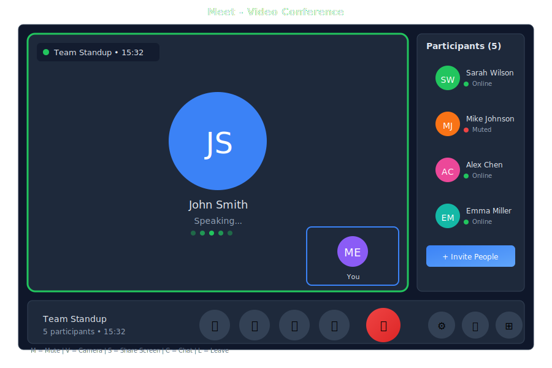

# Meet - Video Calls

> **Your virtual meeting room**



---

## Overview

Meet is the video conferencing app in General Bots Suite. Host video calls, share your screen, collaborate in real-time, and let the AI take notes for you. Meet integrates seamlessly with Calendar so joining meetings is just one click away.

---

## Features

### Meeting Controls

| Control | Description |
|---------|-------------|
| 🎤 Mute | Toggle microphone |
| 📹 Video | Toggle camera |
| 🖥️ Share | Share screen |
| ✋ Raise Hand | Get attention |
| 💬 Chat | In-meeting chat |
| 👥 Participants | View attendees |
| ⚙️ Settings | Audio/video settings |
| 📞 Leave | End call |

### Meeting Features

| Feature | Description |
|---------|-------------|
| **Screen Sharing** | Share your entire screen or specific window |
| **Recording** | Record meetings for later review |
| **Chat** | Send messages during the meeting |
| **Reactions** | Quick emoji reactions |
| **Raise Hand** | Queue to speak |
| **Breakout Rooms** | Split into smaller groups |
| **AI Notes** | Automatic meeting notes |
| **Transcription** | Live captions |

### Layouts

| Layout | Best For |
|--------|----------|
| **Gallery** | Group discussions |
| **Speaker** | Presentations |
| **Sidebar** | Screen sharing |
| **Spotlight** | Featured speaker |

---

## Keyboard Shortcuts

| Shortcut | Action |
|----------|--------|
| `M` | Toggle mute |
| `V` | Toggle video |
| `S` | Share screen |
| `H` | Raise/lower hand |
| `C` | Toggle chat |
| `P` | Toggle participants |
| `R` | Start/stop recording |
| `Space` | Push to talk (when muted) |
| `Escape` | Exit fullscreen |

---

## Meetings via Chat

### Starting a Meeting

<div class="wa-chat">
  <div class="wa-message user">
    <div class="wa-bubble">
      <p>Start a video call</p>
      <div class="wa-time">10:00</div>
    </div>
  </div>
  <div class="wa-message bot">
    <div class="wa-bubble">
      <p>🎥 Meeting room ready!</p>
      <p>📍 Room: Team Huddle</p>
      <p>🔗 Link: https://meet.gb/abc-123</p>
      <p>Click to join or share the link with others.</p>
      <p>[🚀 Join Now]</p>
      <div class="wa-time">10:00</div>
    </div>
  </div>
</div>

### Inviting Participants

<div class="wa-chat">
  <div class="wa-message user">
    <div class="wa-bubble">
      <p>Invite Sarah and John to the meeting</p>
      <div class="wa-time">10:01</div>
    </div>
  </div>
  <div class="wa-message bot">
    <div class="wa-bubble">
      <p>✅ Invitations sent!</p>
      <p>📧 Sarah - invited</p>
      <p>📧 John - invited</p>
      <p>They'll receive a link to join.</p>
      <div class="wa-time">10:01</div>
    </div>
  </div>
</div>

### Scheduling a Meeting

<div class="wa-chat">
  <div class="wa-message user">
    <div class="wa-bubble">
      <p>Schedule a video call with the team for tomorrow at 3pm</p>
      <div class="wa-time">14:30</div>
    </div>
  </div>
  <div class="wa-message bot">
    <div class="wa-bubble">
      <p>✅ Meeting scheduled!</p>
      <p>🎥 Team Video Call</p>
      <p>📅 Tomorrow at 3:00 PM</p>
      <p>👥 Invitations sent to team members</p>
      <p>🔗 Link: https://meet.gb/xyz-789</p>
      <p>Added to your calendar with reminder.</p>
      <div class="wa-time">14:30</div>
    </div>
  </div>
</div>

### Getting Meeting Notes

<div class="wa-chat">
  <div class="wa-message user">
    <div class="wa-bubble">
      <p>What were the key points from today's meeting?</p>
      <div class="wa-time">16:00</div>
    </div>
  </div>
  <div class="wa-message bot">
    <div class="wa-bubble">
      <p>📝 Meeting Summary - Team Sync</p>
      <p>Duration: 45 minutes</p>
      <p>Participants: 5</p>
      <p>---</p>
      <p>📌 Key Points:</p>
      <p>• Project deadline moved to next Friday</p>
      <p>• Budget approved for new tools</p>
      <p>• Sarah will lead the client presentation</p>
      <p>---</p>
      <p>✅ Action Items:</p>
      <p>• John: Update project timeline</p>
      <p>• You: Review proposal by Wednesday</p>
      <div class="wa-time">16:00</div>
    </div>
  </div>
</div>

### Recording Access

<div class="wa-chat">
  <div class="wa-message user">
    <div class="wa-bubble">
      <p>Show me the recording from yesterday's meeting</p>
      <div class="wa-time">09:00</div>
    </div>
  </div>
  <div class="wa-message bot">
    <div class="wa-bubble">
      <p>🎬 Meeting Recording</p>
      <p>📅 Yesterday - Project Review</p>
      <p>⏱️ Duration: 1:15:32</p>
      <p>📁 Saved to: My Drive/Recordings</p>
      <p>[▶️ Play] [⬇️ Download] [🔗 Share]</p>
      <div class="wa-time">09:00</div>
    </div>
  </div>
</div>

---

## API Endpoints

| Endpoint | Method | Description |
|----------|--------|-------------|
| `/api/meet/rooms` | GET | List meeting rooms |
| `/api/meet/rooms` | POST | Create room |
| `/api/meet/rooms/:id` | GET | Get room details |
| `/api/meet/rooms/:id/join` | POST | Join meeting |
| `/api/meet/rooms/:id/leave` | POST | Leave meeting |
| `/api/meet/rooms/:id/invite` | POST | Invite participants |
| `/api/meet/recordings` | GET | List recordings |
| `/api/meet/recordings/:id` | GET | Get recording |

### Create Room Request

```json
{
    "name": "Team Sync",
    "scheduled": "2025-05-16T15:00:00Z",
    "duration": 60,
    "participants": ["sarah@company.com", "john@company.com"],
    "settings": {
        "recording": true,
        "transcription": true,
        "waitingRoom": false
    }
}
```

### Room Response

```json
{
    "id": "room-abc123",
    "name": "Team Sync",
    "url": "https://meet.gb/abc-123",
    "host": "you@company.com",
    "scheduled": "2025-05-16T15:00:00Z",
    "status": "scheduled",
    "participants": [
        {
            "email": "sarah@company.com",
            "status": "invited"
        }
    ],
    "settings": {
        "recording": true,
        "transcription": true
    }
}
```

---

## Configuration

Configure Meet in `config.csv`:

```csv
key,value
meet-provider,livekit
meet-server-url,wss://localhost:7880
meet-recording-enabled,true
meet-transcription-enabled,true
meet-max-participants,50
```

---

## Requirements

### Browser Support

- Chrome 90+
- Firefox 88+
- Safari 14+
- Edge 90+

### Hardware

- Webcam (optional)
- Microphone
- Speakers or headphones
- Stable internet connection

### Permissions

Allow browser access to:
- Camera
- Microphone
- Screen sharing (when needed)

---

## Troubleshooting

### No Audio/Video

1. Check browser permissions
2. Verify correct device selected in settings
3. Try refreshing the page
4. Check if another app is using the camera

### Poor Quality

1. Check internet connection speed
2. Close other bandwidth-heavy applications
3. Try disabling HD video
4. Move closer to your router

### Can't Join Meeting

1. Verify the meeting link is correct
2. Check if meeting has started
3. Ensure you're not blocked by waiting room
4. Try a different browser

### Recording Not Working

1. Verify recording is enabled for the room
2. Check storage quota
3. Ensure you have host permissions

---

## See Also

- [Suite Manual](../suite-manual.md) - Complete user guide
- [Calendar App](./calendar.md) - Schedule meetings
- [Chat App](./chat.md) - Quick calls from chat
- [Calls API](../../08-rest-api-tools/calls-api.md) - API reference