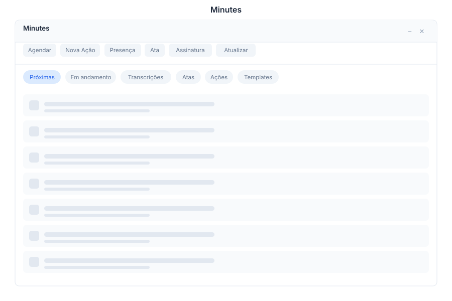

# Minutes 🟡 BETA - Meeting Minutes

> **AI-powered meeting notes with automatic transcription and signature approval**

---

## Overview

Minutes transforms meeting recordings into structured, actionable notes using AI transcription. Track upcoming meetings, review transcripts, generate minutes automatically, and collect digital signatures for approval — all from a single interface.

---

## Features

### Upcoming

| Capability | Description |
|------------|-------------|
| Meetings List | View all scheduled and upcoming meetings |
| Calendar Sync | Syncs with M365/Google Calendar |
| Reminders | Notifications before meetings start |
| Quick Join | One-click join to video conferencing |

### Transcripts

| Capability | Description |
|------------|-------------|
| AI Transcription | Automatic speech-to-text conversion |
| Speaker Detection | Identifies and labels different speakers |
| Timestamps | Linked to audio/video source |
| Search | Full-text search across all transcripts |

### Minutes

| Capability | Description |
|------------|-------------|
| Auto-Generated | AI summarizes key points and decisions |
| Action Items | Extracts tasks and assignments |
| Templates | Customizable minute templates |
| Export | PDF, DOCX, and plain text formats |

### Signatures

| Capability | Description |
|------------|-------------|
| Approve | Review and approve minutes |
| Digital Sign | Electronic signature collection |
| Status Tracking | Track who has signed |
| Audit Trail | Complete signing history |

---

## Keyboard Shortcuts

| Shortcut | Action |
|----------|--------|
| `Ctrl + U` | Show upcoming meetings |
| `Ctrl + T` | Open transcript view |
| `Ctrl + M` | Generate minutes |
| `Ctrl + S` | Request signature |
| `Ctrl + F` | Search transcripts |
| `Ctrl + E` | Export minutes |
| `Esc` | Close current view |

---

## Minutes via Chat

**User:** Show upcoming meetings

**Bot:** Here are your upcoming meetings:

| Time | Meeting | Duration |
|------|---------|----------|
| 10:00 AM | Sprint Planning | 1h |
| 2:00 PM | Client Review | 45min |
| 4:00 PM | Team Standup | 15min |

Would you like to join any of these or review past meeting transcripts?

---

**User:** Generate minutes from last meeting

**Bot:** I found the transcript from yesterday's meeting (2024-01-15, 10:00 AM).

Generating minutes with AI summary...

**Minutes Preview:**
- **Attendees:** 5 participants
- **Duration:** 58 minutes
- **Key Decisions:** Budget approved for Q2
- **Action Items:** 3 tasks assigned
- **Next Meeting:** Scheduled for next Monday

Would you like me to send these for signature approval?

---

## API Reference

| Endpoint | Method | Description |
|----------|--------|-------------|
| `/api/minutes/upcoming` | GET | List upcoming meetings |
| `/api/minutes/transcripts` | GET | List transcripts |
| `/api/minutes/transcripts/{id}` | GET | Get transcript by ID |
| `/api/minutes/minutes` | GET | List generated minutes |
| `/api/minutes/minutes/{id}` | GET | Get minutes by ID |
| `/api/minutes/minutes/{id}/generate` | POST | Generate minutes from transcript |
| `/api/minutes/minutes/{id}/export` | GET | Export minutes as PDF/DOCX |
| `/api/minutes/minutes/{id}/sign` | POST | Submit digital signature |
| `/api/minutes/minutes/{id}/status` | GET | Get signature status |
| `/api/minutes/search` | GET | Search transcripts and minutes |

---

## Related Pages

- [M365](m365.md) — Calendar integration for meeting sync
- [Transcripts](../transcripts.md) — Full transcript management
- [Signatures](../signatures.md) — Digital signature workflow
- [Reports](../reports.md) — Meeting analytics and reports
