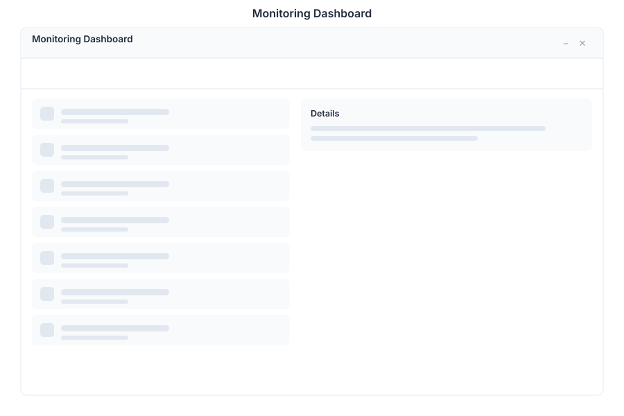

# Monitoring 🟡 BETA - System Health

> **Real-time system observability**



---

## Overview

Monitoring is the system health dashboard in General Bots Suite. Track CPU, RAM, disk, and network usage in real time. Monitor service status across BotServer, PostgreSQL, Valkey, MinIO, and all other components. Investigate logs, configure alerts, and ensure your infrastructure remains healthy.

---

## Features

### Dashboard

| Metric | Description |
|--------|-------------|
| CPU Usage | Real-time processor utilization |
| RAM Usage | Memory consumption and availability |
| Disk Usage | Storage capacity and I/O |
| Network | Bandwidth and connection stats |
| Uptime | System availability percentage |

### Services

| Service | Status Indicators |
|---------|-------------------|
| BotServer | Running, stopped, degraded |
| PostgreSQL | Connection pool, query latency |
| Valkey | Memory, hit rate, connections |
| MinIO | Storage, request throughput |
| Qdrant | Vector operations, indexing |
| Zitadel | Authentication, session count |

### Metrics

| Chart | Timeframe |
|-------|-----------|
| CPU History | Last 1h, 6h, 24h, 7d |
| Memory Trends | Allocation, garbage collection |
| Request Rate | Requests per second |
| Error Rate | 4xx and 5xx responses |
| Latency | P50, P95, P99 response times |

### Logs

| Filter | Description |
|--------|-------------|
| Component | Filter by service name |
| Level | ERROR, WARN, INFO, DEBUG |
| Time Range | Last 5m, 15m, 1h, 24h |
| Search | Full-text search across logs |
| Export | Download filtered logs as JSON |

### Alerts

| Alert | Threshold | Severity |
|-------|-----------|----------|
| High CPU | > 80% for 5 min | Warning |
| Critical CPU | > 95% for 2 min | Critical |
| Low Disk | < 20% free | Warning |
| Memory Pressure | > 90% used | Warning |
| Service Down | Status != running | Critical |

---

## Keyboard Shortcuts

| Shortcut | Action |
|----------|--------|
| `R` | Refresh all metrics |
| `G` then `D` | Go to Dashboard |
| `G` then `S` | Go to Services |
| `G` then `L` | Go to Logs |
| `G` then `A` | Go to Alerts |
| `F` | Toggle fullscreen chart |
| `Escape` | Close modal |

---

## Monitoring via Chat

### Checking System Health

<div class="wa-chat">
  <div class="wa-message user">
    <div class="wa-bubble">
      <p>System health</p>
      <div class="wa-time">09:00</div>
    </div>
  </div>
  <div class="wa-message bot">
    <div class="wa-bubble">
      <p>📊 <strong>System Health Report</strong></p>
      <p>CPU: 42% | RAM: 68% | Disk: 55%</p>
      <p>✅ BotServer: Running</p>
      <p>✅ PostgreSQL: Running (3ms avg)</p>
      <p>✅ Valkey: Running (98% hit rate)</p>
      <p>✅ MinIO: Running (12GB used)</p>
      <p>Uptime: 14 days, 6 hours</p>
      <div class="wa-time">09:00</div>
    </div>
  </div>
</div>

### Reviewing Logs

<div class="wa-chat">
  <div class="wa-message user">
    <div class="wa-bubble">
      <p>Show me the logs</p>
      <div class="wa-time">10:30</div>
    </div>
  </div>
  <div class="wa-message bot">
    <div class="wa-bubble">
      <p>📋 <strong>Recent Logs</strong> (last 5 minutes)</p>
      <p>🔴 ERROR [BotServer] Connection pool exhausted at 10:28</p>
      <p>🟡 WARN [PostgreSQL] Slow query detected (2.3s) at 10:27</p>
      <p>🟢 INFO [DriveMonitor] Bot sync complete at 10:26</p>
      <p>🟢 INFO [BotServer] Session cleanup at 10:25</p>
      <p>[View Full Logs] [Export]</p>
      <div class="wa-time">10:30</div>
    </div>
  </div>
</div>

### Checking a Specific Service

<div class="wa-chat">
  <div class="wa-message user">
    <div class="wa-bubble">
      <p>How is PostgreSQL performing?</p>
      <div class="wa-time">11:00</div>
    </div>
  </div>
  <div class="wa-message bot">
    <div class="wa-bubble">
      <p>🐘 <strong>PostgreSQL Status</strong></p>
      <p>Status: Running | Uptime: 14d 6h</p>
      <p>Connections: 12/100 | Pool: Active</p>
      <p>Avg Query Time: 3ms | Slow Queries: 2</p>
      <p>Database Size: 2.4 GB | Tables: 18</p>
      <p>Last Backup: Today at 03:00 AM</p>
      <div class="wa-time">11:00</div>
    </div>
  </div>
</div>

---

## API Endpoints

| Endpoint | Method | Description |
|----------|--------|-------------|
| `/api/monitoring/health` | GET | Overall system health |
| `/api/monitoring/metrics` | GET | Current system metrics |
| `/api/monitoring/metrics/:service` | GET | Service-specific metrics |
| `/api/monitoring/logs` | GET | Search and filter logs |
| `/api/monitoring/services` | GET | List all services and status |
| `/api/monitoring/services/:name` | GET | Detailed service status |
| `/api/monitoring/alerts` | GET | Active alerts |
| `/api/monitoring/alerts` | POST | Create alert rule |
| `/api/monitoring/alerts/:id` | DELETE | Remove alert rule |

### Health Response

```json
{
    "status": "healthy",
    "uptime_seconds": 1209600,
    "cpu_percent": 42.5,
    "memory_percent": 68.2,
    "disk_percent": 55.1,
    "services": {
        "botserver": { "status": "running", "pid": 1234 },
        "postgresql": { "status": "running", "connections": 12 },
        "valkey": { "status": "running", "memory_used_mb": 256 },
        "minio": { "status": "running", "storage_gb": 12.4 }
    }
}
```

### Logs Query

```json
{
    "component": "botserver",
    "level": "ERROR",
    "since": "2025-05-15T10:00:00Z",
    "limit": 50,
    "search": "connection"
}
```

---

## Configuration

Monitoring thresholds can be configured in `config.csv`:

```csv
key,value
metrics-retention,30d
log-retention,7d
alert-cpu-warning,80
alert-cpu-critical,95
alert-disk-warning,20
alert-memory-warning,90
```

---

## Troubleshooting

### Metrics Not Updating

1. Check Valkey connectivity (metrics are cached)
2. Verify the monitoring service is running
3. Check for clock drift between services
4. Refresh the dashboard manually with `R`

### Logs Missing

1. Verify log retention policy hasn't expired entries
2. Check disk space for log storage
3. Ensure log level is set appropriately
4. Check component is writing to expected log path

### Alerts Not Firing

1. Verify alert thresholds are configured
2. Check notification channels are active
3. Ensure the alert service is running
4. Review alert history for suppressed notifications

---

## See Also

- [Suite Manual](../suite-manual.md) - Complete user guide
- [Admin Panel](./admin.md) - System administration
- [Analytics](./analytics.md) - Business metrics
- [BASIC Monitoring Keywords](../../04-basic-scripting/keyword-monitoring.md) - Script integration
- [Enterprise Agent Governance](../../09-security/enterprise-agent-governance.md) - Governance dashboard, kill switches & security auditing
