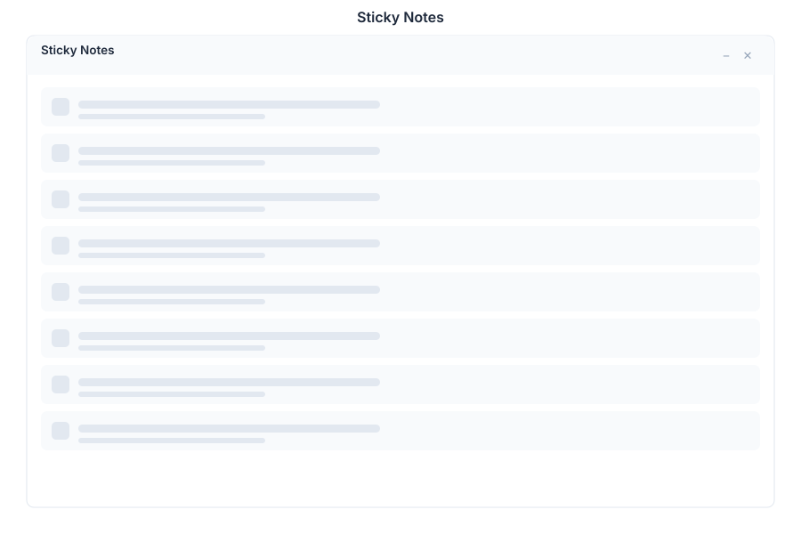

# Sticky Notes 🟡 PREVIEW

> **Preview application.** Usable today, not yet part of the supported surface.

Sticky Notes puts short notes on your desktop where you will actually see them, instead of inside a document you have to remember to open.

## What it does

| Capability | Detail |
|---|---|
| **Quick capture** | Write a note and it stays on the desktop |
| **Colour coding** | Notes are visually distinct, so categories can be told apart at a glance |
| **Delete** | Remove a note when it is done |
| **Persistence** | Notes survive reloads; they are stored, not held in the page |

## When to use it

- Reminders during a session — a phone number, an account reference, a follow-up
- Anything short enough that opening [Paper](./paper.md) would be friction
- Temporary scratch context while working in another app

For anything you will need next week, use a real document: sticky notes are a working surface, not an archive.

## Opening it

Sticky Notes is a **preview** application. Turn on the **Preview** switch in the left sidebar, then open **Sticky Notes** from the app menu.

## See Also

- [Paper](./paper.md) - Documents and richer notes
- [Workspace](./workspace.md) - Collaborative pages
- [Apps overview](./README.md) - Stability classification for the whole suite
