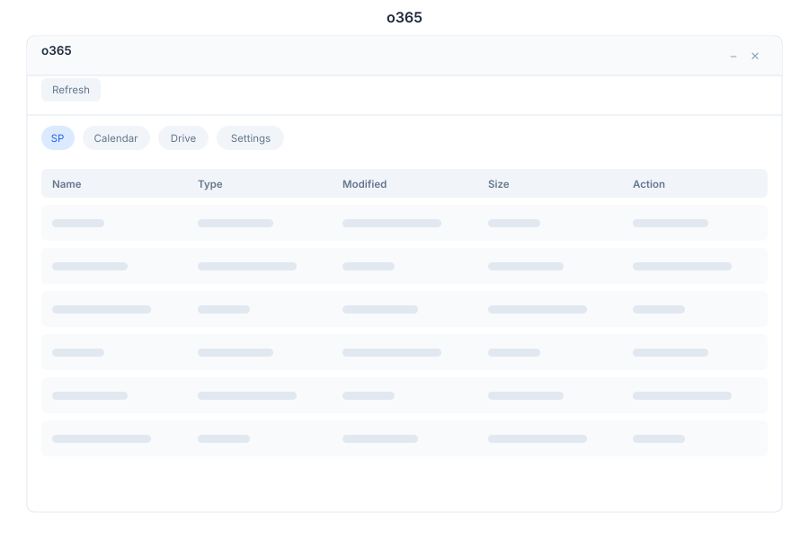

# o365 🟡 BETA - Unified Office Productivity

> **SP, Calendar, Drive & Mail integration in a single interface**

---

## Overview

o365 is the unified office productivity integration app. It merges the former M365 and Office 365 apps
into a single interface backed by one real backend (`botm365`). Terms are vendor-neutral: **SP** instead of
SharePoint, **Drive** instead of OneDrive, and **o365** instead of Microsoft 365.

Connect once and access your office resources without switching between applications.

---

## Features

### SP (Sites & Lists)

| Capability | Description |
|------------|-------------|
| Sites | Browse accessible SP sites |
| Lists | View lists and item counts |
| Items | Inspect documents and list items |

### Calendar

| Capability | Description |
|------------|-------------|
| Events | View upcoming calendar events |
| Meetings | Create meetings with subject, start, end, attendees |
| Status | Track event status |

### Drive (Files)

| Capability | Description |
|------------|-------------|
| Files | Browse, upload, and download files |
| Folders | Navigate folder hierarchy |
| Breadcrumb | Deep folder navigation with breadcrumbs |

### Settings

| Capability | Description |
|------------|-------------|
| Connect | Authenticate and connect o365 account |
| Sync | Manual sync + per-service frequency |
| Status | Connection and last-sync state |

---

## API Reference

The unified app uses the `/api/o365/*` namespace (aliases of the canonical `/api/m365/*` backend).

| Endpoint | Method | Description |
|----------|--------|-------------|
| `/api/o365/sharepoint` | GET | List SP site items |
| `/api/o365/calendar` | GET | List calendar events |
| `/api/o365/calendar` | POST | Create calendar event |
| `/api/o365/onedrive` | GET | List Drive files (`?folder=` optional) |
| `/api/o365/settings` | GET | Get connection settings |

**Aliases:** `/api/m365/*` remains available for the same handlers — both namespaces resolve to the
same `botm365` crate (DB-backed `m365_sharepoint_items`, `m365_calendar_events`,
`m365_onedrive_files`, `oauth_microsoft_settings`).

---

## Related Pages

- [Calendar](../calendar.md) — Standalone calendar management
- [Drive](../drive.md) — Cloud file storage
- [Settings](../settings.md) — Connection and permissions
