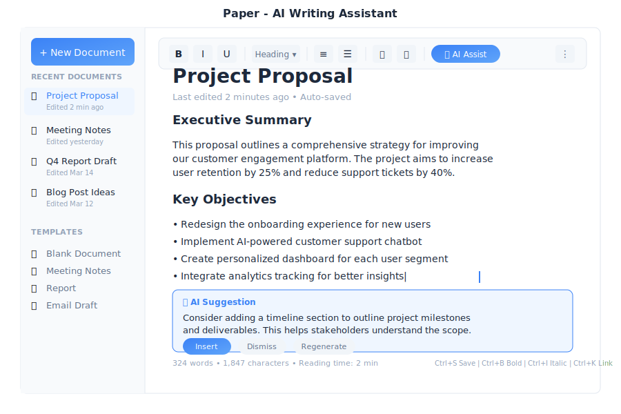

# Paper - AI Writing

> **Your intelligent document editor**



---

## Overview

Paper is the AI-powered writing app in General Bots Suite. Create documents, reports, letters, and more with help from your AI assistant. Paper understands context, suggests improvements, and helps you write faster and better.

---

## Features

### Creating a New Document

**Method 1: Click New Document**

1. Click **+ New Doc** in the left sidebar
2. Start typing immediately
3. Document auto-saves as you work

**Method 2: From Template**

1. Click **+ New Doc**
2. Select **From Template**
3. Choose a template:

| Template | Best For |
|----------|----------|
| **Blank** | Starting from scratch |
| **Report** | Business reports with sections |
| **Letter** | Formal correspondence |
| **Meeting Notes** | Agenda and action items |
| **Checklist** | Task tracking |
| **Email Template** | Reusable email formats |
| **Project Proposal** | Pitches and proposals |
| **Resume/CV** | Job applications |
| **Invoice** | Billing documents |

**Method 3: Ask the Bot**

<div class="wa-chat">
  <div class="wa-message user">
    <div class="wa-bubble">
      <p>Create a new document for meeting notes</p>
      <div class="wa-time">10:30</div>
    </div>
  </div>
  <div class="wa-message bot">
    <div class="wa-bubble">
      <p>✅ Created new document: "Meeting Notes"</p>
      <p>I've set up a template with:</p>
      <p>• Date and attendees section</p>
      <p>• Agenda</p>
      <p>• Discussion points</p>
      <p>• Action items</p>
      <div class="wa-time">10:30</div>
    </div>
  </div>
</div>

---

### Formatting Text

Use the toolbar or keyboard shortcuts to format your text:

| Format | Toolbar | Shortcut |
|--------|---------|----------|
| **Bold** | B | `Ctrl+B` |
| *Italic* | I | `Ctrl+I` |
| Underline | U | `Ctrl+U` |
| ~~Strikethrough~~ | S | `Ctrl+Shift+S` |
| Heading 1 | H1 | `Ctrl+1` |
| Heading 2 | H2 | `Ctrl+2` |
| Heading 3 | H3 | `Ctrl+3` |
| Bullet list | • | `Ctrl+Shift+8` |
| Numbered list | ≡ | `Ctrl+Shift+7` |
| Checklist | ☐ | `Ctrl+Shift+9` |
| Link | 🔗 | `Ctrl+K` |

---

### AI Writing Assistant ✨

Paper's AI assistant helps you write better and faster. Click the **✨ AI** button or type `/` to access AI features.

**Generate Content:**

<div class="wa-chat">
  <div class="wa-message user">
    <div class="wa-bubble">
      <p>/write an introduction about renewable energy</p>
      <div class="wa-time">10:30</div>
    </div>
  </div>
  <div class="wa-message bot">
    <div class="wa-bubble">
      <p>Here's a draft introduction:</p>
      <p>"Renewable energy has emerged as one of the most significant solutions to our global climate challenges. As fossil fuel reserves dwindle and environmental concerns grow, solar, wind, and hydroelectric power offer sustainable alternatives that can power our future while protecting our planet."</p>
      <div class="wa-time">10:30</div>
    </div>
  </div>
</div>

**Improve Writing Options:**

| Option | What It Does |
|--------|--------------|
| **📝 Improve writing** | General quality enhancement |
| **✂️ Make it shorter** | Condense without losing meaning |
| **📖 Make it longer** | Expand with more detail |
| **🎯 Make it clearer** | Simplify complex language |
| **💼 Make it professional** | Formal business tone |
| **😊 Make it friendly** | Casual, approachable tone |
| **🔧 Fix grammar** | Correct errors |
| **🌐 Translate** | Convert to another language |

**Summarize:**

<div class="wa-chat">
  <div class="wa-message user">
    <div class="wa-bubble">
      <p>/summarize this document</p>
      <div class="wa-time">10:30</div>
    </div>
  </div>
  <div class="wa-message bot">
    <div class="wa-bubble">
      <p>📋 <strong>Document Summary:</strong></p>
      <p>This quarterly report covers company performance from January to March 2025. Key points:</p>
      <p>• Revenue grew 15% to $2.4M</p>
      <p>• 47 new customers acquired</p>
      <p>• 94% customer retention rate</p>
      <p>• Enterprise segment drove growth</p>
      <p>The report recommends expanding the sales team and investing in product development.</p>
      <div class="wa-time">10:30</div>
    </div>
  </div>
</div>

**Generate Ideas:**

<div class="wa-chat">
  <div class="wa-message user">
    <div class="wa-bubble">
      <p>/brainstorm topics for a blog post about productivity</p>
      <div class="wa-time">10:30</div>
    </div>
  </div>
  <div class="wa-message bot">
    <div class="wa-bubble">
      <p>💡 Here are 10 blog post ideas:</p>
      <p>1. "5 Morning Habits of Highly Productive People"</p>
      <p>2. "The Pomodoro Technique: A Complete Guide"</p>
      <p>3. "How to Eliminate Distractions While Working"</p>
      <p>4. "Time Blocking: Schedule Your Way to Success"</p>
      <p>5. "The 2-Minute Rule: Small Tasks, Big Impact"</p>
      <p>Would you like me to expand on any of these?</p>
      <div class="wa-time">10:30</div>
    </div>
  </div>
</div>

---

### Document Organization

**Folders:**

Organize your documents into folders:

1. Right-click in the sidebar
2. Select **New Folder**
3. Name your folder
4. Drag documents into it

**Search Documents:**

Find documents quickly:

1. Press `Ctrl+P` or click the search icon
2. Type document name or content
3. Press Enter to open

---

### Collaboration

**Share a Document:**

1. Click **Share** button
2. Enter email addresses
3. Set permissions
4. Click **Send**

**Permissions Explained:**

| Permission | Can View | Can Comment | Can Edit |
|------------|----------|-------------|----------|
| **View** | ✅ | ❌ | ❌ |
| **Comment** | ✅ | ✅ | ❌ |
| **Edit** | ✅ | ✅ | ✅ |

---

### Export Options

Export your documents to different formats:

1. Click **Export ▼**
2. Choose a format:

| Format | Best For |
|--------|----------|
| **PDF** | Printing, sharing final versions |
| **Word (.docx)** | Editing in Microsoft Word |
| **Markdown (.md)** | Technical documentation |
| **Plain Text (.txt)** | Simple text without formatting |
| **HTML** | Web publishing |

**Export Options:**
- Include headers and footers
- Include comments
- Include page numbers

---

### Version History

Paper automatically saves versions of your document:

1. Click **⚙️** → **Version History**
2. See all saved versions
3. Click to preview
4. Restore if needed

---

## Keyboard Shortcuts

### Text Formatting

| Shortcut | Action |
|----------|--------|
| `Ctrl+B` | Bold |
| `Ctrl+I` | Italic |
| `Ctrl+U` | Underline |
| `Ctrl+Shift+S` | Strikethrough |
| `Ctrl+1` | Heading 1 |
| `Ctrl+2` | Heading 2 |
| `Ctrl+3` | Heading 3 |
| `Ctrl+0` | Normal text |

### Lists & Structure

| Shortcut | Action |
|----------|--------|
| `Ctrl+Shift+7` | Numbered list |
| `Ctrl+Shift+8` | Bullet list |
| `Ctrl+Shift+9` | Checklist |
| `Tab` | Indent |
| `Shift+Tab` | Outdent |

### Editing

| Shortcut | Action |
|----------|--------|
| `Ctrl+Z` | Undo |
| `Ctrl+Y` | Redo |
| `Ctrl+C` | Copy |
| `Ctrl+X` | Cut |
| `Ctrl+V` | Paste |
| `Ctrl+A` | Select all |
| `Ctrl+F` | Find |
| `Ctrl+H` | Find and replace |

### Navigation

| Shortcut | Action |
|----------|--------|
| `Ctrl+P` | Quick open document |
| `Ctrl+S` | Save (auto-saves anyway) |
| `Ctrl+N` | New document |
| `Ctrl+W` | Close document |
| `Escape` | Close dialog/menu |

### AI Features

| Shortcut | Action |
|----------|--------|
| `/` | Open AI command menu |
| `Ctrl+Shift+A` | AI improve selection |
| `Ctrl+Shift+G` | Generate content |

---

## Tips & Tricks

### Writing Tips

💡 **Use headings** to organize your document - makes it scannable

💡 **Write first, edit later** - don't let perfectionism slow you down

💡 **Use AI to overcome writer's block** - ask for ideas or outlines

💡 **Break long paragraphs** into shorter ones for readability

### Productivity Tips

💡 **Use templates** for recurring documents (reports, meeting notes)

💡 **Learn keyboard shortcuts** - much faster than clicking

💡 **Use `/` commands** for quick AI assistance

💡 **Set up folders** to keep documents organized

### AI Tips

💡 **Be specific** when asking AI for help - better prompts = better results

💡 **Use "Make it shorter"** for concise professional writing

💡 **Ask for multiple versions** and pick the best one

💡 **Use AI to check grammar** before sharing important documents

---

## Troubleshooting

### Document not saving

**Possible causes:**
1. Internet connection lost
2. Browser storage full
3. Session expired

**Solution:**
1. Check internet connection
2. Copy your text as backup (`Ctrl+A`, `Ctrl+C`)
3. Refresh the page
4. Log in again if prompted
5. Paste your text back if needed

---

### Formatting not working

**Possible causes:**
1. Text not selected
2. Format not supported in current context
3. Browser compatibility issue

**Solution:**
1. Select the text first, then apply formatting
2. Try a different format
3. Use keyboard shortcuts instead of toolbar
4. Try a different browser

---

### AI features not responding

**Possible causes:**
1. AI service temporarily unavailable
2. Network timeout
3. Request too long

**Solution:**
1. Wait a few seconds and try again
2. Try a shorter text selection
3. Refresh the page
4. Check if other AI features work

---

### Can't share document

**Possible causes:**
1. No sharing permissions
2. Invalid email address
3. Document not saved

**Solution:**
1. Check if you're the document owner
2. Verify email addresses are correct
3. Wait for document to save (check status bar)
4. Contact administrator if sharing is restricted

---

### Export fails

**Possible causes:**
1. Document too large
2. Special characters causing issues
3. Browser blocking download

**Solution:**
1. Try exporting a smaller section first
2. Remove any unusual characters or images
3. Check browser download settings
4. Try a different export format

---

## User Storage

Paper documents are stored in your personal `.gbusers` folder within the bot's `.gbdrive` storage. This ensures your documents are private and accessible only to you.

### Storage Structure

```
mybot.gbai/
  mybot.gbdrive/
    users/
      your.email@example.com/      # Your user folder
        papers/
          current/                 # Working documents (auto-saved)
            untitled-1.md
            meeting-notes.md
          named/                   # Saved documents
            quarterly-report/
              document.md
              metadata.json
            project-proposal/
              document.md
              metadata.json
        exports/                   # Exported files (PDF, DOCX, etc.)
          quarterly-report.pdf
          project-proposal.docx
```

### Storage Types

| Type | Location | Description |
|------|----------|-------------|
| **Current** | `papers/current/` | Auto-saved working documents. These are drafts being actively edited. |
| **Named** | `papers/named/{name}/` | Explicitly saved documents with metadata. Each gets its own folder. |
| **Exports** | `exports/` | Generated export files (PDF, Word, HTML, etc.) |

### Auto-Save Behavior

Paper auto-saves your work every 30 seconds to `papers/current/`. When you explicitly save with a title:

1. Document moves from `current/` to `named/{title}/`
2. Metadata file is created with title, timestamps, and word count
3. Original draft in `current/` is removed

### Accessing Your Documents

Your documents follow you across sessions and devices. As long as you're logged in with the same email or phone number, you'll see all your documents.

**From the UI:**
- Documents appear in the sidebar automatically
- Search finds documents by title
- Recent documents shown first

**From BASIC scripts:**
```basic
' Read your document
content = READ USER DRIVE "papers/named/my-report/document.md"

' List your papers
papers = LIST USER DRIVE "papers/named/"
```

### Storage Limits

Default limits per user (configurable by administrator):

| Setting | Default | Description |
|---------|---------|-------------|
| Total storage | 100 MB | Maximum storage per user |
| File size | 5 MB | Maximum single document |
| File count | 500 | Maximum number of documents |

---

## BASIC Integration

Control Paper from your bot dialogs:

### Create a Document

```botserver/docs/src/07-user-interface/apps/paper-create.basic
doc = CREATE DOCUMENT "Project Notes"
doc.content = "Meeting notes from " + TODAY

SAVE DOCUMENT doc
TALK "Document created: " + doc.id
```

### Generate Content with AI

```botserver/docs/src/07-user-interface/apps/paper-generate.basic
HEAR topic AS TEXT "What should I write about?"

content = GENERATE TEXT "Write a brief introduction about " + topic

doc = CREATE DOCUMENT topic
doc.content = content
SAVE DOCUMENT doc

TALK "I've created a document about " + topic
TALK "Here's a preview:"
TALK LEFT(content, 200) + "..."
```

### Export a Document

```botserver/docs/src/07-user-interface/apps/paper-export.basic
HEAR docName AS TEXT "Which document should I export?"

doc = FIND DOCUMENT docName

IF doc IS NOT NULL THEN
    pdf = EXPORT DOCUMENT doc AS "PDF"
    TALK "Here's your PDF:"
    SEND FILE pdf
ELSE
    TALK "Document not found"
END IF
```

### Search Documents

```botserver/docs/src/07-user-interface/apps/paper-search.basic
HEAR query AS TEXT "What are you looking for?"

results = SEARCH DOCUMENTS query

IF COUNT(results) > 0 THEN
    TALK "I found " + COUNT(results) + " documents:"
    FOR EACH doc IN results
        TALK "- " + doc.title
    NEXT
ELSE
    TALK "No documents found matching '" + query + "'"
END IF
```

### Summarize a Document

```botserver/docs/src/07-user-interface/apps/paper-summarize.basic
HEAR docName AS TEXT "Which document should I summarize?"

doc = FIND DOCUMENT docName

IF doc IS NOT NULL THEN
    summary = SUMMARIZE doc.content
    TALK "Summary of '" + doc.title + "':"
    TALK summary
ELSE
    TALK "Document not found"
END IF
```

---

## See Also

- [Drive App](./drive.md) - Store and organize files
- [Mail App](./mail.md) - Email your documents
- [Research App](./research.md) - Research topics for your writing
- [How To: Add Documents to Knowledge Base](../how-to/add-kb-documents.md)