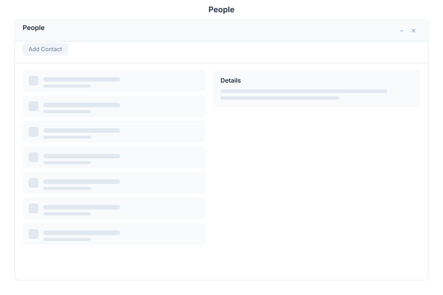

# People - Contacts

> **Contact management & directory**

---

## Overview

People is the contact management and directory module in General Bots Suite. Maintain a comprehensive directory of contacts with groups, activity tracking, and advanced search. People helps teams stay connected and organized with all their professional relationships.

---

## Features

### Contacts

Manage individual contact records with rich profile information.

| Action | Description |
|--------|-------------|
| **Add Contact** | Create contact with name, email, phone, company |
| **Edit Contact** | Update profile information and details |
| **Merge Contacts** | Combine duplicate contact records |
| **Import Contacts** | Bulk import from CSV, vCard, or Excel |
| **Export Contacts** | Download contacts in various formats |

### Groups

Organize contacts into logical groups and lists.

| Action | Description |
|--------|-------------|
| **Create Group** | Define group with name and description |
| **Add to Group** | Assign contacts to groups |
| **Remove from Group** | Remove contacts while keeping the contact |
| **Group Permissions** | Set visibility and access controls |
| **Smart Groups** | Auto-populate based on criteria |

### Directory

Searchable organization-wide contact directory.

| Feature | Description |
|---------|-------------|
| **Full-Text Search** | Search across all contact fields |
| **Advanced Filters** | Filter by company, role, location, etc. |
| **Org Chart** | Visual organization hierarchy |
| **Department View** | Browse by department or team |
| **Recent Contacts** | Quick access to frequently contacted |

### Import/Export

Bulk operations for contact data management.

| Format | Import | Export |
|--------|--------|--------|
| **CSV** | ✅ | ✅ |
| **vCard** | ✅ | ✅ |
| **Excel** | ✅ | ✅ |
| **JSON** | ✅ | ✅ |
| **LDIF** | ✅ | ❌ |

### Activity Timeline

Track interactions and history with contacts.

| Activity | Description |
|----------|-------------|
| **Emails** | Record of email communications |
| **Meetings** | Scheduled and completed meetings |
| **Calls** | Phone call logs and notes |
| **Notes** | Internal notes and comments |
| **Files** | Shared documents and attachments |

---

## Keyboard Shortcuts

| Shortcut | Action |
|----------|--------|
| `N` | Create new contact |
| `E` | Edit selected contact |
| `G` | Create new group |
| `F` | Focus search |
| `I` | Import contacts |
| `/` | Focus search |
| `?` | Show shortcuts |

---

## People via Chat

### Adding a New Contact

  

    

      
Add a new contact: Maria Silva, maria@acme.com, VP of Sales

      
09:00

    

  

  

    

      
✅ Contact created:

      
👤 Maria Silva

      
📧 maria@acme.com

      
💼 VP of Sales

      
🏢 Acme Corp

      
Would you like to add more details?

      
09:00

    

  

### Finding Contacts at a Company

  

    

      
Find contacts at Acme

      
14:30

    

  

  

    

      
👥 Contacts at Acme Corp (5 found):

      
👤 Maria Silva - VP of Sales

      
👤 John Smith - Engineering Manager

      
👤 Lisa Chen - Product Designer

      
👤 David Johnson - Sales Representative

      
👤 Emma Wilson - Marketing Director

      
14:30

    

  

---

## API Reference

People operations are available via REST API:

| Endpoint | Method | Description |
|----------|--------|-------------|
| `/api/contacts` | GET | List all contacts |
| `/api/contacts` | POST | Create new contact |
| `/api/contacts/:id` | GET | Get contact details |
| `/api/contacts/:id` | PUT | Update contact |
| `/api/contacts/:id` | DELETE | Delete contact |
| `/api/contacts/search` GET | Search contacts |
| `/api/contacts/import` | POST | Bulk import contacts |
| `/api/contacts/export` | GET | Export contacts |
| `/api/groups` | GET | List all groups |
| `/api/groups` | POST | Create new group |
| `/api/groups/:id/contacts` | GET | List group contacts |

---

## Related Pages

- [Chat App](./chat.md) — Communicate with contacts
- [Mail App](./mail.md) — Send emails to contacts
- [Calendar App](./calendar.md) — Schedule meetings with contacts
- [CRM App](./crm.md) — Customer relationship management
- [Suite Manual](../suite-manual.md) — Full Suite overview